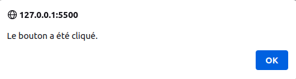
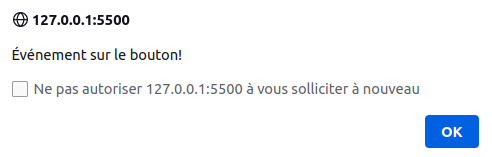
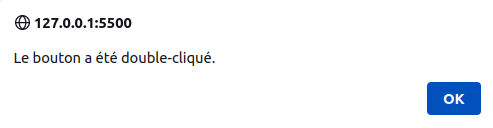
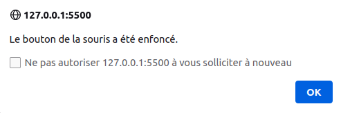
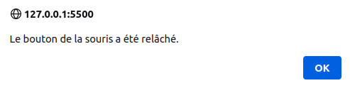
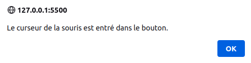
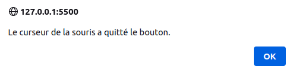
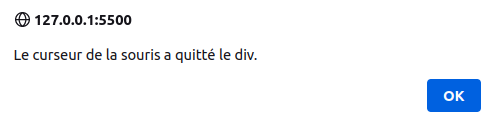
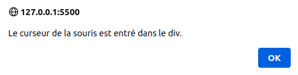

# APPRENDRE À CODER EN JAVASCRIPT

Auteur : [Paterne Guélablé Gnonzion](https://gnpinformatique.fr)

Formateur développeur web et mobile : **PHP, Symfony, Rust ...**

Linkedin : [Paterne G. G.](https://www.linkedin.com/in/gnpinformatique/)

Github : [teamflp](https://github.com/teamflp)

## Procédure pour utiliser ce cours

Bienvenue à ce cours sur le JavaScript ! Pour tirer le meilleur parti de ce contenu et acquérir une compréhension solide de la matière, suivez les étapes recommandées ci-dessous.

1. **Préparation** :

- Assurez-vous d'avoir les prérequis : connaissance basique du HTML et CSS.
- Installez un bon éditeur de code (comme [Visual Studio Code](https://code.visualstudio.com/)).
- Configurez un navigateur moderne pour les tests (Chrome, Firefox, Safari, etc.).

2. **Étude systématique** :

- Commencez par l'**introduction** pour comprendre le contexte du CSS.
- Poursuivez avec les **bases** avant de passer aux concepts avancés.
- Ne sautez pas de sections. Chaque partie est conçue pour s'appuyer sur la précédente.

3. **Pratiquez régulièrement** :

- Après chaque section, prenez le temps de coder et de tester ce que vous avez appris.
- Utilisez les exemples fournis et essayez de les modifier ou de les améliorer.

4. **Participez à des discussions** :

- Rejoignez des forums ou des groupes dédiés au JavaScript pour poser des questions, partager vos connaissances ou aider d'autres apprenants.
- Partager vos réalisations ou vos défis vous permettra d'obtenir des retours constructifs.

5. **Consultez des ressources supplémentaires** :

- Explorez les **ressources et outils** mentionnés à la fin du cours pour approfondir vos connaissances et améliorer vos compétences.

6. **Mettez en pratique** :

- Essayez de créer un petit projet web à partir de zéro, en appliquant tout ce que vous avez appris.
- Cela renforcera votre compréhension et vous donnera une idée des domaines dans lesquels vous pourriez avoir besoin de plus d'entraînement.

7. **Revenez régulièrement** :

- La technologie et les normes évoluent. Revenez périodiquement pour mettre à jour vos connaissances ou rafraîchir certains concepts.

8. **Évaluez vos progrès** :

- Testez régulièrement vos connaissances. Cela peut être à travers des quiz en ligne, des défis de codage ou des revues de code avec des pairs.

Bonne étude ! Rappelez-vous que l'apprentissage est un voyage, et chaque étape vous rapproche de la maîtrise du JavaScript.

<!-- TOC -->
- [APPRENDRE À CODER EN JAVASCRIPT](#apprendre-à-coder-en-javascript)
  - [Procédure pour utiliser ce cours](#procédure-pour-utiliser-ce-cours)
  - [Introduction au JavaScript](#introduction-au-javascript)
    - [Historique et évolution de JavaScript](#historique-et-évolution-de-javascript)
    - [Pourquoi utiliser JavaScript ?](#pourquoi-utiliser-javascript-)
    - [Différence entre Java et JavaScript](#différence-entre-java-et-javascript)
    - [Environnement d'exécution JavaScript](#environnement-dexécution-javascript)
    - [Outils de développement](#outils-de-développement)
  - [Bases du JavaScript](#bases-du-javascript)
    - [Syntaxe de base](#syntaxe-de-base)
    - [Types de données](#types-de-données)
    - [Variables et constantes](#variables-et-constantes)
    - [Affichage : console.log(), alert() et prompt(), document.write()](#affichage--consolelog-alert-et-prompt-documentwrite)
    - [Opérateurs](#opérateurs)
      - [Opérateurs arithmétiques](#opérateurs-arithmétiques)
      - [Opérateurs d'assignation : `+`, `==`, `===`, `!=`, `!==`, `>`, `<`, `<=`, `=>` et `?` `:`, `&&`, `||`, `!`](#opérateurs-dassignation-----------et-----)
      - [Opérateurs de comparaison](#opérateurs-de-comparaison)
      - [Opérateurs logiques](#opérateurs-logiques)
      - [Opérateurs de concaténation](#opérateurs-de-concaténation)
      - [Opérateurs de type](#opérateurs-de-type)
      - [Opérateurs de bits](#opérateurs-de-bits)
      - [Opérateurs de pré/post-incrémentation/décrémentation](#opérateurs-de-prépost-incrémentationdécrémentation)
      - [Opérateurs ternaires](#opérateurs-ternaires)
      - [Opérateurs de décomposition](#opérateurs-de-décomposition)
    - [Structures conditionnelles](#structures-conditionnelles)
      - [if...else](#ifelse)
      - [if...else if...else](#ifelse-ifelse)
      - [switch...case](#switchcase)
    - [Boucles](#boucles)
      - [La boucle for](#la-boucle-for)
      - [La boucle for...in](#la-boucle-forin)
      - [La boucle for...of](#la-boucle-forof)
      - [La boucle while](#la-boucle-while)
      - [La boucle do...while](#la-boucle-dowhile)
      - [La boucle forEach](#la-boucle-foreach)
      - [La boucle for...await...of](#la-boucle-forawaitof)
    - [Fonctions en JavaScript](#fonctions-en-javascript)
      - [Déclaration de fonction](#déclaration-de-fonction)
      - [Fonctions anonymes](#fonctions-anonymes)
      - [Fonctions fléchées (ES6)](#fonctions-fléchées-es6)
      - [Fonctions auto-exécutées (IIFE - Immediately Invoked Function Expression)](#fonctions-auto-exécutées-iife---immediately-invoked-function-expression)
      - [Contructeurs de fonction](#contructeurs-de-fonction)
      - [Fonctions récursives](#fonctions-récursives)
      - [Fonctions de rappel (callbacks)](#fonctions-de-rappel-callbacks)
      - [Fonctions de rappel asynchrones](#fonctions-de-rappel-asynchrones)
      - [Fonctions de rappel avec paramètres](#fonctions-de-rappel-avec-paramètres)
      - [Fonctions de rappel avec plusieurs paramètres](#fonctions-de-rappel-avec-plusieurs-paramètres)
      - [Fonctions de rappel avec une valeur de retour](#fonctions-de-rappel-avec-une-valeur-de-retour)
    - [Portée des variables](#portée-des-variables)
    - [Fermetures (Closures)](#fermetures-closures)
  - [Callbacks et promesses](#callbacks-et-promesses)
    - [Callbacks](#callbacks)
  - [Promesses](#promesses)
  - [Programmation Orientée Objet (POO)](#programmation-orientée-objet-poo)
    - [Objets et propriétés](#objets-et-propriétés)
    - [Constructeurs et prototypes](#constructeurs-et-prototypes)
    - [Héritage et polymorphisme](#héritage-et-polymorphisme)
    - [ES6 Classes](#es6-classes)
    - [Encapsulation et abstraction](#encapsulation-et-abstraction)
  - [Manipulation du DOM](#manipulation-du-dom)
    - [Sélection d'éléments](#sélection-déléments)
      - [Méthodes de sélection d'éléments](#méthodes-de-sélection-déléments)
      - [Sélection d'éléments imbriqués](#sélection-déléments-imbriqués)
    - [Modification du contenu](#modification-du-contenu)
    - [Gestion des événements](#gestion-des-événements)
      - [Ajout d'un gestionnaire d'événements](#ajout-dun-gestionnaire-dévénements)
      - [Suppression d'un gestionnaire d'événements](#suppression-dun-gestionnaire-dévénements)
      - [Propagation d'événements](#propagation-dévénements)
      - [Objet Event](#objet-event)
    - [Types d'événements : Consulter la liste complète des événements sur MDN](#types-dévénements--consulter-la-liste-complète-des-événements-sur-mdn)
      - [Événements de souris](#événements-de-souris)
    - [Animation et effets: setInterval et setTimeout](#animation-et-effets-setinterval-et-settimeout)
      - [setInterval](#setinterval)
      - [setTimeout](#settimeout)
    - [Manipulation du CSS](#manipulation-du-css)
  - [Événements et gestionnaires d'événements](#événements-et-gestionnaires-dévénements)
    - [Écouteurs d'événements](#écouteurs-dévénements)
    - [Événements de formulaire](#événements-de-formulaire)
    - [Propagation des événements](#propagation-des-événements)
  - [Traitement asynchrone en JavaScript](#traitement-asynchrone-en-javascript)
    - [Promesses et async/await](#promesses-et-asyncawait)
    - [AJAX et Fetch API](#ajax-et-fetch-api)
    - [WebSockets et communication en temps réel](#websockets-et-communication-en-temps-réel)
  - [Frameworks et bibliothèques populaires](#frameworks-et-bibliothèques-populaires)
    - [Vue.js](#vuejs)
    - [React](#react)
    - [Angular](#angular)
    - [Backend frameworks (ex: Nest.js, Meteor)](#backend-frameworks-ex-nestjs-meteor)
  - [Bonnes pratiques et sécurité](#bonnes-pratiques-et-sécurité)
    - [Écriture de code maintenable](#écriture-de-code-maintenable)
    - [Outils de débogage](#outils-de-débogage)
    - [Prévention des vulnérabilités courantes](#prévention-des-vulnérabilités-courantes)
  - [Annexes](#annexes)
    - [Ressources supplémentaires](#ressources-supplémentaires)
    - [Glossaire](#glossaire)
    - [Références](#références)
<!-- TOC -->
---

## Introduction au JavaScript

JavaScript, souvent abrégé en JS, est un langage de programmation qui, à l'origine, a été conçu pour rendre les pages web interactives et dynamiques. Depuis sa création en 1995 par Brendan Eich alors qu'il était employé chez Netscape Communications Corporation, JavaScript a parcouru un long chemin. Aujourd'hui, il ne se limite pas uniquement au navigateur web : il est également utilisé côté serveur, pour le développement d'applications mobiles, de jeux et bien d'autres domaines.

Contrairement à ce que son nom pourrait suggérer, JavaScript n'a pas de lien direct avec le langage Java. La similarité des noms est davantage due à des raisons marketing de l'époque qu'à une quelconque ressemblance technique entre les deux langages.

Une des forces majeures de JavaScript est son caractère universel. Presque tous les navigateurs web modernes supportent JavaScript, ce qui en fait l'un des outils les plus accessibles pour améliorer l'expérience utilisateur sur le web. Avec l'avènement de technologies comme Node.js, il est également devenu un acteur majeur dans le développement côté serveur, permettant aux développeurs de travailler avec un seul langage à la fois pour le client et le serveur.

En plus de sa flexibilité, JavaScript est un langage qui est continuellement en évolution. Avec l'introduction d'ECMAScript (ES6, ES7...), de nouvelles fonctionnalités sont régulièrement ajoutées, rendant le langage encore plus puissant et expressif.

L'apprentissage de JavaScript est essentiel pour quiconque souhaite devenir un développeur web complet. Qu'il s'agisse de créer de simples animations sur une page, de développer des applications web complexes ou même des applications serveur, JavaScript se trouve au cœur de la plupart des interactions numériques modernes.

Dans cette formation, nous allons explorer les fondamentaux du langage, découvrir comment il s'intègre dans l'écosystème web et, enfin, plonger dans des concepts avancés qui sont devenus des standards de l'industrie. Alors, préparez-vous pour un voyage passionnant dans le monde de JavaScript !

### Historique et évolution de JavaScript

JavaScript a été créé en 1995 par Brendan Eich, alors employé chez Netscape Communications Corporation. À l'époque, Netscape était le navigateur web le plus populaire, mais il ne disposait pas d'un langage de script pour rendre les pages web interactives. C'est pourquoi Brendan Eich a été engagé pour créer un langage de script pour le navigateur Netscape Navigator.

Historique et évolution de JavaScript

- **1995 : Naissance de JavaScript**

  Brendan Eich, alors employé chez Netscape Communications Corporation, conçoit le langage en seulement dix jours. À l'origine, le langage est appelé Mocha, puis renommé LiveScript, avant d'adopter le nom JavaScript, principalement pour des raisons marketing en lien avec la popularité du langage Java à cette époque.

- **1996-1997 : Adoption et standardisation**

  Microsoft crée une version similaire pour son navigateur Internet Explorer, nommée JScript, afin d'éviter les problèmes de licence avec Netscape.
  Devant l'adoption rapide et l'utilisation croissante du langage, Netscape le soumet à l'ECMA International pour le standardiser. La première édition du standard, nommé ECMAScript, est publiée en 1997.

- **1999 : ECMAScript 3**

  La troisième édition de ECMAScript est publiée, introduisant de nombreuses fonctionnalités qui définiront le cœur du langage pendant plus d'une décennie.

- **2000-2005 : L'ère des ajouts et des frameworks**

  Alors que la quatrième édition d'ECMAScript est abandonnée en raison de désaccords sur son contenu, JavaScript continue de croître en popularité. C'est durant cette période que des bibliothèques comme jQuery voient le jour, simplifiant le développement et masquant les incompatibilités entre navigateurs.

- **2009 : ECMAScript 5 (ES5)**

  Après une longue attente, ES5 est publié avec des fonctionnalités majeures comme les "strict mode", les getters et setters, et les méthodes natives JSON.

- **2015 : ECMAScript 2015 (ES6)**

  Un tournant majeur pour JavaScript. ES6 (aussi appelé ES2015) introduit une multitude de nouvelles fonctionnalités, notamment les classes, les modules, les fonctions fléchées, les promesses, et bien plus encore. C'est aussi le début d'un engagement à mettre à jour le standard chaque année.

- **2016-2020 : Mises à jour annuelles**

  L'ECMA International commence à publier des mises à jour annuelles de la spécification. Chaque année, de nouvelles fonctionnalités sont ajoutées, comme les opérateurs de propagation (2018), les méthodes flatMap et flat pour les tableaux (2019), et l'opérateur de chaînage optionnel (2020).

- **Aujourd'hui :**

  JavaScript est omniprésent, s'exécutant non seulement dans les navigateurs, mais aussi sur les serveurs, les appareils IoT, et d'autres plateformes. Des frameworks et bibliothèques tels que React, Angular, Vue, et Node.js, propulsent JavaScript au rang de l'un des langages de programmation les plus populaires et les plus utilisés au monde.

L'évolution de JavaScript illustre l'adaptabilité et la robustesse d'un langage né d'un besoin de rendre le web plus interactif. Aujourd'hui, sa portée dépasse largement le cadre des navigateurs, témoignant de son rôle central dans l'écosystème technologique moderne.

### Pourquoi utiliser JavaScript ?

JavaScript est l'un des piliers du développement web et possède plusieurs atouts qui en font un choix incontournable pour les développeurs. Voici quelques raisons principales pour lesquelles vous devriez envisager d'utiliser JavaScript :

1. **Interactivité en temps réel :** JavaScript permet d'ajouter des éléments interactifs à une page web, améliorant ainsi l'expérience utilisateur. Que ce soit pour des animations, des formulaires réactifs ou des mises à jour dynamiques, JavaScript est le moteur derrière l'interactivité sur le web.

2. **Prise en charge universelle :** Tous les navigateurs modernes supportent JavaScript. Cela signifie que sans avoir besoin de plugins ou d'extensions supplémentaires, vous pouvez écrire du code qui fonctionnera sur l'ensemble des plateformes.

3. **Écosystème riche :** La communauté JavaScript est l'une des plus actives. De nombreux frameworks, bibliothèques et outils ont été développés pour faciliter la tâche des développeurs. React, Angular, Vue, et Node.js ne sont que quelques exemples parmi tant d'autres.

4. **Full Stack :** Avec Node.js, JavaScript s'est étendu du navigateur au serveur. Cela signifie qu'un développeur peut utiliser JavaScript à la fois pour le front-end et le back-end de son application, favorisant ainsi une cohérence dans le code et une courbe d'apprentissage réduite.

5. **Performances :** Les moteurs JavaScript modernes, comme V8 (utilisé par Chrome et Node.js), sont extrêmement rapides, permettant des applications web aussi performantes que des applications natives.

6. **Adaptable et évolutif :** De simples scripts à de vastes applications d'entreprise, JavaScript peut être utilisé pour tout type de projet. Sa flexibilité en fait un choix solide pour une variété d'applications.

7. **Communauté et soutien :** Avec sa popularité grandissante, il existe une énorme communauté autour de JavaScript. Que vous cherchiez des solutions à des problèmes, des formations ou des partenaires de codage, la communauté JavaScript est active et prête à aider.

8. **Progression constante :** Grâce aux mises à jour annuelles d'ECMAScript, le langage continue d'évoluer et d'adopter de nouvelles fonctionnalités, garantissant qu'il reste moderne et pertinent.

En conclusion, JavaScript est non seulement un choix populaire, mais c'est aussi un outil puissant et flexible qui répond aux besoins des développeurs modernes. Que vous soyez débutant en développement ou un vétéran de l'industrie, les compétences en JavaScript sont essentielles pour naviguer dans le paysage technologique actuel.

### Différence entre Java et JavaScript

Bien que leurs noms soient similaires, Java et JavaScript sont deux langages de programmation distincts avec des différences majeures en termes de conception, d'utilisation et de fonctionnalités. Voici une comparaison détaillée :

1. **Origine et Histoire** :

    - **Java** a été développé par Sun Microsystems (maintenant propriété d'Oracle) dans les années 1990. Il visait à être un langage orienté objet "write once, run anywhere".
    - **JavaScript** a été créé par Brendan Eich pour Netscape en 1995 pour donner vie aux pages web et les rendre interactives.

2. **Exécution** :

    - **Java** est un langage compilé. Le code Java est transformé en bytecode par un compilateur, et ce bytecode est ensuite exécuté par la machine virtuelle Java (JVM).
    - **JavaScript** est un langage interprété. Il est exécuté ligne par ligne, à la volée, principalement par les moteurs JavaScript des navigateurs web.

3. **Domaine d'application** :

    - **Java** est principalement utilisé pour le développement d'applications d'entreprise, d'applications mobiles (Android), de systèmes embarqués et d'applications de bureau.
    - **JavaScript** a été initialement conçu pour le web, mais avec l'arrivée de Node.js, il est maintenant utilisé aussi bien côté client (front-end) que côté serveur (back-end).

4. **Syntaxe et Conception** :

    - Bien que leurs syntaxes puissent partager certaines similitudes (dues à leur héritage commun de C), leurs philosophies et structures sont différentes.
    - **Java** est fortement typé et orienté objet.
    - **JavaScript** est dynamiquement typé et, bien qu'il prenne en charge la programmation orientée objet, il est basé sur des prototypes.

5. **Concurrence** :

    - **Java** utilise des threads pour gérer la concurrence.
    - **JavaScript** utilise un modèle d'exécution à thread unique avec une boucle d'événements, ce qui le rend non bloquant.

6. **Portabilité** :

    - **Java** est connu pour sa promesse "write once, run anywhere" (écrivez une fois, exécutez partout), grâce à la JVM.
    - **JavaScript** est nativement supporté par tous les navigateurs modernes, le rendant universellement disponible pour le développement web.

7. **Interactivité et Intégration** :

    - **Java** peut être intégré dans les pages web à travers des applets, bien que cette pratique soit largement obsolète.
    - **JavaScript** est intégré directement dans les navigateurs web et est essentiel pour le développement web interactif.

8. **Performance** :

    - **Java** est généralement plus rapide en exécution car il est compilé en bytecode, optimisé pour la JVM.
    - **JavaScript** dépend du moteur JavaScript du navigateur ou de l'environnement d'exécution, mais avec les optimisations modernes, il peut être extrêmement rapide.

9. **Ecosystèmes et outils** :
    - **Java** dispose d'un large écosystème avec des frameworks tels que Spring, Hibernate, JavaFX et d'autres.
    - **JavaScript** a une multitude de bibliothèques et de frameworks tels que React, Angular, Vue, Node.js, etc.

En conclusion, malgré leurs noms similaires, Java et JavaScript sont fondamentalement différents et servent des objectifs différents dans le monde de la programmation. Comparer Java à JavaScript, c'est un peu comme comparer des voitures à des vélos; bien qu'ils puissent partager certaines fonctions (comme le transport), leurs utilisations, leurs caractéristiques et leurs mécanismes internes sont profondément différents.

### Environnement d'exécution JavaScript

L'environnement d'exécution est l'endroit où le code est exécuté. Dans le contexte de JavaScript, il est essentiel de comprendre qu'il ne se limite pas à un navigateur. Voici un aperçu des environnements d'exécution courants de JavaScript :

1. **Navigateur Web (Front-end)**:

- L'environnement le plus courant pour JavaScript est le navigateur web. Presque tous les navigateurs modernes possèdent un moteur JavaScript intégré pour interpréter et exécuter le code JavaScript. Des exemples de ces moteurs sont V8 (Google Chrome), SpiderMonkey (Firefox), Chakra (Microsoft Edge), et JavaScriptCore (Safari).
- Dans le navigateur, JavaScript a accès à l'objet global `window`, au Document Object Model (DOM) pour manipuler les éléments de la page, et à d'autres API Web telles que Fetch pour les requêtes réseau.

2. **Serveur (Back-end avec Node.js)**:

- [Node.js](https://nodejs.org/) est une plateforme d'exécution côté serveur basée sur le moteur V8 de Chrome qui permet d'exécuter JavaScript hors du navigateur. C'est l'une des plateformes les plus populaires pour le développement backend avec JavaScript.
- Avec Node.js, JavaScript a accès à l'objet global `global`, au système de fichiers via le module `fs`, et peut effectuer des opérations réseau, entre autres.

3. **Applications Mobiles**:

- Des frameworks tels que [React Native](https://reactnative.dev/) ou [NativeScript](https://www.nativescript.org/) permettent de développer des applications mobiles natives en utilisant JavaScript.

4. **Applications de Bureau**:

- [Electron](https://www.electronjs.org/) est un framework qui permet de créer des applications de bureau multiplateformes avec JavaScript, HTML et CSS. Il combine Node.js et Chromium pour fournir un environnement riche pour les applications de bureau.

5. **Environnements IoT (Internet des Objets)** :

- JavaScript peut également être exécuté sur des dispositifs IoT (comme des microcontrôleurs) grâce à des plateformes comme [JerryScript](https://jerryscript.net/) ou [Espruino](https://www.espruino.com/).

6. **Autres environnements** :

- JavaScript peut également être exécuté dans des environnements tels que des bases de données (comme MongoDB qui utilise JavaScript pour ses fonctions d'agrégation) ou sur des plateformes cloud comme les fonctions AWS Lambda.

### Outils de développement

Il existe de nombreux outils qui améliorent et facilitent le développement en JavaScript :

1. **Consoles de Développeur** : Intégrées à la plupart des navigateurs modernes, elles permettent de déboguer, profiler et inspecter le code JavaScript en temps réel.

2. **Bundlers & Task Runners** : Outils comme Webpack, Rollup, Grunt, et Gulp permettent d'automatiser les tâches, de gérer les dépendances et de packager le code.

3. **Transpilers** : Babel est un exemple populaire qui permet de transformer le code JavaScript moderne (ES6/ESNext) en code ES5 compatible avec les anciens navigateurs.

4. **Linteurs** : Outils comme ESLint et TSLint aident à identifier et corriger les problèmes dans le code.

5. **Environnements de Test** : Frameworks comme Jest, Mocha, et Jasmine offrent des moyens d'écrire des tests pour le code JavaScript.

L'écosystème JavaScript est vaste et en constante évolution. La clé est de trouver les outils et environnements qui correspondent le mieux à vos besoins spécifiques de développement.

## Bases du JavaScript

Dans cette section, nous allons explorer les bases du langage JavaScript. Nous allons commencer par les fondamentaux, puis nous allons plonger dans les types de données, les variables, les opérateurs, les structures conditionnelles et les boucles.

### Syntaxe de base

La syntaxe d'un langage de programmation est un ensemble de règles qui définissent comment le code doit être écrit et structuré. La syntaxe de JavaScript est basée sur le langage C, mais elle a évolué au fil du temps pour inclure des fonctionnalités supplémentaires.

Voici quelques règles de base à garder à l'esprit lors de l'écriture de code JavaScript :

- **Sensibilité à la casse** : JavaScript est sensible à la casse, ce qui signifie que les variables `name` et `Name` sont considérées comme différentes.

```js
let name = "John";
let Name = "Jane";
```

Dans l'exemple ci-dessus, `name` et `Name` sont deux variables différentes.

- **Sensibilité aux espaces** : JavaScript ignore les espaces, les tabulations et les sauts de ligne qui ne sont pas à l'intérieur de chaînes de caractères ou de commentaires.

```js
let name = "John";
let name = "Jane";
```

Dans l'exemple ci-dessus, les deux lignes sont identiques pour JavaScript.

- **Commentaires** : Les commentaires sont utilisés pour rendre le code plus lisible et ne sont pas exécutés. Il existe deux types de commentaires en JavaScript :

  - Commentaires sur une ligne : `// ...`

      ```js
      // Ceci est un commentaire sur une ligne
      console.log("Hello World!");
      ```

  - Commentaires sur plusieurs lignes : `/* ... */`

      ```js
      /*
       * Ceci est un commentaire sur plusieurs lignes
       */
      console.log("Hello World!");
      ```

  - Les commentaires sur plusieurs lignes peuvent être imbriqués. Cependant, il y a une particularité avec les commentaires sur plusieurs lignes en JavaScript : ils ne peuvent pas être imbriqués de manière native.

        - **De manière native :**

      ```js
      /* Ceci est un commentaire sur plusieurs lignes
       /* qui contient un autre commentaire sur plusieurs lignes */
       */
       console.log('Hello World!');
      ```

      Le code ci-dessus générera une erreur de syntaxe.

        - Contournement :

      ```js
      /* Ceci est un commentaire sur plusieurs lignes
       // qui contient un autre commentaire sur plusieurs lignes
       */
      console.log("Hello World!");
      ```

      Notez que l'utilisation de `//` à l'intérieur d'un bloc commenté avec `/* ... */` n'a pas d'effet réel sur le comportement du commentaire, mais cela peut être utile pour la lisibilité ou pour marquer temporairement certaines parties du commentaire.

  En résumé, les commentaires imbriqués ne sont pas directement supportés en JavaScript, mais il y a des méthodes pour contourner cette limitation si nécessaire.

- **Point-virgule** : En JavaScript, le point-virgule (`;`) est utilisé pour séparer les instructions. Cependant, son utilisation présente des particularités qui méritent d'être soulignées.

  - Utilisation facultative (la plupart du temps) :
      Grâce à une fonctionnalité appelée "Insertion automatique de point-virgule" (Automatic Semicolon Insertion - ASI), JavaScript insère automatiquement des points-virgules à la fin des instructions dans la plupart des situations où ils sont omis.

      ```js
      let a = 5;
      let b = 10;
      console.log(a + b);
      ```

      Dans cet exemple, même si aucun point-virgule n'est présent, le code fonctionnera correctement, car l'ASI insérera automatiquement des points-virgules à la fin de chaque instruction.

    - **Style et lisibilité :** L'utilisation explicite de points-virgules peut rendre le code plus lisible pour d'autres développeurs, en particulier pour ceux qui viennent d'autres langages où les points-virgules sont obligatoires. Il est donc recommandé d'utiliser des points-virgules dans votre code, même si ce n'est pas strictement nécessaire.

**Conseil général :** Que vous choisissiez d'utiliser ou non des points-virgules, l'important est d'être cohérent tout au long de votre code. Certains guides de style recommandent toujours l'utilisation de points-virgules, tandis que d'autres sont plus flexibles. Utilisez celui qui convient le mieux à votre équipe ou à votre projet.

En conclusion, bien que l'ASI rende les points-virgules optionnels dans de nombreux cas en JavaScript, il est souvent recommandé de les utiliser explicitement pour éviter toute confusion ou erreur potentielle.

### Types de données

Les types de données sont les différents types de valeurs que peut contenir une variable. JavaScript est un langage dynamiquement typé, ce qui signifie que les variables peuvent contenir des valeurs de différents types sans avoir besoin de les déclarer explicitement. Il existe sept types de données primitifs en JavaScript :

1. **Number** : Les nombres sont utilisés pour représenter des valeurs numériques. Ils peuvent être entiers ou à virgule flottante. Les nombres peuvent être créés en utilisant la syntaxe littérale ou en utilisant le constructeur `Number()`.

```js
let a = 5; // entier
let b = 3.14; // à virgule flottante
let c = Number("5"); // entier
let d = Number("3.14"); // à virgule flottante
```

2. **String** : Les chaînes de caractères sont utilisées pour représenter des valeurs textuelles. Elles peuvent être créées en utilisant la syntaxe littérale ou en utilisant le constructeur `String()`.

```js
let a = "Hello World!"; // avec des guillemets simples
let b = "Hello World!"; // avec des guillemets doubles
let c = String("Hello World!"); // avec le constructeur String()
```

3. **Boolean** : Les booléens sont utilisés pour représenter des valeurs logiques. Ils peuvent être soit `true` (vrai) soit `false` (faux). Les booléens peuvent être créés en utilisant la syntaxe littérale ou en utilisant le constructeur `Boolean()`.

```js
let a = true; // vrai
let b = false; // faux
let c = Boolean("true"); // vrai
let d = Boolean("false"); // vrai
```

4. **Null** : Null est utilisé pour représenter l'absence de valeur. Il peut être créé en utilisant la syntaxe littérale ou en utilisant le mot-clé `null`.

```js
let a = null; // null
let b = null; // null
```

5. **Undefined** : Undefined est utilisé pour représenter une variable qui n'a pas été initialisée. Il peut être créé en utilisant la syntaxe littérale ou en utilisant le mot-clé `undefined`.

```js
let a; // undefined
let b = undefined; // undefined
```

6. **Symbol** : Les symboles sont utilisés pour créer des identifiants uniques. Ils peuvent être créés en utilisant la syntaxe littérale ou en utilisant le constructeur `Symbol()`.

```js
let a = Symbol(); // symbole unique
let b = Symbol(); // symbole unique
```

7. **BigInt** : BigInt est utilisé pour représenter des entiers de taille arbitraire. Il peut être créé en utilisant la syntaxe littérale ou en utilisant le constructeur `BigInt()`.

```js
let a = 1234567890123456789012345678901234567890n; // entier de taille arbitraire
let b = BigInt("1234567890123456789012345678901234567890"); // entier de taille arbitraire
```

En plus des types de données primitifs, JavaScript dispose également de deux types de données non primitifs :

1. **Object** : Les objets sont utilisés pour représenter des collections de données. Ils peuvent être créés en utilisant la syntaxe littérale ou en utilisant le constructeur `Object()`.

```js
let a = {}; // objet vide
let b = { name: "John", age: 30 }; // objet avec des propriétés
let c = new Object(); // objet vide
let d = new Object({ name: "John", age: 30 }); // objet avec des propriétés
```

2. **Function** : Les fonctions sont utilisées pour représenter des blocs de code réutilisables. Elles peuvent être créées en utilisant la syntaxe littérale ou en utilisant le mot-clé `function`.

```js
let a = function () {}; // fonction anonyme
let b = function add(a, b) {
  return a + b;
}; // fonction nommée
function add(a, b) {
  return a + b;
} // fonction nommée
```

En conclusion, JavaScript est un langage dynamiquement typé, ce qui signifie que les variables peuvent contenir des valeurs de différents types sans avoir besoin de les déclarer explicitement. Il existe sept types de données primitifs en JavaScript : Number, String, Boolean, Null, Undefined, Symbol et BigInt. En plus des types de données primitifs, JavaScript dispose également de deux types de données non primitifs : Object et Function.

### Variables et constantes

Les variables sont utilisées pour stocker des valeurs dans la mémoire de l'ordinateur afin de pouvoir les utiliser plus tard dans le programme. Les variables sont déclarées en utilisant le mot-clé `let` ou `var` (déprécié) suivi du nom de la variable. Les variables peuvent être déclarées sans valeur initiale ou avec une valeur initiale. Voici quelques exemples :

```js
let a; // déclaration d'une variable sans valeur initiale
let b = 5; // déclaration d'une variable avec une valeur initiale
```

Les constantes sont similaires aux variables, à la différence qu'elles ne peuvent pas être réaffectées. Les constantes sont déclarées en utilisant le mot-clé `const` suivi du nom de la constante. Les constantes doivent être déclarées avec une valeur initiale. Voici quelques exemples :

```js
const a = 5; // déclaration d'une constante avec une valeur initiale
```

### Affichage : console.log(), alert() et prompt(), document.write()

En JavaScript, il existe plusieurs méthodes pour afficher des valeurs à l'écran. Les plus courantes sont `console.log()`, `alert()` et `prompt()`, `document.write()`.

La fonction `console.log()` est utilisée pour afficher des valeurs dans la console du navigateur. Elle peut être utilisée pour afficher des variables, des constantes, des chaînes de caractères, des nombres, des booléens, des objets, des fonctions, etc. Voici quelques exemples :

```js
let a = 5;
console.log(a); // affiche 5
console.log("Hello World!"); // affiche Hello World!
console.log(true); // affiche true
console.log({ name: "John", age: 30 }); // affiche { name: 'John', age: 30 }
```

La fonction `alert()` est utilisée pour afficher des valeurs dans une boîte de dialogue. Elle peut être utilisée pour afficher des variables, des constantes, des chaînes de caractères, des nombres, des booléens, des objets, des fonctions, etc. Voici quelques exemples :

```js
let a = 5;
alert(a); // affiche 5
```

La fonction `prompt()` est utilisée pour afficher une boîte de dialogue avec un champ de saisie. Elle peut être utilisée pour afficher des variables, des constantes, des chaînes de caractères, des nombres, des booléens, des objets, des fonctions, etc. Voici quelques exemples :

```js
let a = prompt("Entrez une valeur :");
alert(a); // affiche la valeur saisie
```

La fonction `document.write()` est utilisée pour afficher des valeurs dans le document HTML. Elle peut être utilisée pour afficher des variables, des constantes, des chaînes de caractères, des nombres, des booléens, des objets, des fonctions, etc. Voici quelques exemples :

```js
let a = 5;
document.write(a); // affiche 5
```

En conclusion, il existe plusieurs méthodes pour afficher des valeurs à l'écran en JavaScript. Les plus courantes sont `console.log()`, `alert()` et `prompt()`, `document.write()`.

### Opérateurs

Les opérateurs sont utilisés pour effectuer des opérations sur des variables et des valeurs. JavaScript dispose de nombreux opérateurs différents, mais nous allons nous concentrer sur les opérateurs les plus courants.

#### Opérateurs arithmétiques

Les opérateurs arithmétiques sont utilisés pour effectuer des opérations mathématiques sur des variables et des valeurs. Voici une liste des opérateurs arithmétiques les plus courants :

- **Addition (+)** : Additionne deux valeurs.

```js
let a = 5 + 2; // 7
alert(a); // affiche 7
```

- **Soustraction (-)** : Soustrait une valeur d'une autre.

```js
let a = 5 - 2; // 3
alert(a); // affiche 3
```

- **Multiplication (\*)** : Multiplie deux valeurs.

```js
let a = 5 * 2; // 10
alert(a); // affiche 10
```

- **Division (/)** : Divise une valeur par une autre.

```js
let a = 5 / 2; // 2.5
alert(a); // affiche 2.5
```

- **Modulo (%)** : Divise une valeur par une autre et retourne le reste.

```js
let a = 5 % 2; // 1
alert(a); // affiche 1
```

- **Incrémentation (++)** : Incrémente une valeur de 1.

```js
let a = 5;
a++; // équivaut à a = a + 1;
alert(a); // affiche 6
```

- **Décrémentation (--)** : Décrémente une valeur de 1.

```js
let a = 5;
a--; // équivaut à a = a - 1;
alert(a); // affiche 4
```

#### Opérateurs d'assignation : `+`, `==`, `===`, `!=`, `!==`, `>`, `<`, `<=`, `=>` et `?` `:`, `&&`, `||`, `!`

Les opérateurs d'assignation sont utilisés pour assigner des valeurs à des variables. Voici une liste des opérateurs d'assignation les plus courants :

- **Assignation (`=`)** : Assigner une valeur à une variable.

```js
let a = 5; // assigne 5 à la variable a
alert(a); // affiche 5
```

- **Addition et assignation (`+=`)** : Additionne une valeur à une variable et assigne le résultat à la variable.

```js
let a = 5;
a += 2; // équivaut à a = a + 2;
alert(a); // affiche 7
```

- **Soustraction et assignation (`-=`)** : Soustrait une valeur à une variable et assigne le résultat à la variable.

```js
let a = 5;
a -= 2; // équivaut à a = a - 2;
alert(a); // affiche 3
```

- **Multiplication et assignation (`*=`)** : Multiplie une valeur à une variable et assigne le résultat à la variable.

```js
let a = 5;
a *= 2; // équivaut à a = a * 2;
alert(a); // affiche 10
```

- **Division et assignation (`/=`)** : Divise une valeur à une variable et assigne le résultat à la variable.

```js
let a = 5;
a /= 2; // équivaut à a = a / 2;
alert(a); // affiche 2.5
```

- **Modulo et assignation (`%=`)** : Divise une valeur à une variable et assigne le reste à la variable.

```js
let a = 5;
a %= 2; // équivaut à a = a % 2;
alert(a); // affiche 1
```

- **Incrémentation et assignation (`++`)** : Incrémente une valeur à une variable et assigne le résultat à la variable.

```js
let a = 5;
a++; // équivaut à a = a + 1;
alert(a); // affiche 6
```

- **Décrémentation et assignation (`--`)** : Décrémente une valeur à une variable et assigne le résultat à la variable.

```js
let a = 5;
a--; // équivaut à a = a - 1;
alert(a); // affiche 4
```

- **Assignation conditionnelle (`?` `:`)** : Assigner une valeur à une variable en fonction d'une condition.

```js
let a = 5;
let b = a > 2 ? "a est supérieur à 2" : "a est inférieur à 2";
alert(b); // affiche a est supérieur à 2
```

- **Assignation logique (`&&`)** : Assigner une valeur à une variable en fonction de deux conditions.

```js
let a = 5;
let b = a > 2 && a < 10;
alert(b); // affiche true
```

- **Assignation logique (`||`)** : Assigner une valeur à une variable en fonction d'une des deux conditions.

```js
let a = 5;
let b = a > 2 || a < 10;
alert(b); // affiche true
```

- **Assignation logique (`!`)** : Assigner une valeur à une variable en fonction d'une condition négative.

```js
let a = 5;
let b = !(a > 2);
alert(b); // affiche false
```

- **Assignation logique (`??`)** : Assigner une valeur à une variable en fonction d'une condition nulle.

```js
let a = null;
let b = a ?? 5;
alert(b); // affiche 5
```

- **Assignation logique (`??=`)** : Assigner une valeur à une variable en fonction d'une condition nulle.

```js
let a = null;
a ??= 5;
alert(a); // affiche 5
```

- **Assignation logique (`||=`)** : Assigner une valeur à une variable en fonction d'une condition nulle.

```js
let a = null;
a ||= 5;
alert(a); // affiche 5
```

- **Assignation logique (`&&=`)** : Assigner une valeur à une variable en fonction d'une condition nulle.

```js
let a = null;
a &&= 5;
alert(a); // affiche null
```

#### Opérateurs de comparaison

Les opérateurs de comparaison sont utilisés pour comparer des variables et des valeurs. Voici une liste des opérateurs de comparaison les plus courants :

- **Égalité (`==`)** : Vérifie si deux valeurs sont égales.

```js
let a = 5;
let b = 5;
alert(a == b); // affiche true
```

- **Égalité stricte (`===`)** : Vérifie si deux valeurs sont égales et du même type.

```js
let a = 5;
let b = "5";
alert(a === b); // affiche false
```

- **Inégalité (`!=`)** : Vérifie si deux valeurs sont inégales.

```js
let a = 5;
let b = 5;
alert(a != b); // affiche false
```

- **Inégalité stricte (`!==`)** : Vérifie si deux valeurs sont inégales ou de types différents.

```js
let a = 5;
let b = "5";
alert(a !== b); // affiche true
```

- **Supériorité (`>`)** : Vérifie si une valeur est supérieure à une autre.

```js
let a = 5;
let b = 2;
alert(a > b); // affiche true
```

- **Infériorité (`<`)** : Vérifie si une valeur est inférieure à une autre.

```js
let a = 5;
let b = 2;
alert(a < b); // affiche false
```

- **Supériorité ou égalité (`>=`)** : Vérifie si une valeur est supérieure ou égale à une autre.

```js
let a = 5;
let b = 2;
alert(a >= b); // affiche true
```

- **Infériorité ou égalité (`<=`)** : Vérifie si une valeur est inférieure ou égale à une autre.

```js
let a = 5;
let b = 2;
alert(a <= b); // affiche false
```

#### Opérateurs logiques

Les opérateurs logiques sont utilisés pour combiner des conditions. Voici une liste des opérateurs logiques les plus courants :

- **ET (`&&`)** : Vérifie si deux conditions sont vraies.

```js
let a = 5;
let b = 2;
alert(a > 2 && b > 2); // affiche false
```

- **OU (`||`)** : Vérifie si une des deux conditions est vraie.

```js
let a = 5;
let b = 2;
alert(a > 2 || b > 2); // affiche true
```

- **NON (`!`)** : Inverse le résultat d'une condition.

```js
let a = 5;
alert(!(a > 2)); // affiche false
```

#### Opérateurs de concaténation

Les opérateurs de concaténation sont utilisés pour concaténer des chaînes de caractères. Voici une liste des opérateurs de concaténation les plus courants :

- **Concaténation (`+`)** : Concatène deux chaînes de caractères.

```js
let a = "Hello";
let b = "World";
alert(a + " " + b); // affiche Hello World
```

- **Concaténation et assignation (`+=`)** : Concatène une chaîne de caractères à une variable et assigne le résultat à la variable.

```js
let a = "Hello";
a += " World"; // équivaut à a = a + ' World';
alert(a); // affiche Hello World
```

#### Opérateurs de type

Les opérateurs de type sont utilisés pour vérifier le type d'une variable ou d'une valeur. Voici une liste des opérateurs de type les plus courants :

- **Type de (`typeof`)** : Vérifie le type d'une variable ou d'une valeur.

```js
let a = 5;
alert(typeof a); // affiche number
```

- **Instance de (`instanceof`)** : Vérifie si un objet est une instance d'un constructeur.

```js
let a = new Number(5);
alert(a instanceof Number); // affiche true
```

#### Opérateurs de bits

Les opérateurs de bits sont utilisés pour effectuer des opérations binaires sur des valeurs. Voici une liste des opérateurs de bits les plus courants :

- **ET (`&`)** : Effectue un ET binaire sur deux valeurs.

```js
let a = 5;
let b = 1;
alert(a & b); // affiche 1
```

- **OU (`|`)** : Effectue un OU binaire sur deux valeurs.

```js
let a = 5;
let b = 1;
alert(a | b); // affiche 5
```

- **OU exclusif (`^`)** : Effectue un OU exclusif binaire sur deux valeurs.

```js
let a = 5;
let b = 1;
alert(a ^ b); // affiche 4
```

- **Décalage à gauche (`<<`)** : Effectue un décalage à gauche binaire sur deux valeurs.

```js
let a = 5;
let b = 1;
alert(a << b); // affiche 10
```

- **Décalage à droite (`>>`)** : Effectue un décalage à droite binaire sur deux valeurs.

```js
let a = 5;
let b = 1;
alert(a >> b); // affiche 2
```

- **Décalage à droite non signé (`>>>`)** : Effectue un décalage à droite non signé binaire sur deux valeurs.

```js
let a = 5;
let b = 1;
alert(a >>> b); // affiche 2
```

- **Négation (`~`)** : Effectue une négation binaire sur une valeur.

```js
let a = 5;
alert(~a); // affiche -6
```

#### Opérateurs de pré/post-incrémentation/décrémentation

Les opérateurs de pré/post-incrémentation/décrémentation sont utilisés pour incrémenter ou décrémenter des variables. Voici une liste des opérateurs de pré/post-incrémentation/décrémentation les plus courants :

- **Pré-incrémentation (`++`)** : Incrémente une valeur de 1 et retourne la valeur incrémentée.

```js
let a = 5;
alert(++a); // affiche 6
```

- **Post-incrémentation (`++`)** : Incrémente une valeur de 1 et retourne la valeur originale.

```js
let a = 5;
alert(a++); // affiche 5
```

- **Pré-décrémentation (`--`)** : Décrémente une valeur de 1 et retourne la valeur décrémentée.

```js
let a = 5;
alert(--a); // affiche 4
```

- **Post-décrémentation (`--`)** : Décrémente une valeur de 1 et retourne la valeur originale.

```js
let a = 5;
alert(a--); // affiche 5
```

#### Opérateurs ternaires

Les opérateurs ternaires sont utilisés pour effectuer des opérations conditionnelles. Voici une liste des opérateurs ternaires les plus courants :

- **Opérateur ternaire (`?` `:`)** : Effectue une opération conditionnelle.

```js
let a = 5;
let b = a > 2 ? "a est supérieur à 2" : "a est inférieur à 2";
alert(b); // affiche a est supérieur à 2
```

#### Opérateurs de décomposition

Les opérateurs de décomposition sont utilisés pour décomposer des objets ou des tableaux. Voici une liste des opérateurs de décomposition les plus courants :

- **Décomposition d'objet (`...`)** : Décompose un objet en une liste de paramètres.

```js
let a = { name: "John", age: 30 };
let b = { ...a };
alert(b); // affiche { name: 'John', age: 30 }
```

- **Décomposition de tableau (`...`)** : Décompose un tableau en une liste de paramètres.

```js
let a = [1, 2, 3];
let b = [...a];
alert(b); // affiche [1, 2, 3]
```

En conclusion, les opérateurs sont utilisés pour effectuer des opérations sur des variables et des valeurs. JavaScript dispose de nombreux opérateurs différents, mais nous allons nous concentrer sur les opérateurs les plus courants.

### Structures conditionnelles

Les structures conditionnelles sont utilisées pour exécuter des blocs de code en fonction de conditions. JavaScript dispose de plusieurs structures conditionnelles différentes, mais nous allons nous concentrer sur les plus courantes.

#### if...else

La structure conditionnelle `if...else` est utilisée pour exécuter un bloc de code si une condition est vraie et un autre bloc de code si la condition est fausse. Voici un exemple :

```js
let a = 5;
if (a > 2) {
  alert("a est supérieur à 2");
} else {
  alert("a est inférieur à 2");
}
```

Dans l'exemple ci-dessus, le bloc de code entre les accolades `{ ... }` est exécuté si la condition `a > 2` est vraie. Sinon, le bloc de code entre les accolades `{ ... }` est exécuté.

#### if...else if...else

La structure conditionnelle `if...else if...else` est utilisée pour exécuter un bloc de code si une condition est vraie, un autre bloc de code si une autre condition est vraie, et un autre bloc de code si aucune des conditions n'est vraie. Voici un exemple :

```js
let a = 5;
if (a > 2) {
  alert("a est supérieur à 2");
} else if (a < 2) {
  alert("a est inférieur à 2");
} else {
  alert("a est égal à 2"); // affiche a est égal à 2
}
```

Dans l'exemple ci-dessus, le bloc de code entre les accolades `{ ... }` est exécuté si la condition `a > 2` est vraie. Sinon, si la condition `a < 2` est vraie, le bloc de code entre les accolades `{ ... }` est exécuté. Sinon, le bloc de code entre les accolades `{ ... }` est exécuté.

#### switch...case

La structure conditionnelle `switch...case` est utilisée pour exécuter un bloc de code en fonction de plusieurs conditions. Voici un exemple :

La structure `switch...case` en JavaScript (et dans de nombreux autres langages de programmation) est une manière de gérer plusieurs conditions. Elle est similaire à une série d'instructions
{`if...else if...else`}, mais peut offrir une syntaxe plus propre et concise dans certains scénarios.

Voici comment cela fonctionne :

1. **Syntaxe basique :**

   ```js
   switch(expression) {
       case valeur1:
           // code à exécuter si expression est égale à valeur1
           break;
       case valeur2:
           // code à exécuter si expression est égale à valeur2
           break;
       ...
       default:
       // code à exécuter si aucune des valeurs ne correspond
   }
   ```

   Définition des lignes :

    - **expression :** Une expression dont la valeur est comparée à chaque case.
    - **case valeur :** Une valeur à comparer à l'expression.
    - **break :** Arrête l'exécution du bloc de code.
    - **default :** Spécifie le code à exécuter si aucune des valeurs ne correspond.

2. **Avantages :**

    - **Lisibilité :** Pour les scénarios avec de nombreuses conditions basées sur une seule valeur ou expression, `switch...case` peut être plus lisible que plusieurs instructions `if...else if`.

    - **Performance :** Dans certains environnements, l'utilisation d'un switch peut être légèrement plus rapide que l'utilisation d'une série d'instructions `if...else if`, car la valeur ou l'expression n'est évaluée qu'une seule fois.

3. **Limitations :**

- **Égalité stricte :** `switch...cas`e utilise une égalité stricte (`===`) pour les comparaisons, ce qui signifie qu'il vérifie à la fois le type et la valeur.

  - **Valeurs uniques :** Chaque case doit avoir une valeur unique. Vous ne pouvez pas gérer plusieurs valeurs avec un seul case sans utiliser des astuces, comme omettre le break pour exécuter le même code pour plusieurs cases consécutifs.

  - **Moins flexible :** `switch...case` est moins flexible que `if...else` pour gérer des conditions complexes, car il est principalement conçu pour comparer une seule expression ou valeur à plusieurs valeurs possibles.

Supposons que nous voulions écrire un code pour déterminer le jour de la semaine en fonction d'un numéro :

```js
let dayNumber = 0;

switch(dayNumber) {
    case 0:
        alert("Dimanche");
        break;
    case 1:
        alert("Lundi");
        break;
    case 2:
        alert("Mardi");
        break;
    case 3:
        alert("Mercredi");
        break;
    case 4:
        alert("Jeudi");
        break;
    case 5:
        alert("Vendredi");
        break;
    case 6:
        alert("Samedi");
        break;
    default:
        alert("Valeur non valide");
}
Le code ci-dessus affichera "Dimanche" dans la console, car la valeur de la variable dayNumber est 0.
```

En conclusion, switch...case est un outil utile pour gérer plusieurs conditions basées sur une seule valeur ou expression. Cependant, il convient de bien comprendre ses avantages et limitations pour l'utiliser de manière appropriée.

### Boucles

Les boucles permettent d'exécuter une portion de code plusieurs fois, ce qui est fondamental dans la programmation pour éviter la redondance et traiter des collections de données. JavaScript offre plusieurs types de boucles pour traiter différentes situations.

#### La boucle for

La boucle `for` est utilisée pour exécuter un bloc de code un nombre spécifié de fois. Voici un exemple :

```js
for (let i = 0; i < 5; i++) {
  alert(i); // Affichera 0, 1, 2, 3 et 4
}
```

Explication :

- **let i = 0 :** Déclare une variable i et l'initialise à 0.
- **i < 5 :** Vérifie si i est inférieur à 5.
- **i++ :** Incrémente i de 1.
- **alert(i) :** Affiche i dans la console.

Dans l'exemple ci-dessus, le bloc de code entre les accolades `{ ... }` est exécuté tant que la condition `i < 5` est vraie. À chaque itération, la variable `i` est incrémentée de 1.

#### La boucle for...in

La boucle `for...in` est utilisée pour exécuter un bloc de code pour chaque propriété d'un objet. Voici un exemple :

```js
// Déclare un objet person
let person = {
  name: "John",
  age: 30,
};

for (let key in person) {
  alert(key); // Affichera name et age
}
```

Explication :

- **let key in person :** Déclare une variable key et l'initialise à la première propriété de l'objet person.
- **alert(key) :** Affiche key dans la console.

Dans l'exemple ci-dessus, le bloc de code entre les accolades `{ ... }` est exécuté pour chaque propriété de l'objet `person`. À chaque itération, la variable `key` contient le nom de la propriété.

#### La boucle for...of

La boucle `for...of` est utilisée pour exécuter un bloc de code pour chaque élément d'un objet itérable. Voici un exemple :

```js
// Déclare un tableau fruits
let fruits = ["Apple", "Banana", "Orange"];

for (let fruit of fruits) {
  alert(fruit); // Affichera Apple, Banana et Orange
}
```

Explication :

- **let fruit of fruits :** Déclare une variable fruit et l'initialise au premier élément du tableau fruits.
- **alert(fruit) :** Affiche fruit dans la console.

Dans l'exemple ci-dessus, le bloc de code entre les accolades `{ ... }` est exécuté pour chaque élément du tableau `fruits`. À chaque itération, la variable `fruit` contient la valeur de l'élément.

#### La boucle while

La boucle `while` est utilisée pour exécuter un bloc de code tant qu'une condition est vraie. Voici un exemple :

```js
// Déclare une variable i et l'initialise à 0
let i = 0;

// Exécute le bloc de code tant que i est inférieur à 5
while (i < 5) {
  alert(i); // Affichera 0, 1, 2, 3 et 4
  i++;
}
```

Explication :

- **let i = 0 :** Déclare une variable i et l'initialise à 0.
- **i < 5 :** Vérifie si i est inférieur à 5.
- **alert(i) :** Affiche i dans la console.
- **i++ :** Incrémente i de 1.

Dans l'exemple ci-dessus, le bloc de code entre les accolades `{ ... }` est exécuté tant que la condition `i < 5` est vraie. À chaque itération, la variable `i` est incrémentée de 1.

#### La boucle do...while

La boucle `do...while` est utilisée pour exécuter un bloc de code tant qu'une condition est vraie. Voici un exemple :

Similaire à la boucle while, mais le code s'exécute au moins une fois, même si la condition n'est pas satisfaite dès le début.

```js
// Déclare une variable i et l'initialise à 0
let i = 0;

// Exécute le bloc de code
do {
  alert(i); // Affichera 0, 1, 2, 3 et 4
  i++;
} while (i < 5);
```

Explication :

- **let i = 0 :** Déclare une variable i et l'initialise à 0.
- **let i = 1 :** Déclare une variable i et
- **alert(i) :** Affiche i dans la console.
- **i++ :** Incrémente i de 1.
- **i < 5 :** Vérifie si i est inférieur à 5.

Dans l'exemple ci-dessus, le bloc de code entre les accolades `{ ... }` est exécuté tant que la condition `i < 5` est vraie. À chaque itération, la variable `i` est incrémentée de 1.

#### La boucle forEach

La boucle `forEach` est utilisée pour exécuter un bloc de code pour chaque élément d'un tableau. Voici un exemple :

```js
// Déclare un tableau fruits
let fruits = ["Apple", "Banana", "Orange"];

fruits.forEach(function (fruit) {
  alert(fruit); // Affichera Apple, Banana et Orange
});
```

Explication :

- **let fruits = ['Apple', 'Banana', 'Orange'] :** Déclare un tableau fruits.
- **fruits.forEach(function(fruit) { ... }) :** Exécute le bloc de code pour chaque élément du tableau fruits.
- **function(fruit) { ... } :** Déclare une fonction anonyme avec un paramètre fruit.

  - Une `fonction anonyme` est une fonction sans nom. En JavaScript, les fonctions anonymes sont couramment utilisées dans des situations où une fonction est nécessaire pour un usage unique et n'a pas besoin d'être réutilisée ailleurs.

  Caractéristiques d'une fonction anonyme :

- **Sans nom** : Comme son nom l'indique, une fonction anonyme n'a pas de nom spécifié.
- **Utilisation courante avec des callbacks. :** Les fonctions anonymes sont fréquemment utilisées comme fonctions de rappel (callbacks) pour des fonctions qui prennent d'autres fonctions en tant que paramètres, comme dans les événements ou les méthodes de tableau comme `.map()`, `.filter()` et `.forEach()`.
- **Autonomes ou assignées à une variable :** Elles peuvent être auto-exécutées ou assignées à une variable.

Dans l'exemple ci-dessus, le bloc de code entre les accolades `{ ... }` est exécuté pour chaque élément du tableau `fruits`. À chaque itération, la variable `fruit` contient la valeur de l'élément.

#### La boucle for...await...of

La boucle `for...await...of` est utilisée pour exécuter un bloc de code pour chaque élément d'un objet itérable, en attendant que la promesse soit résolue. Voici un exemple :

```js
// Déclare un tableau fruits
let fruits = ["Apple", "Banana", "Orange"];

async function asyncForEach(array) {
  for await (let fruit of array) {
    alert(fruit); // Affichera Apple, Banana et Orange
  }
}

asyncForEach(fruits);
```

Explication :

- **let fruits = ['Apple', 'Banana', 'Orange'] :** Déclare un tableau fruits.
- **async function asyncForEach(array) { ... } :** Déclare une fonction asynchrone nommée asyncForEach avec un paramètre array.
- **for await (let fruit of array) { ... } :** Exécute le bloc de code pour chaque élément du tableau fruits, en attendant que la promesse soit résolue.
- alert(fruit) : Affiche fruit dans la console.
- **asyncForEach(fruits) :** Appelle la fonction asyncForEach avec le tableau fruits comme argument.

Une fonction asynchrone est une fonction qui peut être interrompue et reprise plus tard. Elle est utilisée pour gérer les opérations asynchrones, comme les appels de fichiers, les appels de base de données, les appels de services Web, etc.

Dans l'exemple ci-dessus, le bloc de code entre les accolades `{ ... }` est exécuté pour chaque élément du tableau `fruits`, en attendant que la promesse soit résolue. À chaque itération, la variable `fruit` contient la valeur de l'élément.

Il est crucial de gérer correctement les conditions et les mises à jour dans les boucles pour éviter les boucles infinies, qui peuvent bloquer ou ralentir considérablement un programme ou une application web.

En conclusion, les boucles en JavaScript offrent une flexibilité pour gérer différentes situations d'itération, rendant le traitement des collections de données efficace et simplifié.

### Fonctions en JavaScript

Les fonctions sont un pilier fondamental de JavaScript, un langage fortement axé sur les fonctions. Une fonction est un ensemble de déclarations qui effectue une tâche ou calcule une valeur. Grâce aux fonctions, les développeurs peuvent regrouper du code pour effectuer des tâches spécifiques, le rendre réutilisable et organiser leur code de manière plus structurée.

#### Déclaration de fonction

Une fonction est déclarée en utilisant le mot-clé `function`, suivi d'un nom de fonction, d'une liste de paramètres entre parenthèses `()`, et d'un bloc de code entre accolades `{ ... }`. Voici un exemple :

````js
function maFonction() { // Déclare une fonction nommée maFonction
  // Code à exécuter
}

#### Fonctions nommées

Les fonctions nommées sont utilisées pour exécuter des blocs de code réutilisables. Voici un exemple :

```js
function sayHello() { // Déclare une fonction nommée sayHello
  alert("Hello"); // Affichera Hello
}

sayHello(); // Affichera Hello
````

Explication :

- **function sayHello() { ... } :** Déclare une fonction nommée sayHello.
- **alert("Hello") :** Affiche Hello dans la console.
- **sayHello() :** Appelle la fonction sayHello.

Dans l'exemple ci-dessus, le bloc de code entre les accolades `{ ... }` est exécuté lorsque la fonction `sayHello` est appelée.

#### Fonctions anonymes

Une `fonction anonyme` est une fonction sans nom. En JavaScript, les fonctions anonymes sont couramment utilisées dans des situations où une fonction est nécessaire pour un usage unique et n'a pas besoin d'être réutilisée ailleurs.

```js
let sayHello = function () {
  // Déclare une fonction anonyme et l'assigne à la variable sayHello
  alert("Hello"); // Affichera Hello
};

sayHello(); // Affichera Hello
```

Explication :

- **let sayHello = function() { ... } :** Déclare une fonction anonyme et l'assigne à la variable sayHello.
- **alert("Hello") :** Affiche Hello dans la console.
- **sayHello() :** Appelle la fonction sayHello.

Dans l'exemple ci-dessus, le bloc de code entre les accolades `{ ... }` est exécuté lorsque la fonction `sayHello` est appelée.

#### Fonctions fléchées (ES6)

Introduites avec ES6, elles offrent une syntaxe plus concise pour définir les fonctions, en particulier pour les fonctions qui n'ont qu'une seule expression.

```js
let sayHello = () => {
  // Déclare une fonction fléchée et l'assigne à la variable sayHello
  alert("Hello"); // Affichera Hello
};

sayHello(); // Affichera Hello

//----------------------------------------------------------

const additionner = (a, b) => a + b;

console.log(additionner(2, 3)); // Affiche 5
```

Explication :

- **let sayHello = () => { ... } :** Déclare une fonction fléchée et l'assigne à la variable sayHello.
- **alert("Hello") :** Affiche Hello dans la console.
- **sayHello() :** Appelle la fonction sayHello.

Dans l'exemple ci-dessus, le bloc de code entre les accolades `{ ... }` est exécuté lorsque la fonction `sayHello` est appelée.

#### Fonctions auto-exécutées (IIFE - Immediately Invoked Function Expression)

En JavaScript, une IIFE, ou "Immediately Invoked Function Expression", est une fonction qui s'exécute immédiatement après avoir été définie. C'est une manière courante d'encapsuler la logique pour éviter les conflits de portée et pour empêcher l'exposition involontaire de variables à la portée globale.

Syntaxe de base:

```js
(function () {
  // Corps de la fonction
})();
```

Le but principal des IIFE est de créer une nouvelle portée lexicale. Ainsi, toutes les variables déclarées dans la IIFE ne peuvent pas être accessibles à l'extérieur de la fonction.

```js
(function () {
  var variableLocale = "Je suis une variable locale à l'IIFE";
  console.log(variableLocale);
})();

// console.log(variableLocale); // Cela provoquera une erreur car 'variableLocale' n'est pas définie en dehors de l'IIFE.
```

**Avantages des IIFE :**

- **Eviter de polluer la portée globale**: En encapsulant le code dans une IIFE, on prévient l'ajout involontaire de variables à la portée globale, ce qui peut conduire à des conflits et des comportements inattendus.

- **Organisation du code :** Les IIFE peuvent être utilisées pour regrouper des fonctionnalités spécifiques ou des unités logiques de code, rendant le code plus organisé et lisible.

- **Variables privées :** Les IIFE peuvent être utilisées pour simuler des variables privées, car tout ce qui est défini à l'intérieur de l'IIFE n'est pas accessible en dehors.

- **Usage avec d'autres structures :** Les IIFE sont souvent utilisées en combinaison avec d'autres structures, comme les objets et les fonctions, pour créer des modules, des espaces de noms, et d'autres motifs avancés de programmation.

Variantes et usages:

Les IIFE peuvent également accepter des paramètres:

Syntaxe de base:

```js
(function (param1, param2) {
  // Corps de la fonction
})(valeur1, valeur2);
```

```js
(function (message) {
  console.log(message);
})("Salut, ceci est un message dans une IIFE !");
```

IIFE avec une syntaxe de fonction fléchée (bien que moins courante) :

Syntaxe de base:

```js
(() => {
  // Corps de la fonction
})();
```

```js
(() => {
  console.log("Salut, ceci est un message dans une IIFE !");
})();
```

En conclusion, les IIFE sont un outil puissant en JavaScript pour encapsuler le code, prévenir les conflits potentiels et créer des structures plus complexes tout en gardant le code propre et bien organisé.

#### Contructeurs de fonction

Les constructeurs de fonction sont utilisés pour créer des objets. Voici un exemple :

```js
function Person(name, age) {
  // Déclare une fonction nommée Person
  this.name = name; // Déclare une propriété name
  this.age = age; // Déclare une propriété age
}

let person = new Person("John", 30); // Crée un nouvel objet person
onsole.log(person.name); // Affichera John
console.log(person.age); // Affichera 30
```

Explication :

- **function Person(name, age) { ... } :** Déclare une fonction nommée Person avec deux paramètres name et age.
- **this.name = name :** Déclare une propriété name et l'assigne à la valeur du paramètre name.
- **this.age = age :** Déclare une propriété age et l'assigne à la valeur du paramètre age.
- **let person = new Person('John', 30) :** Crée un nouvel objet person en appelant la fonction Person avec les arguments 'John' et 30.
- **console.log(person.name) :** Affiche la valeur de la propriété name de l'objet person.
- **console.log(person.age) :** Affiche la valeur de la propriété age de l'objet person.

Dans l'exemple ci-dessus, le bloc de code entre les accolades `{ ... }` est exécuté lorsque la fonction `Person` est appelée avec l'opérateur `new`.

#### Fonctions récursives

Une fonction récursive est une fonction qui s'appelle elle-même, directement ou indirectement, dans le but de résoudre un problème en le divisant en sous-problèmes plus petits et plus gérables. La récursion est un concept fondamental en informatique et peut être utilisée pour résoudre une variété de problèmes de manière élégante.
Exemple classique: Factorielle

La factorielle d'un nombre nn, notée n!n!, est le produit de tous les entiers positifs de 1 à nn. La factorielle peut être définie de manière récursive comme suit:

**n! = n \* (n-1)!**

En JavaScript, cela pourrait être représenté comme :

```js
function factorielle(n) {
  if (n === 0) {
    // Vérifie si n est égal à 0
    return 1; // Cas de base
  }
  return n * factorielle(n - 1); // Appel récursif
}

console.log(factorielle(5)); // Affiche 120
```

Concepts clés:

- **Cas de base :** Chaque fonction récursive doit avoir un ou plusieurs cas de base qui déterminent quand la fonction doit cesser de s'appeler elle-même. Sans cela, la fonction s'appellera indéfiniment, conduisant à une débordement de pile (stack overflow).

- **Cas récursif :** C'est là que la fonction s'appelle elle-même, généralement avec un argument modifié ou réduit d'une certaine manière.

- **Diviser pour régner :** Beaucoup d'algorithmes récursifs adoptent l'approche "diviser pour régner", où le problème est divisé en sous-problèmes plus petits jusqu'à ce qu'il atteigne le cas de base.

Autres exemples:

- **Suite de Fibonacci :** La suite de Fibonacci est une séquence où chaque nombre est la somme des deux précédents.

Exemple de code:

```js
function fibonacci(n) {
  if (n <= 1) {
    // Vérifie si n est inférieur ou égal à 1
    return n; // Cas de base
  }
  return fibonacci(n - 1) + fibonacci(n - 2); // Appel récursif
}

console.log(fibonacci(5)); // Affiche 5
```

```js
function countDown(number) {
  // Déclare une fonction nommée countDown avec un paramètre number
  if (number < 0) {
    // Vérifie si number est inférieur à 0
    return; // Retourne undefined
  }

  console.log(number); // Affiche number dans la console

  countDown(number - 1); // Appelle la fonction countDown avec number - 1 comme argument
}

countDown(5); // Affichera 5, 4, 3, 2, 1 et 0
```

Exerciece à faire :
Créez une fonction récursive qui calcule la somme des nombres de 0 à n.

```js
function sum(n) {
  if (n === 0) {
    // Vérifie si n est égal à 0
    return 0; // Cas de base
  }
  return n + sum(n - 1); // Appel récursif
}

console.log(sum(5)); // Affiche 15 (5 + 4 + 3 + 2 + 1)
```

La fonction commence par vérifier le cas de base: si `n` est égal à `0`, elle renvoie simplement `0`. Sinon, elle s'appelle elle-même avec `n−1n−1` et ajoute `n` au résultat.

#### Fonctions de rappel (callbacks)

Une fonction de rappel est une fonction qui est passée à une autre fonction en tant qu'argument et qui est exécutée à l'intérieur de la fonction appelée. Les fonctions de rappel sont couramment utilisées avec des fonctions asynchrones, mais ne sont pas limitées à l'asynchronisme.

```js
function sayHello() {
  // Déclare une fonction nommée sayHello
  alert("Hello"); // Affichera Hello
}

function executeCallback(callback) {
  // Déclare une fonction nommée executeCallback avec un paramètre callback
  callback(); // Appelle la fonction callback
}

executeCallback(sayHello); // Affichera Hello
```

Explication :

- **function sayHello() { ... } :** Déclare une fonction nommée sayHello.
- **function executeCallback(callback) { ... } :** Déclare une fonction nommée executeCallback avec un paramètre callback.
- **callback() :** Appelle la fonction callback.
- **executeCallback(sayHello) :** Appelle la fonction executeCallback avec la fonction sayHello comme argument.

Dans l'exemple ci-dessus, la fonction `sayHello` est passée à la fonction `executeCallback` en tant qu'argument et est appelée à l'intérieur de la fonction `executeCallback`.

#### Fonctions de rappel asynchrones

Les fonctions de rappel asynchrones sont des fonctions de rappel qui sont exécutées de manière asynchrone, c'est-à-dire qu'elles sont exécutées après que le reste du code a été exécuté. Les fonctions de rappel asynchrones sont couramment utilisées avec des fonctions asynchrones, comme les appels de fichiers, les appels de base de données, les appels de services Web, etc.

```js
function sayHello() {
  // Déclare une fonction nommée sayHello
  alert("Hello"); // Affichera Hello
}

function executeCallback(callback) {
  // Déclare une fonction nommée executeCallback avec un paramètre callback
  setTimeout(function () {
    // Déclare une fonction anonyme
    callback(); // Appelle la fonction callback
  }, 1000); // Attend 1000 millisecondes (1 seconde)
}

executeCallback(sayHello); // Affichera Hello après 1 seconde
```

Explication :

- **function sayHello() { ... } :** Déclare une fonction nommée sayHello.
- **function executeCallback(callback) { ... } :** Déclare une fonction nommée executeCallback avec un paramètre callback.
- **setTimeout(function() { ... }, 1000) :** Exécute la fonction anonyme après 1000 millisecondes (1 seconde).
- **callback() :** Appelle la fonction callback.
- **executeCallback(sayHello) :** Appelle la fonction executeCallback avec la fonction sayHello comme argument.

Dans l'exemple ci-dessus, la fonction `sayHello` est passée à la fonction `executeCallback` en tant qu'argument et est appelée à l'intérieur de la fonction `executeCallback` après 1 seconde.

#### Fonctions de rappel avec paramètres

Les fonctions de rappel avec paramètres sont des fonctions de rappel qui acceptent des paramètres. Voici un exemple :

```js
function sayHello(name) {
  // Déclare une fonction nommée sayHello avec un paramètre name
  alert("Hello " + name); // Affichera Hello suivi du paramètre name
}

function executeCallback(callback) {
  // Déclare une fonction nommée executeCallback avec un paramètre callback
  callback("John"); // Appelle la fonction callback avec le paramètre John
}

executeCallback(sayHello); // Affichera Hello John
```

Explication :

- **function sayHello(name) { ... } :** Déclare une fonction nommée sayHello avec un paramètre name.
- **function executeCallback(callback) { ... } :** Déclare une fonction nommée executeCallback avec un paramètre callback.
- **callback("John") :** Appelle la fonction callback avec le paramètre John.
- **executeCallback(sayHello) :** Appelle la fonction executeCallback avec la fonction sayHello comme argument.
- **alert("Hello " + name) :** Affiche Hello suivi du paramètre name.

Dans l'exemple ci-dessus, la fonction `sayHello` est passée à la fonction `executeCallback` en tant qu'argument et est appelée à l'intérieur de la fonction `executeCallback` avec le paramètre `John`.

#### Fonctions de rappel avec plusieurs paramètres

Les fonctions de rappel avec plusieurs paramètres sont des fonctions de rappel qui acceptent plusieurs paramètres. Voici un exemple :

```js
function sayHello(name, age) {
  // Déclare une fonction nommée sayHello avec deux paramètres name et age
  alert("Hello " + name + ", you are " + age + " years old"); // Affichera Hello suivi du paramètre name et du paramètre age
}

function executeCallback(callback) {
  // Déclare une fonction nommée executeCallback avec un paramètre callback
  callback("John", 30); // Appelle la fonction callback avec le paramètre John et le paramètre 30
}

executeCallback(sayHello); // Affichera Hello John, you are 30 years old
```

Explication :

- **function sayHello(name, age) { ... } :** Déclare une fonction nommée sayHello avec deux paramètres name et age.
- **function executeCallback(callback) { ... } :** Déclare une fonction nommée executeCallback avec un paramètre callback.
- **callback("John", 30) :** Appelle la fonction callback avec le paramètre John et le paramètre 30.
- **executeCallback(sayHello) :** Appelle la fonction executeCallback avec la fonction sayHello comme argument.
- **alert("Hello " + name + ", you are " + age + " years old") :** Affiche Hello suivi du paramètre name et du paramètre age.

Dans l'exemple ci-dessus, la fonction `sayHello` est passée à la fonction `executeCallback` en tant qu'argument et est appelée à l'intérieur de la fonction `executeCallback` avec le paramètre `John` et le paramètre `30`.

#### Fonctions de rappel avec une valeur de retour

Les fonctions de rappel avec une valeur de retour sont des fonctions de rappel qui retournent une valeur. Voici un exemple :

```js
function add(a, b) {
  // Déclare une fonction nommée add avec deux paramètres a et b
  return a + b; // Retourne la somme de a et b
}

function executeCallback(callback) {
  // Déclare une fonction nommée executeCallback avec un paramètre callback
  return callback(1, 2); // Retourne la valeur de la fonction callback avec le paramètre 1 et le paramètre 2
}

let result = executeCallback(add); // Appelle la fonction executeCallback avec la fonction add comme argument et assigne le résultat à la variable result
console.log(result); // Affichera 3
```

Explication :

- **function add(a, b) { ... } :** Déclare une fonction nommée add avec deux paramètres a et b.
- **function executeCallback(callback) { ... } :** Déclare une fonction nommée executeCallback avec un paramètre callback.
- **return a + b :** la somme de a et b.
- **return callback(1, 2) :** Retourne la valeur de la fonction callback avec le paramètre 1 et le paramètre 2.
- **let result = executeCallback(add) :** Appelle la fonction executeCallback avec la fonction add comme argument et assigne le résultat à la variable result.
- **console.log(result) :** Affiche la valeur de la variable result.

Dans l'exemple ci-dessus, la fonction `add` est passée à la fonction `executeCallback` en tant qu'argument et est appelée à l'intérieur de la fonction `executeCallback` avec le paramètre `1` et le paramètre `2`. La valeur de retour de la fonction `add` est ensuite retournée par la fonction `executeCallback` et assignée à la variable `result`.

### Portée des variables

La portée d'une variable en programmation détermine où une variable peut être accédée dans le code. En JavaScript, la portée des variables est essentiellement déterminée par leur emplacement et la manière dont elles sont déclarées.

1. \*\*Portée Globale :
   Toute variable déclarée en dehors d'une fonction possède une portée globale. Cela signifie qu'elle peut être accessible et modifiée depuis n'importe quel autre code du script, y compris les fonctions.

```js
let variableGlobale = "Je suis une variable globale";

function afficherVariable() {
  console.log(variableGlobale);
}

afficherVariable(); // Affiche "Je suis une variable globale"
```

2. **Portée locale (ou de fonction):**

Les variables déclarées à l'intérieur d'une fonction ont une portée locale. Elles ne sont accessibles qu'à l'intérieur de cette fonction.

```js
function afficherMessage() {
  let variableLocale = "Je suis une variable locale";
  console.log(variableLocale);
}

afficherMessage(); // Affiche "Je suis une variable locale"
// console.log(variableLocale);  // Erreur : variableLocale n'est pas définie
```

3. Portée de bloc (avec let et const):

Avec l'introduction de let et const dans ES6 (ECMAScript 2015), JavaScript dispose désormais de variables à portée de bloc. Cela signifie que ces variables sont limitées à la portée du bloc (délimité par des accolades { }), de la boucle ou de l'expression dans laquelle elles sont définies.Exemple : Déclarer des fonctions en ligne lors de leur utilisation. ```
declareThis = function() {};

```js
if (true) {
  let variableDeBloc = "Je suis limitée à ce bloc";
  console.log(variableDeBloc); // "Je suis limitée à ce bloc"
}
// console.log(variableDeBloc);  // Erreur : variableDeBloc n'est pas définie
```

4. Variables `var` :

Avant ES6, JavaScript n'avait que des variables `var`, qui sont soit globales, soit limitées à la portée d'une fonction, indépendamment de la portée de bloc.

```js
for (var i = 0; i < 3; i++) {
  console.log(i);
}
console.log(i); // Affiche "3", car i est accessible en dehors de la boucle
```

Il est généralement recommandé d'utiliser let ou const pour une meilleure gestion de la portée et éviter les erreurs potentielles liées à la portée des variables.

Conclusion:

Comprendre la portée des variables est crucial en JavaScript pour éviter des bugs inattendus et écrire du code propre et maintenable. C'est aussi une base pour comprendre des concepts plus avancés comme les fermetures (closures).

### Fermetures (Closures)

En JavaScript, une fermeture (ou closure en anglais) est une fonction qui a accès à la portée parente, même après que la fonction parente ait terminé son exécution. Cela peut sembler complexe de prime abord, mais en comprenant comment fonctionnent les portées en JavaScript, les closures deviennent plus intuitifs.

1. **Comprendre les Closures :**

Une fermeture se crée chaque fois qu'une fonction est définie à l'intérieur d'une autre fonction.

```js
function fonctionExterne(x) {
  function fonctionInterne(y) {
    return x + y;
  }
  return fonctionInterne;
}

let exemple = fonctionExterne(10);
console.log(exemple(5)); // Affiche 15
```

Dans l'exemple ci-dessus, fonctionInterne est une fermeture qui a accès à la variable x, qui est une variable de sa portée externe (fonctionExterne). 2. Pourquoi sont-elles utiles ?

Les closures sont utiles pour :

- Créer des fonctions d'usine.
- Émuler la "privacité" dans les objets (données privées).
- Utiliser dans les fonctions comme les _callbacks_, où vous voulez conserver un état spécifique.

```js
function creerCompteur() {
  let compteur = 0;

  return function () {
    return compteur++;
  };
}

let monCompteur = creerCompteur();
console.log(monCompteur()); // 0
console.log(monCompteur()); // 1
console.log(monCompteur()); // 2
```

Dans cet exemple, chaque fois que creerCompteur est appelée, elle crée une nouvelle closure autour de la variable compteur. Ainsi, chaque compteur peut maintenir son propre état.

4. **Précautions :**

Bien que les closures soient puissants, ils peuvent également causer des problèmes si vous ne faites pas attention. Un problème courant est la boucle "for" avec des closures. Si vous ne comprenez pas bien comment fonctionnent les closures, vous pourriez vous retrouver à créer des boucles qui ne se comportent pas comme prévu.

```js
for (var i = 0; i < 3; i++) {
  setTimeout(function () {
    console.log(i);
  }, 1000);
}

// Affiche "3" trois fois au lieu de 0, 1, 2
```

Pour résoudre ce problème, vous pouvez utiliser une `IIFE` (Immediately Invoked Function Expression) ou simplement utiliser [let]() à la place de `var`.

Conclusion:

Les closures sont l'un des concepts fondamentaux et puissants de JavaScript. Bien qu'ils puissent sembler déroutants au début, avec la pratique, ils deviennent un outil essentiel dans la boîte à outils de tout développeur JavaScript.

## Callbacks et promesses

En JavaScript, de nombreuses opérations sont asynchrones, comme les requêtes réseau, les lectures de fichiers ou les timeouts. Les callbacks et les promesses sont deux approches pour gérer l'asynchronisme.

### Callbacks

Un callback est simplement une fonction passée en tant qu'argument à une autre fonction, qui est ensuite exécutée après que cette dernière a terminé son exécution.

1. **Utilisation de Callbacks :**

Voici un exemple simple d'un callback utilisé avec la fonction `setTimeout` :

```js
function monCallback() {
  console.log("Callback exécuté après 2 secondes");
}

setTimeout(monCallback, 2000);
```

2. **Callbacks et Asynchronisme :**

Les callbacks sont souvent utilisés pour traiter des opérations asynchrones :

```js
const fs = require("fs"); // Requiert le module 'fs' pour la lecture de fichiers en Node.js

fs.readFile("monFichier.txt", "utf8", function (err, data) {
  if (err) throw err;
  console.log(data);
});
```

Ce phénomène est souvent appelé "Callback Hell" ou "Pyramide de la Doom". Cela rend le code difficile à lire et à maintenir.

## Promesses

Les promesses sont une alternative aux callbacks pour gérer l'asynchronisme. Une promesse représente une valeur qui pourrait être disponible maintenant, dans le futur, ou jamais.

1. **Création d'une promesse :**

```js
let maPromesse = new Promise((resolve, reject) => {
  setTimeout(() => {
    resolve("Promesse résolue après 2 secondes");
  }, 2000);
});

maPromesse.then((message) => {
  console.log(message);
});
```

2. **Chaînage des Promesses :**

Les promesses peuvent être chaînées pour éviter le "Callback Hell" :

```js
operation1()
  .then((result1) => operation2(result1))
  .then((result2) => operation3(result2))
  .then((result3) => {
    // Traitement final
  })
  .catch((err) => {
    // Gestion des erreurs
  });
```

3. **async/await :**

Introduit avec ES2017, `async/await` est une syntaxe qui permet d'écrire des opérations asynchrones de manière plus lisible, comme si elles étaient synchrones :

```js
async function traitementAsynchrone() {
  try {
    let result1 = await operation1();
    let result2 = await operation2(result1);
    let result3 = await operation3(result2);
    // Traitement final
  } catch (err) {
    // Gestion des erreurs
  }
}

traitementAsynchrone();
```

Tandis que les callbacks ont été la méthode principale pour gérer l'asynchronisme en JavaScript pendant des années, les promesses et `async/await` offrent une syntaxe plus claire et plus facile à gérer pour les opérations asynchrones complexes. Il est donc recommandé de privilégier ces dernières dans les applications modernes.

## Programmation Orientée Objet (POO)

La programmation orientée objet (POO) est un paradigme de programmation qui repose sur l'idée de structurer le code en unités appelées "objets". Ces objets regroupent à la fois des données (souvent appelées "attributs" ou "propriétés") et des fonctions (appelées "méthodes") qui opèrent sur ces données. En JavaScript, la POO est supportée et offre des mécanismes tels que les prototypes, et plus récemment, les classes.

### Objets et propriétés

En JavaScript, un objet est une collection non ordonnée de propriétés. Chaque propriété est une association entre une clé (ou un nom de propriété) et une valeur. Une valeur de propriété peut être une fonction, qui est alors appelée une méthode de l'objet. Les objets en JavaScript sont extrêmement flexibles et sont la base de nombreuses fonctionnalités du langage.

1. **Création d'objets**

Il existe plusieurs manières de créer des objets en JavaScript :

**Littéral d'objet :**

```js
let voiture = {
  marque: "Toyota",
  modele: "Corolla",
  annee: 2020,
  demarrer: function () {
    console.log("La voiture démarre !");
  },
};
```

**Constructeur d'objet**

```js
let voiture = new Object();
voiture.marque = "Toyota";
voiture.modele = "Corolla";
voiture.annee = 2020;
voiture.demarrer = function () {
  console.log("La voiture démarre !");
};
```

3. **Accéder aux propriétés**

On peut accéder aux propriétés d'un objet de deux manières :

- Notation point :

```js
console.log(voiture.marque); // Affiche "Toyota"
```

- Notation crochets:

```js
console.log(voiture["marque"]); // Affiche "Toyota"
```

La notation crochets est particulièrement utile lorsque le nom de la propriété est stocké dans une variable ou lorsqu'il contient des caractères spéciaux.

3. **Ajout et suppression de propriétés**

JavaScript permet d'ajouter ou de supprimer des propriétés d'un objet après sa création.

- Ajout :

```js
voiture.couleur = "rouge";
```

- Suppresion :

```js
delete voiture.annee;
```

4. **Vérification de l'existence d'une propriété**

Pour vérifier si un objet possède une propriété, on peut utiliser l'opérateur `in` :

```js
console.log("marque" in voiture); // Affiche "true"
```

5. **Méthodes**

Les méthodes sont des fonctions associées à un objet. Elles peuvent accéder et opérer sur les données contenues dans l'objet.

```js
voiture.demarrer(); // Affiche "La voiture démarre !"
```

Les objets sont au cœur de JavaScript et sont utilisés pour représenter des `choses` avec un ensemble de propriétés. La capacité à créer, modifier et accéder à ces propriétés rend JavaScript extrêmement puissant et flexible.

### Constructeurs et prototypes

Le système d'objet en JavaScript est basé sur des prototypes plutôt que sur des classes, comme c'est le cas dans de nombreux autres langages de programmation orientée objet. Cependant, JavaScript offre une notion de constructeurs qui, combinée à des prototypes, permet de réaliser des modèles de programmation similaires à ceux basés sur des classes.

1. **Constructeurs**

Un constructeur est une fonction qui est utilisée avec le mot-clé new pour créer et initialiser un nouvel objet.

```js
function Voiture(marque, modele, annee) {
  this.marque = marque;
  this.modele = modele;
  this.annee = annee;
  this.demarrer = function () {
    console.log(this.marque + " démarre !");
  };
}

let maVoiture = new Voiture("Toyota", "Corolla", 2020);
maVoiture.demarrer(); // Affiche "Toyota démarre !"
```

2. **Prototypes**

Chaque objet en JavaScript possède une propriété interne appelée prototype. C'est une référence à un autre objet. Lorsque vous tentez d'accéder à une propriété qui n'existe pas dans un objet, JavaScript tente de la trouver dans son prototype.

L'utilisation du prototype est surtout utile pour ajouter des méthodes et des propriétés communes à toutes les instances d'un objet, sans les définir individuellement pour chaque instance.

```js
Voiture.prototype.klaxonner = function () {
  console.log("Beep Beep !");
};

maVoiture.klaxonner(); // Affiche "Beep Beep !"
```

Grâce à ce mécanisme, tous les objets créés à partir du constructeur Voiture auront maintenant accès à la méthode klaxonner.

3. **Héritage de prototype**

L'héritage en JavaScript est réalisé par la délégation de prototype. Si un objet ne possède pas une propriété, JavaScript recherche cette propriété dans le prototype de l'objet, puis dans le prototype du prototype, et ainsi de suite, jusqu'à ce qu'il atteigne le haut de la chaîne de prototype.

Pour réaliser un héritage entre deux fonctions constructeurs :

```
function Vehicule() {
    this.estUnVehicule = true;
}

Voiture.prototype = new Vehicule();

let monVehicule = new Voiture("Honda", "Civic", 2021);
console.log(monVehicule.estUnVehicule);  // Affiche "true"
```

Les constructeurs et prototypes sont des éléments fondamentaux de la programmation orientée objet en JavaScript. Ils permettent de définir des "classes" et des méthodes, d'instancier de nouveaux objets, et d'implémenter des mécanismes d'héritage. Même si cela peut sembler complexe au premier abord, cette flexibilité permet une grande variété de modèles de programmation en JavaScript.

### Héritage et polymorphisme

En programmation orientée objet, l'héritage est un mécanisme qui permet à une classe d'acquérir les propriétés et les comportements d'une autre classe. Le polymorphisme, quant à lui, permet à des objets de différentes classes d'être traités comme s'ils appartenaient à la même classe, généralement via l'héritage.

JavaScript, n'étant pas basé sur des classes mais sur des prototypes, offre un système d'héritage et de polymorphisme un peu différent des langages traditionnels comme Java ou C++. Cependant, avec l'introduction des classes ES6, JavaScript fournit désormais des mécanismes d'héritage plus traditionnels.

1. **Héritage**

Avec les classes ES6, JavaScript introduit le mot-clé extends pour mettre en œuvre l'héritage.

```js
class Vehicule {
  constructor(type) {
    this.type = type;
  }

  description() {
    return `Un véhicule de type ${this.type}`;
  }
}

class Voiture extends Vehicule {
  constructor(marque, modele) {
    super("voiture"); // Appel du constructeur parent
    this.marque = marque;
    this.modele = modele;
  }

  description() {
    return `${super.description()} de marque ${this.marque} et de modèle ${
      this.modele
    }`;
  }
}

let maVoiture = new Voiture("Toyota", "Corolla");
console.log(maVoiture.description()); // "Un véhicule de type voiture de marque Toyota et de modèle Corolla"
```

2. **Polymorphisme**

Le polymorphisme permet aux objets de différentes classes d'être traités comme s'ils étaient de la même classe. C'est souvent réalisé par l'intermédiaire de l'héritage.

```js
class Moto extends Vehicule {
  constructor(marque) {
    super("moto");
    this.marque = marque;
  }

  description() {
    return `${super.description()} de marque ${this.marque}`;
  }
}

function afficherDescription(vehicule) {
  console.log(vehicule.description());
}

let maMoto = new Moto("Harley Davidson");
afficherDescription(maVoiture); // "Un véhicule de type voiture de marque Toyota et de modèle Corolla"
afficherDescription(maMoto); // "Un véhicule de type moto de marque Harley Davidson"
```

Même si `maVoiture` et `maMoto` sont de classes différentes, elles peuvent être traitées de la même manière grâce au polymorphisme.

L'héritage et le polymorphisme sont des concepts essentiels de la programmation orientée objet. Ils offrent une structure et une flexibilité pour concevoir des systèmes plus modulaires et réutilisables. Avec l'introduction des classes en ES6, JavaScript peut désormais exploiter ces concepts d'une manière similaire aux langages orientés objet traditionnels, tout en conservant sa flexibilité inhérente basée sur les prototypes.

### ES6 Classes

Avec l'introduction de `ES6` (ou ES2015), JavaScript a introduit le concept de classes. Avant cette version, la programmation orientée objet en JavaScript était basée sur des fonctions et des prototypes. Les classes ES6 offrent une syntaxe plus propre et plus concise pour créer des objets et gérer l'héritage.

**`ES6`** est l'abréviation de "ECMAScript 6", et il est également connu sous le nom d'ECMAScript 2015. Pour comprendre ce que signifie `ES6`, il est essentiel de connaître la signification d'ECMAScript :

ECMAScript est une norme pour les langages de script, dont JavaScript est l'implémentation la plus connue. La norme est définie par un groupe appelé ECMA International, et le nom "ECMAScript" est dérivé de cette organisation.

Historiquement, différentes versions d'ECMAScript ont été publiées au fil des années :

ES6 (ECMAScript 2015)

ES6 est l'abréviation de `ECMAScript 6`, et il est également connu sous le nom d'ECMAScript 2015. Pour comprendre ce que signifie ES6, il est essentiel de connaître la signification d'ECMAScript :

ECMAScript est une norme pour les langages de script, dont JavaScript est l'implémentation la plus connue. La norme est définie par un groupe appelé ECMA International, et le nom "ECMAScript" est dérivé de cette organisation.

Historiquement, différentes versions d'ECMAScript ont été publiées au fil des années :

- ES1 (ECMAScript 1) - 1997
- ES2 (ECMAScript 2) - 1998
- ES3 (ECMAScript 3) - 1999
- ES4 (ECMAScript 4) - Ce projet a été abandonné.
- ES5 (ECMAScript 5) - 2009
- ES6 (ECMAScript 2015 ou ECMAScript 6) - 2015

La sixième édition, ES6 (ou ECMAScript 2015), est particulièrement notable car elle a introduit un grand nombre de nouvelles fonctionnalités et de changements significatifs dans le langage. Parmi ces ajouts figurent :

- Classes
- Modules
- Flèches fonctions (=>)
- Promesses
- Opérateur de propagation (...)
- Nouvelles méthodes pour les objets et les tableaux
- Mots-clés `let` et `const` pour la déclaration de variables
- Et bien plus encore.

Après `ES6`, l'ECMA International a adopté une approche annuelle pour la publication des spécifications, utilisant désormais le format "ECMAScript [année]", par exemple, ECMAScript 2016, ECMAScript 2017, etc. Ces versions sont parfois désignées par leur numéro de version (comme ES7, ES8), mais le nom officiel est basé sur l'année de publication.

1. **Définition d'une classe**

Une `class` est un concept fondamental en programmation orientée objet (POO). Elle sert de modèle ou de plan pour créer des objets (instances de la classe). La classe encapsule les données pour l'objet et les méthodes pour manipuler ces données.

Pour définir une nouvelle classe on utilise le mot-clé `class`

```
class Personne {
    constructor(nom, prenom) {
        this.nom = nom;
        this.prenom = prenom;
    }

    saluer() {
        console.log(`Bonjour, je m'appelle ${this.prenom} ${this.nom}!`);
    }
}
```

2. **Instanciation**

Dans la programmation orientée objet (POO), `instancier` est le processus de création d'un objet à partir d'une classe. L'objet ainsi créé est appelé une "instance" de cette classe.

Chaque instance d'une classe possède des propriétés (ou attributs) et des méthodes définies par cette classe, mais l'état (les valeurs des attributs) peut varier entre les différentes instances.
Comment instancier une classe ?

En JavaScript, en utilisant la syntaxe `ES6` pour les classes, vous instanciez une classe en utilisant le mot-clé `new` suivi du nom de la classe et de parenthèses (qui peuvent contenir des arguments si le constructeur de la classe en requiert).

Pour créer une nouvelle instance d'une classe on utilise le mot-clé `new`.

```js
let personne1 = new Personne("Doe", "John");
personne1.saluer(); // "Bonjour, je m'appelle John Doe!"
```

Dans ce code ci-dessus, le mot-clé `this` fait référence à l'objet en cours d'instanciation (dans ce contexte, une instance de Personne).

En résumé, la classe Personne sert de modèle pour créer des objets qui représentent des personnes avec un nom et un prénom. Elle fournit également une méthode pour ces objets afin de les saluer en utilisant leurs noms et prénoms.

3. **Héritage**

Pour hériter d'une classe on utilise le mot-clé `extends`

```js
class Etudiant extends Personne {
  constructor(nom, prenom, matricule) {
    super(nom, prenom); // Appel du constructeur parent
    this.matricule = matricule;
  }

  sePresenter() {
    super.saluer();
    console.log(`Mon numéro de matricule est ${this.matricule}.`);
  }
}

let etudiant1 = new Etudiant("Smith", "Jane", "12345");
etudiant1.sePresenter();
// "Bonjour, je m'appelle Jane Smith!"
// "Mon numéro de matricule est 12345."
```

4. **Méthodes statiques**

Les méthodes statiques sont attachées à la classe elle-même et non à ses instances.

```
class Utilitaires {
    static pi() {
        return 3.141592653589793;
    }
}

console.log(Utilitaires.pi());  // 3.141592653589793
```

5. **Getters et setters**

Utilisez les mots-clés `get` et `set` pour créer des accesseurs et des mutateurs.

```
class Cercle {
    constructor(rayon) {
        this._rayon = rayon;
    }

    get rayon() {
        return this._rayon;
    }

    set rayon(valeur) {
        if (valeur < 0) {
            console.log("Le rayon ne peut pas être négatif!");
            return;
        }
        this._rayon = valeur;
    }

    get aire() {
        return Utilitaires.pi() * this._rayon * this._rayon;
    }
}

let cercle1 = new Cercle(5);
console.log(cercle1.aire);  // 78.53981633974483
cercle1.rayon = -10; // "Le rayon ne peut pas être négatif!"
```

Les classes ES6 ont rendu la programmation orientée objet en JavaScript plus accessible et plus proche de ce que la plupart des programmeurs connaissent des autres langages. Toutefois, il est essentiel de comprendre que sous le capot, JavaScript utilise toujours son mécanisme de prototype pour gérer les classes et l'héritage.

### Encapsulation et abstraction

L'encapsulation et l'abstraction sont deux des quatre piliers fondamentaux de la programmation orientée objet (les deux autres étant l'héritage et le polymorphisme). Ces concepts sont essentiels pour concevoir des logiciels modulaires, maintenables et sécurisés.

**Encapsulation**

L'encapsulation est le regroupement des données (propriétés) et des méthodes (fonctions) qui agissent sur ces données en une seule unité, ou objet. Elle permet également de restreindre l'accès direct à certaines propriétés ou méthodes, garantissant ainsi l'intégrité des données.

**Caractéristiques de l'encapsulation:**

1. **Modificateurs d'accès:** Les classes peuvent utiliser des modificateurs d'accès comme private, protected ou public pour déterminer la visibilité des propriétés et des méthodes. (Note: JavaScript n'a introduit la notion de champs privés qu'avec ES2020.)

**private :** est utilisée pour restreindre l'accès à certaines propriétés ou méthodes d'une classe. Lorsqu'un élément est marqué comme private, il ne peut être accédé ou modifié qu'à partir de l'intérieur de cette classe, et non depuis un objet instancié ou toute autre classe.

En JavaScript, avant ES2020, il n'y avait pas de vraie notion de membres privés nativement supportée. Cependant, il était courant d'utiliser des conventions, comme préfixer les propriétés avec un underscore (`_`), pour indiquer qu'elles sont destinées à être traitées comme privées. Mais cette convention n'empêche pas réellement l'accès à ces propriétés depuis l'extérieur de la classe.

Avec l'ajout des champs de classe privés dans ES2020, JavaScript introduit une véritable notion de propriétés privées. Ces champs sont déclarés en préfixant le nom du champ avec un `#`.

Exemple :

```js
class Compteur {
  #valeur;

  constructor(valeurInitiale = 0) {
    this.#valeur = valeurInitiale;
  }

  incrementer() {
    this.#valeur++;
  }

  obtenirValeur() {
    return this.#valeur;
  }
}

const compteur = new Compteur();
compteur.incrementer();
console.log(compteur.obtenirValeur()); // Affiche 1
console.log(compteur.#valeur); // Erreur: La propriété privée #valeur doit être déclarée dans une classe contenant son accès
```

**protected :**`
Le modificateur d'accès`protected`(protected en anglais) est un peu plus restrictif. Lorsqu'un membre est marqué comme`protected`, il peut être accédé à l'intérieur de la classe qui le contient et également à l'intérieur des classes qui en héritent (sous-classes). Il n'est pas accessible de l'extérieur de ces classes.

JavaScript n'a pas de véritable notion native de membres protected, mais il est courant d'utiliser des conventions, comme préfixer les propriétés avec un underscore (`_`), pour indiquer qu'elles sont destinées à être traitées comme protégées.
Exemple (en utilisant la convention `_` pour protected en JavaScript):

Voici quelques façons d'émuler protected en JavaScript :

- **_Conventions :_** Similaire à l'approche de l'underscore pour les membres "privés", vous pouvez préfixer les propriétés et méthodes "protégées" avec un underscore. Cela n'empêche pas réellement l'accès à ces membres en dehors de la classe, mais cela signale aux développeurs qu'ils doivent être traités comme s'ils étaient protégés.

```js
class Base {
  constructor() {
    this._protectedProp = "Je suis protégé par convention";
  }
}

class Derivee extends Base {
  afficher() {
    console.log(this._protectedProp);
  }
}

const obj = new Derivee();
obj.afficher(); // Affiche "Je suis protégé par convention"
```

- **_Symbols :_** Une autre approche consiste à utiliser des symbols comme clés pour les propriétés protégées. Les `symbols` sont uniques et ne peuvent pas être reproduits, donc sauf si le symbol est partagé ou accessible, les propriétés qu'il indexe peuvent être considérées comme protégées.

```js
const protectedProp = Symbol("protectedProp");

class Base {
  constructor() {
    this[protectedProp] = "Je suis protégé par un Symbol";
  }
}

class Derivee extends Base {
  afficher() {
    console.log(this[protectedProp]);
  }
}

const obj = new Derivee();
obj.afficher(); // Affiche "Je suis protégé par un Symbol"
```

**public :** indique qu'une propriété ou méthode peut être accessible depuis n'importe où, que ce soit à l'intérieur ou à l'extérieur de la classe où elle est définie. C'est le niveau d'accès le moins restrictif.

En JavaScript, par défaut, toutes les propriétés et méthodes sont public à moins que vous ne preniez des mesures spécifiques pour limiter leur visibilité (par exemple, en utilisant des champs privés avec le préfixe # introduit dans ES2020).
Exemple :

```js
class Personne {
  constructor(nom, age) {
    this.nom = nom; // Ceci est une propriété publique
    this.age = age; // Ceci est aussi une propriété publique
  }

  presenter() {
    // Ceci est une méthode publique
    console.log(`Je m'appelle ${this.nom} et j'ai ${this.age} ans.`);
  }
}

const paul = new Personne("Paul", 30);
paul.presenter(); // Affiche "Je m'appelle Paul et j'ai 30 ans."
console.log(paul.nom); // Affiche "Paul" car la propriété 'nom' est publique
```

Dans cet exemple, les propriétés `nom` et `age` ainsi que la méthode presenter() sont toutes publiques. Vous pouvez y accéder et les manipuler depuis n'importe où.

Il est à noter que dans la plupart des autres langages de programmation orientée objet (comme Java ou C++), vous devriez explicitement marquer une propriété ou méthode comme `public` pour qu'elle soit accessible de l'extérieur. Mais en JavaScript, c'est le comportement par défaut. Vous n'avez pas besoin d'utiliser le mot-clé `public` car il n'existe pas en tant que tel dans le langage.

Malgré l'utilisation de conventions pour indiquer une propriété comme étant `protected`, rien n'empêche techniquement d'accéder à ces propriétés depuis l'extérieur en JavaScript. Ces conventions sont plus des directives pour les développeurs que des règles strictes imposées par le langage lui-même.

Il f aut noter que ces techniques n'offrent qu'une protection nominale en JavaScript. Elles sont utiles pour indiquer l'intention, mais elles ne fournissent pas une encapsulation stricte comme le ferait un véritable modificateur protected dans d'autres langages.

2. **Getters et setters:** Ils permettent d'encapsuler l'accès aux propriétés tout en offrant une interface pour les manipuler.

```js
class Boite {
  constructor() {
    this._contenu = [];
  }

  get contenu() {
    return this._contenu;
  }

  ajouter(element) {
    this._contenu.push(element);
  }

  retirer() {
    return this._contenu.pop();
  }
}
```

**Abstraction**

L'abstraction est un processus de dissimulation des détails de mise en œuvre complexes et de présentation uniquement des fonctionnalités essentielles à l'utilisateur. Cela permet à l'utilisateur de se concentrer sur ce que fait l'objet plutôt que sur la manière dont il le fait.

Caractéristiques de l'abstraction:

1. **Simplification:** Présentation uniquement des informations nécessaires, ce qui simplifie la perception de l'utilisateur.

2. **Réutilisabilité:** En cachant les détails, les objets peuvent être réutilisés dans différents contextes sans nécessiter de modifications.

3. **Sécurité:** En cachant les détails de mise en œuvre, on peut empêcher les utilisateurs d'effectuer des actions non désirées ou potentiellement dangereuses.

```js
class Voiture {
  constructor(marque, modele) {
    this.marque = marque;
    this.modele = modele;
    this._kilometrage = 0;
  }

  avancer(distance) {
    this._augmenterKilometrage(distance);
    console.log(`La voiture avance de ${distance} km.`);
  }

  // méthode privée (abstraite pour l'utilisateur)
  _augmenterKilometrage(distance) {
    this._kilometrage += distance;
  }
}
```

Dans cet exemple, la méthode `_augmenterKilometrage` est un détail de mise en œuvre caché à l'utilisateur. L'utilisateur interagit simplement avec la voiture en utilisant la méthode `avancer`.

L'encapsulation et l'abstraction sont des concepts clés pour garantir l'intégrité des données, simplifier l'interface utilisateur, et permettre la flexibilité et l'évolutivité du code. En appliquant correctement ces principes, les développeurs peuvent créer des systèmes modulaires et robustes.

## Manipulation du DOM

La manipulation du Document Object Model (DOM) est l'une des tâches fondamentales lors de la programmation web côté client avec JavaScript. Le DOM est une représentation structurée d'un document web, et il fournit une interface qui permet de modifier sa structure, son style et son contenu.

### Sélection d'éléments

La sélection d'éléments est une étape essentielle lors de la manipulation du DOM en JavaScript. Elle nous permet d'accéder à des éléments spécifiques du document afin d'en lire ou modifier le contenu, les attributs, les classes et bien d'autres propriétés.

#### Méthodes de sélection d'éléments

Il existe plusieurs méthodes pour sélectionner des éléments dans le DOM :

- `document.getElementById(id)` : Sélectionne un élément par son attribut id.
- `document.querySelector(selecteur)` : Sélectionne le premier élément correspondant au sélecteur CSS spécifié.
- `document.querySelectorAll(selecteur)` : Sélectionne tous les éléments correspondant au sélecteur CSS spécifié.
- `document.getElementsByClassName(nomDeClasse)` : Sélectionne tous les éléments ayant la classe spécifiée.
- `document.getElementsByTagName(nomDeBalise)` : Sélectionne tous les éléments ayant la balise spécifiée.
- `document.getElementsByName(nom)` : Sélectionne tous les éléments ayant l'attribut name spécifié.
- `document.forms[nomDuFormulaire]` : Sélectionne le formulaire ayant le nom spécifié.

#### Sélection d'éléments imbriqués

Il est possible de sélectionner des éléments imbriqués en utilisant la notation point ou la notation crochets :

- `document.getElementById(id)` : Permet de sélectionner un élément unique en utilisant l'attribut `id` de cet élément. Retourne un élément ou `null` si aucun élément ne possède cet ID.

```js
const element = document.getElementById("monId");
```

<br>

- `document.querySelector(selecteur)` : Permet de sélectionner le premier élément qui correspond à un sélecteur CSS donné. Il offre une grande flexibilité, car il prend en charge tous les sélecteurs CSS.

```js
const premierElement = document.querySelector(".maClasse"); // Sélectionne le premier élément ayant la classe "maClasse"
```

<br>

- `document.querySelectorAll(selecteur)` : Similaire à `querySelector`, mais sélectionne tous les éléments correspondant au sélecteur CSS fourni. Retourne un objet de type NodeList.

```js
const tousLesElements = document.querySelectorAll("div .maClasse");
```

**Note sur NodeList et HTMLCollection**

- `NodeList` et `HTMLCollection` ressemblent à des tableaux, mais ils ont des méthodes et propriétés différentes.
- `querySelectorAll` retourne un `NodeList` qui est statique, c'est-à-dire qu'il ne se met pas à jour si le DOM change.
- `getElementsByClassName` et `getElementsByTagNam`e retournent un HTMLCollection qui est "vivant", c'est-à-dire qu'il se met à jour automatiquement lorsque le DOM est modifié.

<br>

- `document.getElementsByClassName(nomDeClasse)` : Sélectionne une liste d'éléments ayant une classe spécifique. Retourne un objet de type `HTMLCollection`.

```js
const elements = document.getElementsByClassName("maClasse");
```

<br>

- `document.getElementsByTagName(nomDeBalise)` : Sélectionne une liste d'éléments selon le nom du tag (par exemple, 'div', 'a', 'li'). Retourne un objet de type HTMLCollection.

```js
const elements = document.getElementsByTagName("div", "a", "li");
```

<br>

- `document.getElementsByName(nom)` : Sélectionne tous les éléments ayant l'attribut name spécifié.

La méthode `getElementsByName` est utilisée pour sélectionner des éléments en fonction de l'attribut `name`. Elle est fréquemment utilisée avec des formulaires pour sélectionner des éléments tels que les boutons radio, les cases à cocher et les champs de saisie, qui possèdent souvent un attribut name.

La méthode document.getElementsByName retourne une collection d'éléments ayant un attribut name spécifique. La collection renvoyée est un objet NodeList "vivant", ce qui signifie qu'il se met à jour automatiquement si le DOM est modifié.

```html
<form>
  <input type="text" name="username" placeholder="Nom d'utilisateur" />
  <input type="radio" name="gender" value="male" /> Homme
  <input type="radio" name="gender" value="female" /> Femme
</form>
```

```js
const radioButtons = document.getElementsByName("gender"); // ['Homme', 'Femme']

// On parcourt la collection et on affiche la valeur de l'élément sélectionné
for (let i = 0; i < radioButtons.length; i++) {
  if (radioButtons[i].checked) {
    console.log(radioButtons[i].value);
  }
}
```

Résultat :

<form>
    <input type="text" name="username" placeholder="Nom d'utilisateur"> <br><br>
    <input type="radio" name="gender" value="male" checked> Homme
    <input type="radio" name="gender" value="female"> Femme
</form>

<br>

- `document.forms[nomDuFormulaire]` :
  La propriété `document.forms` permet d'accéder à tous les éléments `<form>` d'un document. Vous pouvez utiliser cette propriété pour accéder directement à un formulaire en fonction de son attribut `name` ou de son `index`.

  L'objet document.forms est une collection de tous les éléments de formulaire (<form>) présents dans le document.

Code HTML :

```html
<form name="inscriptionForm">
  <input type="text" name="username" placeholder="Nom d'utilisateur" />
  <input type="password" name="password" placeholder="Mot de passe" />
  <button type="submit">S'inscrire</button>
</form>

<form name="loginForm">
  <input type="text" name="username" placeholder="Nom d'utilisateur" />
  <input type="password" name="password" placeholder="Mot de passe" />
  <button type="submit">Se connecter</button>
</form>
```

Pour accéder au formulaire d'inscription en utilisant son nom :

```js
const formInscription = document.forms["inscriptionForm"];
```

Pour accéder au deuxième formulaire (formulaire de connexion) en utilisant son index :

```js
const formLogin = document.forms[1];
```

Une fois que vous avez une référence à un formulaire spécifique, vous pouvez accéder à ses éléments de la même manière, par exemple :

```js
const username = formInscription.elements["username"];
const password = formInscription.elements["password"];
```

L'utilisation de `document.forms` offre une manière pratique et directe d'accéder aux éléments de formulaire sans avoir à utiliser d'autres sélecteurs du DOM. Il est particulièrement utile dans les scripts qui traitent la validation de formulaire, l'envoi de données, etc.

Résultat :

Formulaire d'insription

<form name="inscriptionForm">
    <input type="text" name="username" placeholder="Nom d'utilisateur"><br>
    <input type="password" name="password" placeholder="Mot de passe"><br>
    <button type="submit">S'inscrire</button>
</form>

Formulaire de connexion

<form name="loginForm">
    <input type="text" name="username" placeholder="Nom d'utilisateur"><br>
    <input type="password" name="password" placeholder="Mot de passe"><br>
    <button type="submit">Se connecter</button>
</form>

<br>

### Modification du contenu

`.innerText et .textContent`

- Description: Ces propriétés permettent de récupérer ou de définir le contenu textuel d'un élément.

- Différence: Bien que similaires, `.textContent` récupère le contenu de tous les éléments, y compris les éléments <script> et <style>, tandis que `.innerText` est plus conscient du style et ne retourne que le texte visible à l'utilisateur.

```html
<div id="monElement"></div>
```

```js
const element = document.getElementById("monElement");
element.innerText = "Nouveau texte";
```

Résultat :

<div id="monElement">
    Nouveau texte
</div>

<br>

`.innerHTML`

- Description: Cette propriété permet de récupérer ou de définir le contenu HTML d'un élément.

Exemple:

```html
<div id="monElement"></div>
```

```js
const element = document.getElementById("monElement");
element.innerHTML = "<strong>Nouveau</strong> contenu HTML";
```

**NB:** Lorsque vous utilisez `innerHTML` pour définir le contenu HTML d'un élément, le navigateur analyse le contenu et crée les nœuds DOM correspondants. Cela peut être une opération coûteuse, surtout si vous modifiez fréquemment le contenu d'un élément. Si vous ne modifiez que le texte d'un élément, il est préférable d'utiliser `innerText` ou `textContent` à la place.

**Attention!** L'utilisation de .innerHTML peut rendre votre code vulnérable aux attaques par injection de code (comme l'injection de scripts) si vous insérez du contenu non fiable. Assurez-vous de toujours valider ou nettoyer le contenu que vous injectez.

Résultat :

<div id="monElement">
    <strong>Nouveau</strong> contenu HTML
</div>

<br>

`.outerHTML`

- Description: Cette propriété permet de récupérer ou de définir le code HTML complet de l'élément, y compris l'élément lui-même.

Exemple:

```html
<div id="monElement">
  <p>Contenu</p>
</div>
```

```js
const element = document.getElementById("monElement");
element.outerHTML =
  '<div id="monElement"><strong>Nouveau</strong> contenu HTML</div>';

const newElement = document.getElementById("monElement");
console.log(newElement.outerHTML);
```

Résultat :

<div id="monElement">
    <strong>Nouveau</strong> contenu HTML
</div>

<br>

**Créer et ajouter des éléments**

**Méthodes:**

- `document.createElement(tagName)`: crée un nouvel élément.
- `.appendChild(childElement)`: ajoute un élément enfant à la fin.
- `.insertBefore(newElement, referenceElement)`: insère un nouvel élément avant l'élément de référence.

Exemple:

```html
<div id="monElement">
  <p>Contenu</p>
</div>

<button id="monBouton">Ajouter un élément</button>
```

```js
const element = document.getElementById("monElement");
const bouton = document.getElementById("monBouton");

bouton.addEventListener("click", () => {
  const nouveauParagraphe = document.createElement("p");
  nouveauParagraphe.textContent = "Nouveau paragraphe";
  element.appendChild(nouveauParagraphe);
});
```

Résultat :

<div id="monElement">
    <p>Contenu</p>
    <p>Nouveau paragraphe</p>
</div>

Manipuler le contenu du DOM est essentiel pour créer des applications web interactives. Que vous souhaitiez mettre à jour le texte affiché, ajouter des éléments dynamiquement ou modifier le code HTML, JavaScript offre les outils nécessaires pour réaliser ces tâches avec précision et efficacité.
<br>

### Gestion des événements

Les événements sont des actions qui se produisent dans le navigateur que JavaScript peut utiliser pour exécuter du code. Par exemple, lorsque l'utilisateur clique sur un bouton, un événement de clic est déclenché, et vous pouvez utiliser JavaScript pour gérer cet événement.

#### Ajout d'un gestionnaire d'événements

**Méthode :** `.addEventListener(type, listener [, options])`

Pour ajouter un gestionnaire d'événements, vous devez d'abord sélectionner l'élément sur lequel vous souhaitez écouter l'événement. Ensuite, vous pouvez utiliser la méthode `.addEventListener()` pour ajouter un gestionnaire d'événements à cet élément.

```html
<button id="monBouton">Cliquez ici</button>
```

```js
const bouton = document.getElementById("monBouton");
bouton.addEventListener("click", function () {
  alert("Le bouton a été cliqué.");
});
```

Résultat :

<button id="monBouton">Cliquez ici</button>

Le résultat de l'exemple ci-dessus est un bouton qui, lorsqu'il est cliqué, affiche une boîte de dialogue avec un message : "Le bouton a été cliqué".



**Note:** La méthode `addEventListener` prend deux arguments : le nom de l'événement et la fonction de rappel (ou gestionnaire d'événements). La fonction de rappel est exécutée chaque fois que l'événement se produit.

#### Suppression d'un gestionnaire d'événements

Pour supprimer un gestionnaire d'événements, vous pouvez utiliser la méthode `.removeEventListener(type, listener [, options])`.

```js
const bouton = document.getElementById("monBouton");

function gestionnaire() {
  console.log("Le bouton a été cliqué.");
}

bouton.addEventListener("click", gestionnaire);

// On supprime le gestionnaire d'événements
bouton.removeEventListener("click", gestionnaire);
```

Rien ne s'affichera dans la console lorsque vous cliquez sur le bouton. Le gestionnaire d'événements a été supprimé.

**Note:** La méthode `removeEventListener` prend deux arguments : le nom de l'événement et la fonction de rappel (ou gestionnaire d'événements). La fonction de rappel est exécutée chaque fois que l'événement se produit.

#### Propagation d'événements

Les événements en JavaScript se propagent en deux phases : la phase de capture et la phase de remontée (bubbling).

- Exemple :

```js
document.body.addEventListener("click", function () {
  alert("Événement sur le body!");
});

const bouton = document.getElementById("monBouton");
bouton.addEventListener("click", function (e) {
  alert("Événement sur le bouton!");
  e.stopPropagation(); // Empêche l'événement de remonter
});
```

- Événement sur le body!
  

- Événement sur le bouton!
  

Dans cet exemple, nous avons deux gestionnaires d'événements : un sur le body et un sur le bouton. Lorsque vous cliquez sur le bouton, les deux gestionnaires d'événements sont déclenchés sauf si vous utilisez `e.stopPropagation()`, qui empêchera la phase de remontée. C'est parce que les événements se propagent par défaut de l'élément le plus profond (le bouton) à l'élément le plus externe (le body).

#### Objet Event

Lorsqu'un événement est déclenché, un objet `Event` est créé et passé à la fonction de rappel. Cet objet contient des informations sur l'événement, telles que l'élément sur lequel l'événement a eu lieu, le type d'événement, et d'autres informations spécifiques à cet événement.

```js
const bouton = document.getElementById("monBouton");
bouton.addEventListener("click", function (e) {
  console.log(e.target); // L'élément qui a déclenché l'événement. e.target est le bouton dans notre cas
});
```

### Types d'événements : Consulter la liste complète des événements sur [MDN](https://developer.mozilla.org/fr/docs/Web/Events)

#### Événements de souris

Les événements de souris sont déclenchés par les actions de la souris, comme le clic, le double-clic, le survol, etc.
Voyons quelques-uns des événements de souris les plus courants :

- `click` : Se produit lorsqu'un élément est cliqué.
- `dblclick` : Se produit lorsqu'un élément est double-cliqué.
- `mousedown` : Se produit lorsqu'un bouton de la souris est enfoncé sur un élément.
- `mouseup` : Se produit lorsqu'un bouton de la souris est relâché sur un élément.
- `mouseenter` : Se produit lorsqu'un curseur de souris entre dans un élément.
- `mouseleave` : Se produit lorsqu'un curseur de souris quitte un élément.
- `mousemove` : Se produit lorsqu'un curseur de souris se déplace sur un élément.
- `mouseout` : Se produit lorsqu'un curseur de souris quitte un élément ou l'un de ses enfants.
- `mouseover` : Se produit lorsqu'un curseur de souris entre dans un élément ou l'un de ses enfants.

- `click` : Se produit lorsqu'un élément est cliqué.

```html
<button id="monBouton">Cliquez ici</button>
```

```js
const bouton = document.getElementById("monBouton");
bouton.addEventListener("click", function () {
  alert("Le bouton a été cliqué.");
});
```

<br>

- `dblclick` : Se produit lorsqu'un élément est double-cliqué.

```html
<button id="monBouton">Cliquez ici</button>
```

```js
const bouton = document.getElementById("monBouton");
bouton.addEventListener("dblclick", function () {
  alert("Le bouton a été double-cliqué.");
});
```



<br>

- `mousedown` : Se produit lorsqu'un bouton de la souris est enfoncé sur un élément.

```html
<button id="monBouton">Cliquez ici</button>
```

```js
const bouton = document.getElementById("monBouton");
bouton.addEventListener("mousedown", function () {
  alert("Le bouton de la souris a été enfoncé.");
});
```



<br>

- `mouseup` : Se produit lorsqu'un bouton de la souris est relâché sur un élément.

```html
<button id="monBouton">Cliquez ici</button>
```

```js
const bouton = document.getElementById("monBouton");
bouton.addEventListener("mouseup", function () {
  alert("Le bouton de la souris a été relâché.");
});
```



<br>

- `mouseenter` : Se produit lorsqu'un curseur de souris entre dans un élément.

```html
<button id="monBouton">Cliquez ici</button>
```

```js
const bouton = document.getElementById("monBouton");
bouton.addEventListener("mouseenter", function () {
  alert("Le curseur de la souris est entré dans le bouton.");
});
```



<br>

- `mouseleave` : Se produit lorsqu'un curseur de souris quitte un élément.

```html
<button id="monBouton">Cliquez ici</button>
```

```js
const bouton = document.getElementById("monBouton");
bouton.addEventListener("mouseleave", function () {
  alert("Le curseur de la souris a quitté le bouton.");
});
```



<br>

- `mousemove` : Se produit lorsqu'un curseur de souris se déplace sur un élément.

```html
<div id="monDiv"></div>
```

```js
const div = document.getElementById("monDiv");
div.addEventListener("mousemove", function () {
  console.log("Le curseur de la souris se déplace sur le div.");
});
```


<br>

- `mouseout` : Se produit lorsqu'un curseur de souris quitte un élément ou l'un de ses enfants.

```html
<div id="monDiv">
  <button id="monBouton">Cliquez ici</button>
</div>
```

```js
const div = document.getElementById("monDiv");
div.addEventListener("mouseout", function () {
  alert("Le curseur de la souris a quitté le div.");
});
```



<br>

- `mouseover` : Se produit lorsqu'un curseur de souris entre dans un élément ou l'un de ses enfants.

```html
<div id="monDiv">
  <button id="monBouton">Cliquez ici</button>
</div>
```

```js
const div = document.getElementById("monDiv");
div.addEventListener("mouseover", function () {
  alert("Le curseur de la souris est entré dans le div.");
});
```



<br>

### Animation et effets: setInterval et setTimeout

#### setInterval

La méthode `setInterval()` permet d'exécuter une fonction à intervalles réguliers. Elle prend deux arguments : la fonction à exécuter et l'intervalle de temps (en millisecondes) entre chaque exécution.

- Syntaxe :

```js
setInterval(function, interval, [arg1, arg2, ...]);
```

```js
let compteur = 0;
const intervalId = setInterval(function() {
    compteur++;
    console.log('Intervalle: ' + compteur);
    if (compteur >= 5) {
        clearInterval(intervalId);
    }
}, 1000);
```

Dans cet exemple, le message "Intervalle: x" sera affiché chaque seconde. L'intervalle sera arrêté après 5 secondes grâce à la fonction clearInterval.
Exemple d'animation

Supposons que vous ayez un élément que vous souhaitez déplacer horizontalement de 10 pixels toutes les 50 millisecondes :

```html
<div id="monDiv"></div>
```

```css
#monDiv {
    position: relative;
    width: 100px;
    height: 100px;
    background-color: red;
}
```

```js
const element = document.getElementById('monDiv');
let position = 0;

const intervalId = setInterval(function() {
    position += 10;
    element.style.left = position + 'px';

    if (position >= 300) { // Stop après avoir déplacé de 300 pixels
        clearInterval(intervalId);
    }
}, 50);
```

Dans ce code, nous utilisons la méthode `setInterval` pour déplacer l'élément de 10 pixels toutes les 50 millisecondes. L'intervalle est arrêté lorsque l'élément a été déplacé de 300 pixels.


#### setTimeout

La méthode `setTimeout()` permet d'exécuter une fonction une seule fois après un certain délai. Elle prend deux arguments : la fonction à exécuter et le délai (en millisecondes) avant l'exécution.

- Syntaxe :

```js
let timeoutId = setTimeout(function[, delay, arg1, arg2, ...]);
```

- `function`: La fonction que vous souhaitez exécuter après le délai.
- `delay`: Le délai en millisecondes (1000 ms = 1 s). Si ce paramètre n'est pas fourni, la valeur par défaut est `0`.
- `arg1, arg2, ...`: Arguments optionnels à passer à la fonction.

Exemple basique :

```js
setTimeout(function() {
    alert('Affiché après 3 secondes!');
}, 3000);
```

Dans cet exemple, une boîte d'alerte s'affiche 3 secondes après l'appel de `setTimeout`.

Passer des arguments à la fonction

```js
function afficherMessage(msg) {
    alert(msg);
}

setTimeout(afficherMessage, 2000, 'Message après 2 secondes!');
```

Ici, nous passons un argument à la fonction afficherMessage qui sera exécutée après 2 secondes.

**Annuler un setTimeout**

Vous pouvez annuler un `setTimeout` à l'aide de la fonction `clearTimeout` si vous avez besoin d'arrêter l'exécution prévue avant qu'elle ne se produise.

```js
let timeoutId = setTimeout(function() {
    alert('Ceci ne sera pas affiché');
}, 5000);

// Annuler le setTimeout avant qu'il ne soit exécuté
clearTimeout(timeoutId);
```

Dans cet exemple, même si nous avons défini un setTimeout, nous l'annulons immédiatement, donc la fonction ne sera jamais exécutée.

**Exemple d'animation**

Supposons que vous ayez un élément que vous souhaitez déplacer horizontalement de 10 pixels après 2 secondes :

```html
<div id="monDiv"></div>
```

```css
#monDiv {
    position: relative;
    width: 100px;
    height: 100px;
    background-color: red;
}
```

```js
const element = document.getElementById('monDiv');

setTimeout(function() {
    element.style.left = '100px';
}, 2000);
```

<br>

### Manipulation du CSS

Avec JavaScript, vous pouvez facilement manipuler le CSS d'un élément pour changer son apparence dynamiquement. Voici quelques méthodes courantes pour interagir avec les styles CSS via JavaScript.

1. Manipuler le style directement

Chaque élément du DOM possède un objet style qui vous permet de lire ou de modifier ses styles en ligne.

- **Syntaxe :**

```js
element.style.property = value;
```

- **Exemple :**

```js
const element = document.getElementById('monElement');
element.style.color = 'blue'; // Change la couleur du texte
element.style.fontSize = '20px'; // Change la taille de la police
```

2. Ajouter ou supprimer des classes CSS

Vous pouvez utiliser les méthodes `classList.add()`, `classList.remove()`, et `classList.toggle()` pour ajouter, supprimer ou basculer une classe sur un élément.

- Ajouter une classe :

```js
element.classList.add('maClasse');
```

- Supprimer une classe :

```js
element.classList.remove('maClasse');
```

- Basculer une classe :

```js
element.classList.toggle('maClasse');
```

- Vérifier si un élément possède une classe :

```js
if (element.classList.contains('maClasse')) {
    console.log('L\'élément a la classe maClasse');
}
```

3. Calculer les styles appliqués

Si vous souhaitez obtenir les styles calculés (ceux qui sont effectivement appliqués à un élément, provenant de feuilles de style externes, internes ou en ligne), vous pouvez utiliser `getComputedStyle`.

- **Syntaxe :**

```js
let styles = window.getComputedStyle(element);
```

- **Exemple :**

```js
const element = document.getElementById('monElement');
let styles = window.getComputedStyle(element);
console.log(styles.color); // Affiche la couleur calculée de l'élément
console.log(styles.fontSize); // Affiche la taille de la police calculée de l'élément
```

4. Modifier les variables CSS (variables personnalisées)

Les variables CSS, également appelées propriétés personnalisées, sont des entités définies par l'auteur pour contenir des valeurs spécifiques pour réutiliser dans tout le document. Vous pouvez les manipuler avec JavaScript.

- **Syntaxe :**

```js
element.style.setProperty('--maVariable', 'maValeur');
```

- **Exemple :**

```js
const element = document.documentElement; // Racine du document
element.style.setProperty('--ma-couleur-principale', 'red');
```

Ces techniques offrent une grande flexibilité pour changer l'apparence des éléments de la page Web de manière réactive en fonction des interactions de l'utilisateur ou d'autres événements.

## Événements et gestionnaires d'événements

Lorsque vous interagissez avec une page Web, que ce soit en cliquant sur un bouton, en remplissant un formulaire ou même en déplaçant votre souris, des événements sont déclenchés. JavaScript vous offre la possibilité de "écouter" ces événements et d'exécuter du code en réponse à ces interactions.

### Écouteurs d'événements

Un écouteur d'événement est une procédure dans JavaScript qui attend qu'un événement se produise, comme un clic sur un bouton. Une fois cet événement déclenché, l'écouteur exécute une action.

- Syntaxe pour ajouter un écouteur :

```js
element.addEventListener('typeEvenement', fonctionCallback);
```

- Exemple :

```js
const bouton = document.getElementById('monBouton');
bouton.addEventListener('click', function() {
    alert('Bouton cliqué!');
});
```

### Événements de formulaire

Les formulaires sur les pages Web peuvent déclencher divers événements. Voici quelques-uns des plus courants :

- submit : déclenché lors de la soumission d'un formulaire.

- change : déclenché lorsqu'une valeur de champ de formulaire est modifiée.

- focus : déclenché lorsqu'un élément reçoit le focus.

- blur : déclenché lorsqu'un élément perd le focus.

Exemple d'écouteur d'événement pour un formulaire :

```html
<form id="monFormulaire">
    <input type="text" name="username" placeholder="Nom d'utilisateur">
    <input type="password" name="password" placeholder="Mot de passe">
    <button type="submit">Se connecter</button>
</form>

<script>
    const form = document.getElementById('monFormulaire');
    form.addEventListener('submit', function(e) {
        e.preventDefault(); // Empêche le formulaire d'être soumis
        alert('Formulaire soumis!');
    });
</script>
```


### Propagation des événements

Lorsqu'un événement se produit sur un élément, il ne se limite pas uniquement à cet élément. Il se propage à travers les éléments parent jusqu'à l'élément racine du document. Ce processus est appelé propagation d'événement.

Il y a deux phases principales :

1. Capture (ou phase descendante) : L'événement est d'abord capturé par l'élément le plus externe et propagé jusqu'à l'élément sur lequel il s'est produit.

2. Bubbling (ou phase ascendante) : Après avoir atteint l'élément cible, l'événement "remonte" jusqu'à l'élément le plus externe.

Vous pouvez utiliser la propriété `stopPropagation` pour empêcher l'événement de se propager :

- Exemple :

```js
bouton.addEventListener('click', function(e) {
    alert('Bouton cliqué!');
    e.stopPropagation(); // Empêche la propagation de l'événement
});
```

En comprenant comment fonctionnent les événements et leur propagation, vous pouvez écrire du code JavaScript plus efficace et prévisible pour gérer les interactions utilisateur.

## Traitement asynchrone en JavaScript

Dans un environnement JavaScript, l'exécution du code se fait généralement de manière synchrone, c'est-à-dire ligne par ligne. Cependant, il existe de nombreuses situations où vous pourriez avoir besoin d'exécuter des tâches qui prennent du temps, comme des requêtes réseau, sans bloquer le reste du code. Pour gérer ces situations, JavaScript propose plusieurs mécanismes pour traiter le code de manière asynchrone.

### Promesses et async/await

Les promesses sont des objets qui représentent la fin ou l'échec éventuel d'une opération asynchrone.

Syntaxe d'une promesse :

```js
const maPromesse = new Promise((resolve, reject) => {
  // Opération asynchrone
  if (maCondition) {
    resolve('Résultat réussi');
  } else {
    reject('Erreur survenue');
  }
});
```

- Utilisation de la promesse :

```js
maPromesse.then(resultat => {
    console.log(resultat);
}).catch(erreur => {
    console.error(erreur);
});
```

`async/await` est une manière plus élégante de travailler avec des promesses :

- Syntaxe async/await :

```js
async function fonctionAsynchrone() {
  try {
    const resultat = await maPromesse;
    console.log(resultat);
  } catch (erreur) {
    console.error(erreur);
  }
}
```

### AJAX et Fetch API

AJAX (Asynchronous JavaScript And XML) est une technique qui permet d'envoyer et de recevoir des données d'un serveur sans avoir à recharger la page.

La Fetch API est l'outil moderne pour effectuer des requêtes AJAX :

Exemple d'utilisation de Fetch :

```js
fetch('https://api.exemple.com/donnees')
.then(response => response.json())
.then(donnees => {
    console.log(donnees);
})
.catch(erreur => {
    console.error('Erreur :', erreur);
});
```

### WebSockets et communication en temps réel

Les WebSockets fournissent un canal de communication bidirectionnel entre le client et le serveur. C'est idéal pour les applications qui nécessitent des mises à jour en temps réel, comme les chats ou les jeux.

Exemple de création d'un WebSocket :

```js
const socket = new WebSocket('ws://monserveur.com');

socket.onopen = (event) => {
    socket.send('Salut Serveur!');
};

socket.onmessage = (event) => {
    console.log('Message reçu:', event.data);
};
```

Avec ces outils et techniques, JavaScript est bien équipé pour gérer toutes sortes d'opérations asynchrones, que ce soit des requêtes de données, des retards programmés ou des communications en temps réel.

## Frameworks et bibliothèques populaires

La richesse de l'écosystème JavaScript s'illustre par l'abondance de ses frameworks et bibliothèques, qui facilitent et accélèrent le développement d'applications. Ces outils sont conçus pour répondre à divers besoins, de la construction d'interfaces utilisateur réactives à la création d'API robustes côté serveur.

### Vue.js

Vue.js est un framework progressif pour construire des interfaces utilisateur. Conçu pour être adopté de manière incrémentielle, Vue est parfaitement capable de propulser des applications monopages complexes en se combinant avec des outils modernes et des bibliothèques complémentaires.

**Caractéristiques principales :**

- Réactif : Facilite la création d'interfaces riches et interactives.
- Composable : Vous pouvez utiliser autant ou aussi peu de Vue que vous le souhaitez.

### React

Développé et soutenu par Facebook, React est une bibliothèque pour construire des interfaces utilisateur. Il vous permet de créer des vues complexes à partir de petits composants réutilisables.

**Caractéristiques principales :**

- Composant : Tout est un composant dans React, facilitant la réutilisation de code.
- Unidirectionnel : Le flux de données unidirectionnel rend le débogage plus facile.

### Angular

Angular est un framework plateforme pour construire des applications web avec HTML, CSS et JavaScript/TypeScript. Il est complet et fournit de nombreux outils hors de la boîte pour le développement d'applications complexes.

**Caractéristiques principales :**

- Batteries incluses : Inclut tout, de la gestion de l'état à la mise en réseau HTTP.
- TypeScript : Angular est écrit en TypeScript, apportant de la puissance à la POO et à la vérification de types.

### Backend frameworks (ex: Nest.js, Meteor)

**Nest.js :** Un framework pour construire des applications server-side efficaces et évolutives avec JavaScript. Il utilise TypeScript et est fortement inspiré par Angular.

- Modulaire : Structurez votre application avec différents modules pour une meilleure organisation.
- Décorateurs : Utilisez des décorateurs pour une syntaxe plus concise et expressive.

**Meteor :** Une plateforme complète pour construire des applications web et mobiles en JavaScript pur.

- Temps réel par défaut : Toutes les couches, de la base de données à votre template, sont mises à jour automatiquement.
- Full-stack : Meteor vous donne tout ce dont vous avez besoin, de la base de données à la mise en réseau HTTP.

Ces outils, parmi d'autres, rendent le développement en JavaScript plus efficace et agréable, permettant aux développeurs de se concentrer sur la création d'applications impressionnantes plutôt que sur les détails de mise en œuvre.

## Bonnes pratiques et sécurité

Lorsque vous développez en JavaScript, il est crucial de suivre les meilleures pratiques pour garantir que votre code soit propre, maintenable et, surtout, sécurisé. Comme tout langage de programmation puissant, JavaScript peut être utilisé de manière incorrecte, ce qui peut entraîner des bogues, des problèmes de performances ou des vulnérabilités de sécurité.

### Écriture de code maintenable

**L'écriture de code maintenable** est au cœur d'un développement sain. Cela garantit que votre code peut être facilement compris, modifié et étendu par d'autres développeurs, ou par vous-même à l'avenir.

- **Commentaires** : Documentez votre code pour expliquer pourquoi certaines décisions ont été prises.
- **Nommage** : Utilisez des noms de variables et de fonctions descriptifs.
- **DRY (Don't Repeat Yourself)** : Réutilisez le code autant que possible pour réduire les répétitions.

### Outils de débogage

- **Console :** Utilisez console.log(), console.debug() et autres méthodes pour inspecter les valeurs pendant l'exécution.
- **Navigateur :** Les navigateurs modernes offrent des outils de développement intégrés pour déboguer le code, inspecter le DOM et surveiller les requêtes réseau.

### Prévention des vulnérabilités courantes

La sécurité doit toujours être une priorité. Connaître les vulnérabilités courantes peut vous aider à écrire un code plus sécurisé.

- **Cross-Site Scripting (XSS) :** Évitez d'insérer du contenu non filtré dans le DOM.
- **Cross-Site Request Forgery (CSRF) :** Utilisez des tokens anti-CSRF dans vos formulaires.
- **Injections :** Assurez-vous de filtrer et de désinfecter les entrées utilisateur avant de les traiter.

## Annexes

Il est toujours utile d'avoir une section d'annexes dans votre documentation ou votre livre. Cela peut fournir des informations supplémentaires, des éclaircissements ou des détails sur les sujets abordés.

### Ressources supplémentaires

- [MDN Web Docs](https://developer.mozilla.org/fr/docs/Web/JavaScript)
- [JavaScript.info](https://javascript.info/)
- [W3Schools](https://www.w3schools.com/js/default.asp)

### Glossaire

- **DOM** : Document Object Model (Modèle d'Objet de Document) est une interface de programmation pour les documents HTML et XML.
- **API** : Application Programming Interface (Interface de Programmation d'Application) est un ensemble de définitions et de protocoles qui facilite la création et l'intégration de logiciels d'applications.
- **AJAX** : Asynchronous JavaScript And XML (JavaScript et XML Asynchrones) est une technique qui permet d'envoyer et de recevoir des données d'un serveur sans avoir à recharger la page.
- **XSS** : Cross-Site Scripting (Script intersite) est une vulnérabilité qui permet à un attaquant d'injecter du code malveillant dans une application web.
- **CSRF** : Cross-Site Request Forgery (Falsification de requête intersite) est une attaque qui force un utilisateur à exécuter des actions non voulues sur un site web auquel il est authentifié.
- **DRY** : Don't Repeat Yourself (Ne vous répétez pas) est un principe de programmation qui consiste à éviter la répétition de code.
- **POO** : Programmation Orientée Objet est un paradigme de programmation basé sur le concept d'objets.
- **TypeScript** : TypeScript est un langage de programmation open-source développé par Microsoft qui ajoute des types à JavaScript.
- **WebSocket** : WebSocket est une technologie qui fournit un canal de communication bidirectionnel entre le client et le serveur.
- **Framework** : Un framework est un ensemble d'outils et de composants logiciels qui facilitent le développement d'applications.
- **Bibliothèque** : Une bibliothèque est un ensemble de fonctions réutilisables qui peuvent être utilisées pour le développement de logiciels.
- **Promesse** : Une promesse est un objet qui représente la fin ou l'échec éventuel d'une opération asynchrone.
- **Async/await** : Async/await est une manière plus élégante de travailler avec des promesses.

### Références

- [MDN Web Docs](https://developer.mozilla.org/fr/docs/Web/JavaScript)
- [JavaScript.info](https://javascript.info/)
- [W3Schools](https://www.w3schools.com/js/default.asp)
