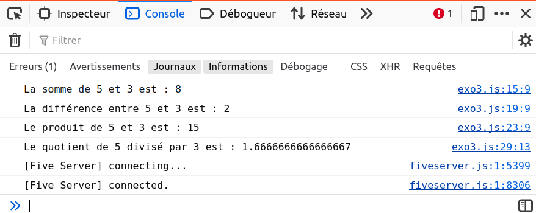
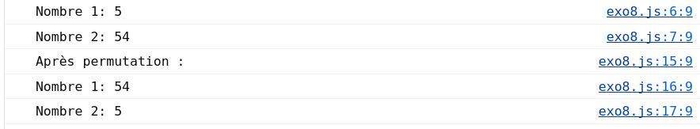
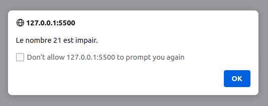

# CORRIGÉ DES EXERCICES EN JAVASCRIPT

## EXO 1 : Conditionnelles et boucles (FizzBuzz)

Écrivez une boucle qui parcourt les nombres de 1 à 100. Pour les multiples de 3, affichez `Fizz`, pour les multiples de 5, affichez `Buzz`, et pour les multiples de 3 et 5, affichez `FizzBuzz`.
    
```js
for (let i = 1; i <= 100; i++) {
    if (i % 3 === 0 && i % 5 === 0) {
        console.log('FizzBuzz');
    } else if (i % 3 === 0) {
        console.log('Fizz');
    } else if (i % 5 === 0) {
        console.log('Buzz');
    } else {
        console.log(i);
    }
}
```
Cette boucle parcourt les nombres de `1` à `100`. Elle utilise l'opérateur modulo `(%)` pour vérifier si un nombre est un multiple de `3`, de `5`, ou des `deux`. Elle affiche ensuite `Fizz`, `Buzz`, `FizzBuzz` ou le nombre lui-même selon le cas.


---
## EXO 2 : Votes municipaux

```js
// Demandez à l'utilisateur de saisir son année de naissance
// parsInt() convertit la chaîne de caractères en nombre entier
let anneeNaissance = parseInt(prompt("Veuillez entrer votre année de naissance :"));

// Calculez l'âge de l'utilisateur
let dateActuelle = new Date(); // Créez un objet Date
    
// getFullYear() renvoie l'année de la date spécifiée
let anneeActuelle = dateActuelle.getFullYear(); // Obtenez l'année actuelle
let age = anneeActuelle - anneeNaissance; // Calculez l'âge de l'utilisateur

// Vérifiez si l'utilisateur est majeur ou mineur et affichez le message correspondant
if (age >= 18) {
    alert("Vous êtes majeur, vous pouvez voter.");
} else {
    alert("Vous êtes mineur, vous ne pouvez pas voter.");
}
```
L'utilisateur est invité à entrer son année de naissance. Le programme calcule ensuite son âge en soustrayant l'année actuelle par l'année de naissance saisie. Enfin, il vérifie si l'âge est supérieur ou égal à 18 pour déterminer si l'utilisateur est majeur ou mineur et affiche un message correspondant.
La méthode `getFullYear()` est une méthode de l'objet `Date` en JavaScript. Elle est utilisée pour obtenir l'année (complète à quatre chiffres) d'une date spécifiée.


---
## EXO 3 : Addition, soustraction, multiplication et division

```js
// Déclaration des deux variables a et b
let a = 5; // vous pouvez changer cette valeur
let b = 3; // vous pouvez aussi changer cette valeur

// Calcul et affichage de la somme
let somme = a + b;
console.log("La somme de " + a + " et " + b + " est : " + somme);

// Calcul et affichage de la différence
let difference = a - b;
console.log("La différence entre " + a + " et " + b + " est : " + difference);

// Calcul et affichage du produit
let produit = a * b;
console.log("Le produit de " + a + " et " + b + " est : " + produit);

// Calcul et affichage du quotient
// Vérification que b n'est pas égal à zéro pour éviter une division par zéro
if (b !== 0) {
    let quotient = a / b;
    console.log("Le quotient de " + a + " divisé par " + b + " est : " + quotient);
} else {
    console.log("Division par zéro non autorisée.");
}
```
Ce code déclare deux variables `a` et `b`, effectue les opérations arithmétiques demandées et affiche les résultats à l'aide de `console.log()`.



---
## EXO 4 : Tableau et boucle

```js
// Déclaration du tableau contenant les jours de la semaine
let joursDeLaSemaine = ["Lundi", "Mardi", "Mercredi", "Jeudi", "Vendredi", "Samedi", "Dimanche"];

// Utilisation d'une boucle pour parcourir et afficher chaque jour
for (let i = 0; i < joursDeLaSemaine.length; i++) {
    console.log(joursDeLaSemaine[i]);
    // Si vous souhaitez utiliser alert() à la place, décommentez la ligne suivante :
    // alert(joursDeLaSemaine[i]);
}
```
Ce code déclare un tableau contenant les jours de la semaine, puis utilise une boucle `for` pour parcourir et afficher chaque jour.


---
## EXO 5 : Salutation selon l'heure

```js
// Demandez à l'utilisateur d'entrer l'heure actuelle
let heure = parseInt(prompt("Veuillez entrer l'heure actuelle (un nombre entre 0 et 23) :"));

// Vérifiez l'heure entrée et affichez le message correspondant
if (heure >= 0 && heure < 12) {
    alert("Bonjour");
} else if (heure >= 12 && heure < 18) {
    alert("Bon après-midi");
} else if (heure >= 18 && heure <= 23) {
    alert("Bonsoir");
} else {
    alert("Veuillez entrer une heure valide.");
}
```
Ce programme demande à l'utilisateur d'entrer l'heure actuelle. Ensuite, il vérifie l'heure saisie et affiche le message de salutation approprié à l'aide de conditions if et else if. Si l'utilisateur entre une heure non valide (par exemple, un nombre en dehors de la plage 0-23), le programme affiche un message d'erreur.


---
## EXO 6 : Manipulation du DOM

**Partie 1 :** Demandez à l'utilisateur d'entrer son nom et son prénom. Ensuite, le programme doit afficher le nom et le prénom de l'utilisateur dans la console ou avec `alert()`.

```js
let prenom = prompt("Veuillez entrer votre prénom :");
let nom = prompt("Veuillez entrer votre nom :");

//console.log("Prénom : " + prenom + ", Nom : " + nom);
// Si vous souhaitez utiliser alert() à la place, décommentez la ligne suivante :
alert("Prénom : " + prenom + ", Nom : " + nom);

```
Ce code demande à l'utilisateur d'entrer son nom et son prénom, puis affiche les deux dans la console.


**Partie 2 :** Utilisez JavaScript pour changer la couleur d'un paragraphe sur une page web lorsqu'on clique sur un bouton.

```js
// Option 1 : Utilisation de onclick dans le bouton
function changerCouleur() {
    // Sélectionne le paragraphe par son ID
    let paragraphe = document.getElementById("monParagraphe");
    
    // Change la couleur du paragraphe
    paragraphe.style.color = "red"; // Ici, la couleur est définie sur "red", mais vous pouvez choisir n'importe quelle autre couleur.
}

// Option 2 : en utilisant la fonction addEventListener
let bouton = document.querySelector("button");
bouton.addEventListener("click", changerCouleur); // Lorsqu'on clique sur le bouton, la fonction changerCouleur() est appelée

// Option 3 : en utilisant la fonction addEventListener
let bouton = document.querySelector("button");
let paragraphe = document.getElementById("monParagraphe");
bouton.addEventListener("click", function() {
    // Change la couleur du paragraphe
    paragraphe.style.color = "red"; // Ici, la couleur est définie sur "red", mais vous pouvez choisir n'importe quelle autre couleur.
});
```
Ce code sélectionne un élément `<p>` par son ID, puis change sa couleur en rouge lorsqu'on clique sur un bouton.


---
## EXO 7 : Formulaire simple

Partie 1 : Formulaire avec différents champs et affichage des valeurs.

```html
<form id="monFormulaire">
    Nom: <input type="text" id="nom"><br><br>
    Prénom: <input type="text" id="prenom"><br><br>
    Âge: <input type="number" id="age"><br><br>
    Adresse e-mail: <input type="email" id="email"><br><br>
    Mot de passe: <input type="password" id="password"><br><br>
    <button type="button" onclick="afficherValeurs()">Soumettre</button>
</form>
```


```js
function afficherValeurs() {
    let nom = document.getElementById("nom").value;
    let prenom = document.getElementById("prenom").value;
    let age = document.getElementById("age").value;
    let email = document.getElementById("email").value;
    let password = document.getElementById("password").value;
    
    console.log("Nom:", nom);
    console.log("Prénom:", prenom);
    console.log("Âge:", age);
    console.log("E-mail:", email);
    console.log("Mot de passe:", password);

    // Pour utiliser alert() :
    // alert("Nom: " + nom + "\nPrénom: " + prenom + "\nÂge: " + age + "\nE-mail: " + email + "\nMot de passe: " + password);
}
```


Partie 2 : Formulaire avec champ de saisie pour le nom et affichage du message de bienvenue
    
```html
<form>
    Nom: <br><input type="text" id="nomDeBienvenue">
    <button type="button" onclick="afficherBienvenue()">Afficher le message de bienvenue</button>
</form>

<h2 id="messageBienvenue"></h2>
```


```js
// Option 1 : en utilisant innerHTML
function afficherBienvenue() {
    let nom = document.getElementById("nomDeBienvenue").value;
    let message = document.getElementById("messageBienvenue");
    message.innerHTML = "Bienvenue " + nom + " !";
}

// Option 2 : en utilisant textContent
function afficherBienvenue() {
    let nom = document.getElementById("nomDeBienvenue").value;
    document.getElementById("messageBienvenue").textContent = "Bienvenue, " + nom + "!";
}

// Option 3 : en utilisant querySelector

function afficherBienvenue() {
    let nom = document.getElementById("nomDeBienvenue").value;
    document.querySelector("h2").textContent = "Bienvenue, " + nom + "!";
}
```

---
## EXO 8 : Permutation de valeurs

```js
// Demandez à l'utilisateur d'entrer les deux nombres
let nombre1 = parseFloat(prompt("Veuillez entrer le premier nombre :")); // parseFloat() convertit la chaîne de caractères en nombre décimal
let nombre2 = parseFloat(prompt("Veuillez entrer le deuxième nombre :"));

// Affichez les nombres originaux
console.log("Nombre 1: " + nombre1);
console.log("Nombre 2: " + nombre2);

// Permutez les valeurs des deux nombres

console.log("Avant permutation :");
let temp = nombre1;
nombre1 = nombre2;
nombre2 = temp;

// Affichez les nombres après permutation
console.log("Après permutation :");
console.log("Nombre 1: " + nombre1);
console.log("Nombre 2: " + nombre2);

// Si vous souhaitez utiliser alert() :
// alert("Nombres originaux :\nNombre 1: " + temp + "\nNombre 2: " + nombre2);
// alert("Après permutation :\nNombre 1: " + nombre1 + "\nNombre 2: " + nombre2);
```
Ce programme commence par demander à l'utilisateur d'entrer deux nombres. Il affiche ensuite ces nombres. Pour permuter les valeurs des deux nombres, une variable temporaire est utilisée. Enfin, les nombres permutés sont affichés.



---
## EXO 9 : Nombre de voyelles

```js
// Demandez à l'utilisateur d'entrer une chaîne de caractères
let chaine = prompt("Veuillez entrer une chaîne de caractères :");

// Fonction pour compter le nombre de voyelles dans une chaîne
function compterVoyelles(texte) {
    let count = 0; // Variable pour compter le nombre de voyelles
    let voyelles = ['a', 'e', 'i', 'o', 'u', 'y', 'A', 'E', 'I', 'O', 'U', 'Y']; // Tableau contenant les voyelles

    for (let lettre of texte) {
        if (voyelles.includes(lettre)) {
            count++;
        }
    }
    return count;
}

// Affichez le nombre de voyelles
let nombreVoyelles = compterVoyelles(chaine);
alert("Le nombre de voyelles dans la chaîne est : " + nombreVoyelles);
```

Le programme commence par demander à l'utilisateur d'entrer une chaîne de caractères. Il utilise ensuite une fonction compterVoyelles pour déterminer le nombre de voyelles dans la chaîne. Cette fonction parcourt chaque lettre de la chaîne et vérifie si elle est une voyelle en la comparant à un tableau de voyelles. Enfin, le `nombre total de voyelles` est affiché à l'utilisateur à l'aide de `alert()`.


---
## EXO 10 : Nombre pair ou impair

```js
// Demandez à l'utilisateur d'entrer un nombre entier
let nombre = parseInt(prompt("Veuillez entrer un nombre entier :"));

// Vérifiez si le nombre est pair ou impair
if (nombre % 2 === 0) {
    alert("Le nombre " + nombre + " est pair.");
} else {
    alert("Le nombre " + nombre + " est impair.");
}
```

Le programme demande à l'utilisateur d'entrer un nombre entier. Il vérifie ensuite si le reste de la division de ce nombre par 2 est égal à zéro. Si c'est le cas, cela signifie que le nombre est pair. Sinon, il est impair. Le résultat est ensuite affiché à l'utilisateur à l'aide de `alert()`.



---
## EXO 11 : Algorithmes de tri

Scénario 1 : Trier une liste de nombres
```js

// Option 1 : Utilisation de la méthode sort()
// Demandez à l'utilisateur d'entrer une liste de nombres séparés par des virgules
let liste = prompt("Veuillez entrer une liste de nombres séparés par des virgules :");

// Convertissez la chaîne de caractères en tableau
let tableau = liste.split(",");
console.log("Tableau avant tri : " + tableau);

// Triez le tableau
tableau.sort(function(a, b) {
    return a - b;
});

// Affichez le tableau trié
console.log("Tableau après tri : " + tableau);

// Option 2 : Utilisation de la méthode sort() et de la fonction fléchée (arrow function) ES6 
let nombres = prompt("Veuillez entrer une liste de nombres séparés par des virgules:");
let tableauNombres = nombres.split(',').map(Number).sort((a, b) => a - b);
alert("Nombres triés par ordre croissant : " + tableauNombres.join(', '));
```


Scénario 2 : Trier une liste de noms
```js
// Demandez à l'utilisateur d'entrer une liste de noms séparés par des virgules
let liste = prompt("Veuillez entrer une liste de noms séparés par des virgules :");

// Convertissez la chaîne de caractères en tableau
let tableau = liste.split(",");
console.log("Tableau avant tri : " + tableau);

// Triez le tableau
tableau.sort();

// Affichez le tableau trié
console.log("Tableau après tri : " + tableau);

// Option 2 : Utilisation de la méthode sort() et de la fonction fléchée (arrow function) ES6
let noms = prompt("Veuillez entrer une liste de noms séparés par des virgules:");
let tableauNoms = noms.split(',').sort((a, b) => a.localeCompare(b));
alert("Noms triés par ordre alphabétique : " + tableauNoms.join(', '));

// Option 3 : Utilisation de la méthode map(), sort() et de la fonction fléchée (arrow function) ES6
let noms = prompt("Veuillez entrer une liste de noms séparés par des virgules:");
let tableauNoms = noms.split(',').map(nom => nom.trim()).sort();
alert("Noms triés par ordre alphabétique : " + tableauNoms.join(', '));
```


Scénario 3 : Trouver le plus grand nombre dans une liste
```js
Option 1 : Utilisation de la méthode Math.max()
// Demandez à l'utilisateur d'entrer une liste de nombres séparés par des virgules 

let liste = prompt("Veuillez entrer une liste de nombres séparés par des virgules :");

// Convertissez la chaîne de caractères en tableau
let tableau = liste.split(",");
console.log("Tableau : " + tableau);

// Trouvez le plus grand nombre dans le tableau
let max = Math.max(...tableau);
console.log("Le plus grand nombre est : " + max);

// Option 2 : Utilisation de la méthode Math.max() et de map()

let nombres = prompt("Veuillez entrer une liste de nombres séparés par des virgules:");
let tableauNombres = nombres.split(',').map(Number);
let plusGrandNombre = Math.max(...tableauNombres);
alert("Le plus grand nombre est : " + plusGrandNombre);

// Option 3 : Utilisation d'une boucle for
let liste = prompt("Veuillez entrer une liste de nombres séparés par des virgules :");
let tableau = liste.split(",");
console.log("Tableau : " + tableau);

let max = tableau[0];
for (let i = 1; i < tableau.length; i++) {
    if (tableau[i] > max) {
        max = tableau[i];
    }
}
```


Voici comment cela fonctionne :

1. Pour chaque scénario, l'utilisateur est invité à entrer une liste de nombres ou de noms séparés par des virgules.
2. La chaîne entrée est ensuite divisée en un tableau à l'aide de la méthode `split()`.
3. Selon les besoins du scénario, le tableau est trié ou le maximum est trouvé.
4. Enfin, le résultat est affiché à l'utilisateur à l'aide de `alert()`.

