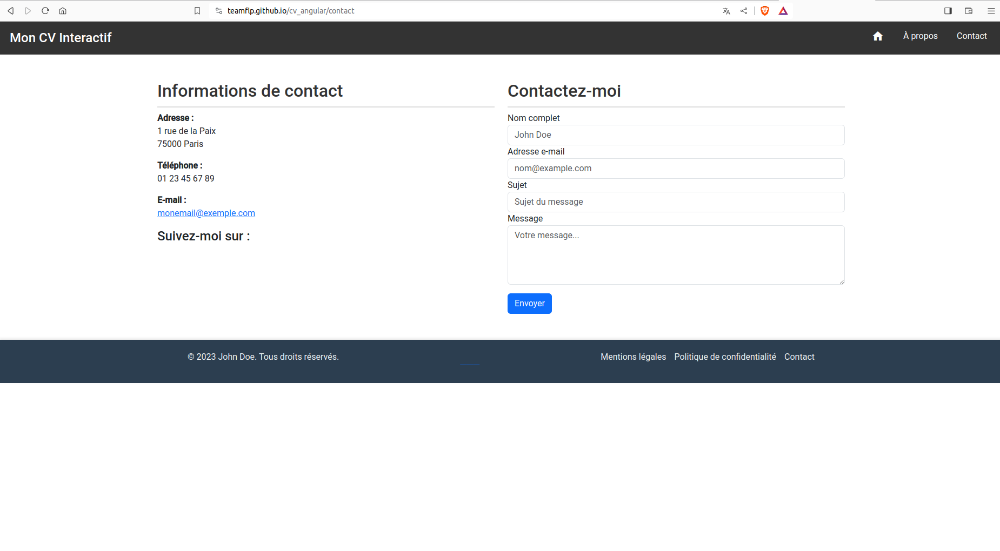

# Apprendre le framework Angular


Auteur : [Paterne Guélablé Gnonzion](https://gnpinformatique.fr)

Formateur développeur web et mobile : **PHP, Symfony, Rust ...**

Linkedin: [Paterne G. G.](https://www.linkedin.com/in/gnpinformatique/)

Github : [teamflp](https://github.com/teamflp)


## Procédure pour utiliser ce cours

Bienvenue à ce cours sur le TypeScript ! Pour tirer le meilleur parti de ce contenu et acquérir une compréhension solide de la matière, suivez les étapes recommandées ci-dessous.

Bienvenue à ce cours sur le `JavaScript` ! Pour tirer le meilleur parti de ce contenu et acquérir une compréhension solide de la matière, suivez les étapes recommandées ci-dessous.

1. **Préparation** :

- Assurez-vous d'avoir les prérequis : connaissance basique du HTML et CSS.
- Installez un bon éditeur de code (comme [Visual Studio Code](https://code.visualstudio.com/)).
- Configurez un navigateur moderne pour les tests (Chrome, Firefox, Safari, etc.).

2. **Étude systématique** :

- Commencez par l'**introduction** pour comprendre le contexte du `TypeScript`.

- Commencez par l'**introduction** pour comprendre le contexte du `JavaScript`.

- Poursuivez avec les **bases** avant de passer aux concepts avancés.
- Ne sautez pas de sections. Chaque partie est conçue pour s'appuyer sur la précédente.

3. **Pratiquez régulièrement** :

- Après chaque section, prenez le temps de coder et de tester ce que vous avez appris.
- Utilisez les exemples fournis et essayez de les modifier ou de les améliorer.

4. **Participez à des discussions** :

- Rejoignez des forums ou des groupes dédiés au JavaScript pour poser des questions, partager vos connaissances ou aider d'autres apprenants.

- Rejoignez des forums ou des groupes dédiés au `JavaScript` pour poser des questions, partager vos connaissances ou aider d'autres apprenants.

- Partager vos réalisations ou vos défis vous permettra d'obtenir des retours constructifs.

5. **Consultez des ressources supplémentaires** :

- Explorez les **ressources et outils** mentionnés à la fin du cours pour approfondir vos connaissances et améliorer vos compétences.

6. **Mettez en pratique** :

- Essayez de créer un petit projet web à partir de zéro, en appliquant tout ce que vous avez appris.
- Cela renforcera votre compréhension et vous donnera une idée des domaines dans lesquels vous pourriez avoir besoin de plus d'entraînement.

7. **Revenez régulièrement** :

- La technologie et les normes évoluent. Revenez périodiquement pour mettre à jour vos connaissances ou rafraîchir certains concepts.

8. **Évaluez vos progrès** :

- Testez régulièrement vos connaissances. Cela peut être à travers des quiz en ligne, des défis de codage ou des revues de code avec des pairs.

Bonne étude ! Rappelez-vous que l'apprentissage est un voyage, et chaque étape vous rapproche de la maîtrise du JavaScript.

---

<!-- TOC -->
* [Apprendre le framework Angular](#apprendre-le-framework-angular)
  * [Procédure pour utiliser ce cours](#procédure-pour-utiliser-ce-cours)
  * [Introduction à Angular](#introduction-à-angular)
    * [Historique et contexte](#historique-et-contexte)
    * [Avantages et inconvenients d'Angular](#avantages-et-inconvenients-dangular)
      * [Avantages](#avantages)
      * [Inconvénients](#inconvénients)
    * [Comparaison avec d'autres frameworks/front-end](#comparaison-avec-dautres-frameworksfront-end)
    * [Quand utiliser Angular?](#quand-utiliser-angular)
  * [Installation et Configuration](#installation-et-configuration)
    * [Prérequis (Node.js, npm)](#prérequis-nodejs-npm)
    * [Installation du CLI Angular](#installation-du-cli-angular)
    * [Création d'une nouvelle application Angular](#création-dune-nouvelle-application-angular)
  * [Architecture d'Angular](#architecture-dangular)
    * [Modules](#modules)
    * [Composants](#composants)
    * [Services](#services)
    * [Directives](#directives)
  * [Les Composants](#les-composants)
    * [Structure et cycle de vie](#structure-et-cycle-de-vie)
    * [Templates et styles](#templates-et-styles)
    * [Communication entre composants (Input/Output)](#communication-entre-composants-inputoutput)
  * [Services et Injection de dépendances](#services-et-injection-de-dépendances)
    * [Création de services](#création-de-services)
    * [Providers et injection](#providers-et-injection)
    * [Singleton et portée](#singleton-et-portée)
  * [Routing](#routing)
    * [Configuration des routes](#configuration-des-routes)
    * [Navigation entre routes](#navigation-entre-routes)
    * [Guardiens de route (Route Guards)](#guardiens-de-route-route-guards)
  * [Forms](#forms)
    * [Forms Template-driven](#forms-template-driven)
    * [Forms Reactive](#forms-reactive)
  * [Directives](#directives-1)
    * [Directives structurelles (NgFor, NgIf)](#directives-structurelles-ngfor-ngif)
    * [Directives attributaires (NgClass, NgStyle)](#directives-attributaires-ngclass-ngstyle)
    * [Directives attributaires (NgClass, NgStyle)](#directives-attributaires-ngclass-ngstyle-1)
  * [HTTP et Communication avec les API](#http-et-communication-avec-les-api)
    * [Le service HttpClient](#le-service-httpclient)
    * [Interception et gestion des erreurs](#interception-et-gestion-des-erreurs)
    * [Observable et RxJS](#observable-et-rxjs)
  * [Pipes](#pipes)
    * [Utilisation des pipes prédéfinis](#utilisation-des-pipes-prédéfinis)
    * [Création de pipes personnalisés](#création-de-pipes-personnalisés)
  * [Tests et Debugging](#tests-et-debugging)
    * [Tests unitaires avec Jasmine et Karma](#tests-unitaires-avec-jasmine-et-karma)
    * [Tests d'intégration](#tests-dintégration)
    * [Debugging avec Angular DevTools](#debugging-avec-angular-devtools)
  * [Optimisation et Performance](#optimisation-et-performance)
    * [Change Detection et stratégies](#change-detection-et-stratégies)
    * [Lazy Loading](#lazy-loading)
    * [Ahead-of-Time (AOT) Compilation : Compilation anticipée](#ahead-of-time-aot-compilation--compilation-anticipée)
  * [Ajout de libraries tierces : Angular Material, Bootstrap, JQuery, FontAwesome etc](#ajout-de-libraries-tierces--angular-material-bootstrap-jquery-fontawesome-etc)
    * [Installation de bibliothèques tierces](#installation-de-bibliothèques-tierces)
    * [Ajout de bibliothèques tierces globales](#ajout-de-bibliothèques-tierces-globales)
    * [Ajoutons les icônes de FontAwesome, JQuery et Bootstrap](#ajoutons-les-icônes-de-fontawesome-jquery-et-bootstrap)
      * [Ajout de FontAwesome](#ajout-de-fontawesome)
      * [Ajout de Bootstrap](#ajout-de-bootstrap)
      * [Ajout de JQuery](#ajout-de-jquery)
      * [Installer ces librairie en une seule commande](#installer-ces-librairie-en-une-seule-commande)
    * [Comment installer et utiliser les icons Material Design ?](#comment-installer-et-utiliser-les-icons-material-design-)
  * [Internationalisation (i18n)](#internationalisation-i18n)
    * [Configuration de l'internationalisation](#configuration-de-linternationalisation)
  * [Déploiement](#déploiement)
    * [Build et packaging](#build-et-packaging)
    * [Déploiement sur différents serveurs (Firebase, Vercel, etc.)](#déploiement-sur-différents-serveurs-firebase-vercel-etc)
  * [Bonnes pratiques et conventions](#bonnes-pratiques-et-conventions)
    * [Style guide officiel](#style-guide-officiel)
    * [Organisation du code et modularité](#organisation-du-code-et-modularité)
  * [Évolution et avenir d'Angular](#évolution-et-avenir-dangular)
    * [Mises à jour et migration](#mises-à-jour-et-migration)
    * [Angular Universal et Server Side Rendering (SSR)](#angular-universal-et-server-side-rendering-ssr)
  * [Projet pratique](#projet-pratique)
  * [Conclusion](#conclusion)
  * [Ressources et liens utiles](#ressources-et-liens-utiles)
    * [Ressources officielles](#ressources-officielles)
    * [Tutoriels et guides](#tutoriels-et-guides)
    * [Communauté et support](#communauté-et-support)
  * [Références](#références)
<!-- TOC -->

---

## Introduction à Angular

Angular est un framework MVC (Modèle-Vue-Contrôleur) qui permet de créer des applications web dynamiques et réactives. Il est utilisé par de nombreuses entreprises et organisations, notamment Google, Microsoft, Apple, PayPal, Upwork, AWS, IBM, Adobe, Nike, etc. Il a été développé et est maintenu par Google.

Angular s'exécute dans le navigateur et est chargé de gérer l'interface utilisateur (UI) de l'application. Il est également possible d'utiliser Angular pour créer des applications mobiles et de bureau, mais ce n'est pas son objectif principal.

Angular est basé sur TypeScript, un langage de programmation open source développé par Microsoft. TypeScript est un sur-ensemble de JavaScript qui ajoute des fonctionnalités supplémentaires au langage, notamment le typage statique, la programmation orientée objet et la compilation.

### Historique et contexte

Angular n'est pas à confondre avec AngularJS, qui est la première version du framework. Lancé en 2010, AngularJS a rapidement gagné en popularité en raison de sa capacité à étendre le vocabulaire HTML pour les applications web, rendant ainsi le développement plus expressif, lisible et rapide. Cependant, en raison de défis liés à la performance et d'autres problématiques, l'équipe Angular a décidé de réécrire complètement le framework, résultant en la naissance d'Angular (parfois appelé "Angular 2+"), qui a été présenté en 2016.

### Avantages et inconvenients d'Angular

#### Avantages

1. **Modularité** : Angular est construit autour de l'idée de modularité. Les applications sont constituées de modules, ce qui rend le code plus organisé et réutilisable.

2. **Performance** : Grâce à des techniques telles que l'AoT (Ahead-of-Time) Compilation et le changement de détection, Angular offre des performances impressionnantes pour les applications de grande et moyenne envergure.

3. **Outils puissants** : Avec le `CLI Angular` (Command Line Interface), les développeurs peuvent rapidement initialiser, développer, et déployer des applications.

4. **Support et écosystème** : Étant soutenu par Google, Angular bénéficie d'un support solide, d'une grande communauté et d'une multitude de ressources d'apprentissage.

5. **Intégration facile** : Angular s'intègre facilement avec diverses bibliothèques ou outils, comme Material Design, NgRx, et plus.

#### Inconvénients

- **Courbe d'apprentissage** : Contrairement à d'autres bibliothèques ou cadres, Angular peut sembler complexe pour les débutants. Sa structure modulaire, son utilisation des observables (avec RxJS), et certains de ses concepts, comme les directives, peuvent nécessiter du temps pour être pleinement compris.

- **Taille du Bundle** : Bien qu'Angular ait des outils pour aider à réduire la taille des bundles, les applications Angular peuvent devenir volumineuses, surtout si elles ne sont pas correctement optimisées. Cela peut influer sur les temps de chargement des pages.

- **Complexité pour des applications simples** : Pour des projets plus simples, Angular pourrait être perçu comme "trop lourd" ou "overkill". Des solutions plus légères comme Vue.js ou React pourraient être plus appropriées pour des applications web simples ou des sites web statiques.

- **Migration** : Les mises à jour majeures peuvent parfois introduire des changements qui nécessitent des modifications dans le code existant. Même si l'équipe Angular fournit des guides de mise à jour, le processus peut parfois être laborieux, en particulier pour les grandes applications.

- **Performance pour certaines utilisations** : Bien qu'Angular soit optimisé pour la plupart des scénarios courants, il peut y avoir des cas où la détection de changements, en particulier dans les applications avec de nombreux composants ou des mises à jour fréquentes, peut affecter les performances.

- **Verbosité** : Angular nécessite parfois plus de code pour accomplir des tâches simples, en particulier lorsqu'on le compare à d'autres frameworks comme React ou Vue.

- **Dépendance à RxJS** : Bien que RxJS (bibliothèque pour travailler avec des observables) soit puissant, il ajoute une autre courbe d'apprentissage. Ceux qui ne sont pas familiers avec les concepts réactifs peuvent trouver cela déroutant.

La perception des inconvénients peut varier selon les développeurs. Certains peuvent considérer certains aspects comme des défis, tandis que d'autres peuvent les voir comme des obstacles. De plus, avec l'évolution constante de la technologie, certains de ces points pourraient être atténués dans les futures versions d'Angular.

### Comparaison avec d'autres frameworks/front-end

**Angular**

- Nature : Framework complet offrant une solution globale (y compris HTTP, formulaires, etc.)
- Taille : Peut être volumineux, bien que des outils soient disponibles pour l'optimisation.
- Performance : Solide pour les applications à grande échelle; la détection de changement peut nécessiter des optimisations dans de grandes applications.
- Apprentissage : Courbe d'apprentissage plus raide, surtout avec RxJS.
- Écosystème : Riche, avec de nombreux outils et extensions disponibles.
- Soutien : Soutenu par Google.

**React**

- Nature : Bibliothèque pour la création d'interfaces utilisateurs; nécessite des solutions tierces pour le routage, la gestion de l'état, etc.
- Taille : Plus léger qu'Angular en termes de taille de base.
- Performance : Très performant, grâce à son algorithme de réconciliation virtuel DOM.
- Apprentissage : Courbe d'apprentissage modérée, JSX peut être nouveau pour certains.
- Écosystème : Extrêmement riche avec une vaste communauté; de nombreuses bibliothèques tierces disponibles.
- Soutien: Soutenu par Facebook.

**Vue.js**

- Nature : Framework progressif; l'utilisateur peut choisir de n'inclure que les parties qu'il utilise.
- Taille : Très léger, offrant une bonne performance pour sa taille.
- Performance : Comparable à React en termes de performance grâce à son système de réactivité et son Virtual DOM.
- Apprentissage : Courbe d'apprentissage douce; syntaxe simple et claire.
- Écosystème : En croissance rapide avec une communauté active; l'écosystème est moins mature que React ou Angular, mais est très solide.
- Soutien : Développé par une équipe d'indépendants, mais avec un support solide de la communauté.

### Quand utiliser Angular?

Angular est particulièrement adapté aux applications web complexes et de grande envergure, telles que les applications d'entreprise, les plateformes SaaS ou les applications nécessitant une performance élevée. Cependant, pour des projets plus simples ou des sites web statiques, d'autres solutions pourraient être plus adaptées.

## Installation et Configuration

Pour démarrer avec Angular, il est nécessaire de passer par quelques étapes préliminaires pour mettre en place l'environnement de développement. Dans cette section, nous allons voir comment installer et configurer Angular sur votre machine.

### Prérequis (Node.js, npm)

Avant d'installer Angular, il y a certains prérequis que vous devez avoir sur votre machine.

1. **Node.js** : Angular nécessite Node.js pour exécuter les scripts qui permettent de gérer et d'exécuter votre application.
Pour installer`Node.js`, rendez-vous sur le site [officiel de Node.js](https://nodejs.org/) et téléchargez la dernière version stable (LTS).
Une fois l'installation terminée, vous pouvez vérifier la version de Node.js installée avec la commande :

```bash
node -v
```

2. **npm (Node Package Manager)** : Il est généralement installé avec Node.js. Il s'agit d'un gestionnaire de paquets qui vous permettra d'installer des bibliothèques, des outils et des frameworks pour vos projets.
Pour vérifier la version de npm installée, utilisez la commande :

```bash
npm -v
```

### Installation du CLI Angular

`Angular CLI` est un outil en ligne de commande qui vous permet de créer et gérer des applications Angular. C'est l'outil recommandé pour la création d'applications Angular.
Pour installer Angular CLI, ouvrez un terminal ou une invite de commandes et tapez :

```bash
npm install -g @angular/cli
```

La commande **`-g`** signifie que vous installez Angular CLI globalement sur votre machine. Une fois l'installation terminée, vous pouvez vérifier la version d'Angular CLI avec :

```bash
ng version
```

### Création d'une nouvelle application Angular

Après avoir installé Angular CLI, la création d'une nouvelle application Angular est simple.

1. Dans votre terminal ou invite de commandes, naviguez vers l'endroit où vous souhaitez créer votre projet.
2. Tapez la commande suivante :

```bash
ng new nom-de-votre-application
```

Par exemple, pour une application nommée `mon-app`, la commande serait :

```bash
ng new mon-app
```

1. `Angular CLI` vous posera quelques questions concernant les fonctionnalités à inclure, comme le routage ou les styles (CSS, SCSS, etc.). Sélectionnez les options souhaitées.
2. Une fois la création terminée, naviguez dans le répertoire de votre nouvelle application :

```bash
cd mon-app
```

Pour lancer l'application, utilisez la commande :

```bash
ng serve
```

`ng serve` lance le serveur de développement et surveille les modifications apportées au code.

Pour arrêter le serveur, utilisez la combinaison de touches `Ctrl + C`.

Ouvrez un navigateur et rendez-vous à [http://localhost:4200/](http://localhost:4200/). Vous devriez voir l'application Angular par défaut s'afficher.


Avec ces étapes, vous avez maintenant un environnement de développement Angular opérationnel et une nouvelle application prête à être développée!

## Architecture d'Angular

Angular est construit autour de certaines idées clés qui définissent son architecture. Ces éléments s'imbriquent les uns dans les autres pour former la structure d'une application Angular.

### Modules

Dans Angular, les modules sont le moyen de segmenter une application en blocs logiques distincts. Chaque module peut encapsuler des fonctionnalités spécifiques de votre application.

- **NgModule** : Toutes les applications Angular ont au moins un module, le module racine, généralement nommé AppModule. Ce module est décoré avec @NgModule.

- **Fonction** : Les modules déclarent quels composants, directives et pipes appartiennent à l'application. Ils permettent également d'importer des fonctionnalités d'autres modules.

- **Lazily-loaded modules** : Les modules peuvent également être chargés "paresseusement", c'est-à-dire qu'ils ne sont chargés qu'à la demande pour améliorer les performances.

### Composants

Un composant contrôle une partie de l'écran appelée vue. Une application Angular est composée d'un arbre de composants imbriqués.

- **Décoration `@Component`** : Pour définir un composant, on utilise le décorateur `@Component` qui permet de spécifier différentes propriétés du composant comme son template, son style et son sélecteur.

- **Life-cycle hooks** : Les composants ont un cycle de vie, Angular vous permet d'exécuter du code à des moments clés du cycle de vie d'un composant, comme sa création ou sa destruction.

### Services

Les services sont des classes qui encapsulent des logiques métier ou des interactions avec des API. Ils peuvent être injectés dans des composants et d'autres services grâce au système d'injection de dépendances d'Angular, permettant une meilleure modularité et réutilisabilité du code.

- **Décoration `@Injectable`** : Bien que ce ne soit pas toujours nécessaire, marquer une classe avec `@Injectable` garantit qu'elle peut être injectée dans d'autres parties de votre application.

- **Singletons** : Par défaut, les services sont des singletons. Lorsqu'un service est fourni à l'application, une seule instance de ce service est créée et partagée.

### Directives

Les directives sont des scripts qui permettent de modifier le comportement des éléments du `DOM`. Angular a trois types de directives :

1. **Directives de composants** : Ce sont des directives avec un template. Ce sont essentiellement les composants que nous avons déjà abordés.

2. **Directives structurelles** : Ces directives modifient la structure du `DOM` en ajoutant/en supprimant des éléments. Exemples : `*ngFor` et `*ngIf`.

3. **Directives d'attribut** : Elles modifient l'apparence ou le comportement d'un élément, d'un composant ou d'une autre directive. Par exemple, la directive `ngStyle`.

En comprenant ces éléments clés et comment ils interagissent, vous aurez une solide base pour architecturer et développer des applications robustes avec Angular.

                mon-application/
                |-- node_modules/
                |-- src/
                |   |-- app/
                |   |   |-- components/
                |   |   |-- services/
                |   |   |-- models/
                |   |   |-- app-routing.module.ts
                |   |   |-- app.component.css
                |   |   |-- app.component.html
                |   |   |-- app.component.spec.ts
                |   |   |-- app.component.ts
                |   |   |-- app.module.ts
                |   |-- assets/
                |   |-- environments/
                |   |   |-- environment.prod.ts
                |   |   |-- environment.ts
                |   |-- index.html
                |   |-- main.ts
                |   |-- polyfills.ts
                |   |-- styles.css
                |   |-- test.ts
                |-- angular.json
                |-- .editorconfig
                |-- .gitignore
                |-- karma.conf.js
                |-- package-lock.json
                |-- package.json
                |-- README.md
                |-- tsconfig.app.json
                |-- tsconfig.json
                |-- tsconfig.spec.json
                |-- tslint.json

Explication des fichiers et dossiers :

- **node_modules** : Contient les dépendances de l'application.
- **src** : Contient le code source de l'application.
  - **app** : Contient les composants, services, modèles et autres éléments de l'application.
  - **assets** : Contient les fichiers statiques comme les images, les polices, etc.
  - **environments** : Contient les fichiers de configuration pour différents environnements (dev, prod, etc.).
    - **environment.prod.ts** : Fichier de configuration pour l'environnement de production.
    - **environment.ts** : Fichier de configuration pour l'environnement de développement.
  - **index.html** : Fichier HTML principal de l'application.
  - **main.ts** : Point d'entrée de l'application.
  - **polyfills.ts** : Fichier de polyfills pour les navigateurs plus anciens.
  - **styles.css** : Fichier CSS global.
  - **test.ts** : Point d'entrée pour les tests.
- **angular.json** : Fichier de configuration pour Angular CLI.
- **.editorconfig** : Fichier de configuration pour les éditeurs de code.
- **.gitignore** : Fichier pour ignorer les fichiers/dossiers dans Git.
- **karma.conf.js** : Fichier de configuration pour Karma.
- **package-lock.json** : Fichier de verrouillage des dépendances.
- **package.json** : Fichier de configuration pour npm.
- **README.md** : Fichier README.
- **tsconfig.app.json** : Fichier de configuration TypeScript pour l'application.
- **tsconfig.json** : Fichier de configuration TypeScript global.
- **tsconfig.spec.json** : Fichier de configuration TypeScript pour les tests.
- **tslint.json** : Fichier de configuration pour TSLint.

## Les Composants

Les composants sont au cœur d'Angular et représentent les éléments fondamentaux pour construire des applications Angular. Un composant est responsable de la vue (avec son HTML, CSS) et de la logique associée à cette vue.

### Structure et cycle de vie

Chaque composant Angular a une structure définie qui se compose de :

- **Classe** : Contient la logique pour le composant, des propriétés pour les données et des méthodes pour manipuler ces données.
- **Template** : Le code HTML qui représente la vue du composant.
- **Métadonnées** : Informations sur le composant, notamment ses sélecteurs, ses templates et d'autres configurations.

Un composant Angular a également un cycle de vie bien défini, avec plusieurs hooks (points d'ancrage) qui permettent d'exécuter du code à différents moments de ce cycle de vie. Quelques-uns de ces hooks incluent:

- **`ngOnInit()`** : Appelé après que les propriétés liées aux données d'un composant ont été initialisées.
- **`ngOnChanges()`** : Appelé chaque fois qu'une propriété liée aux données change.
- **`ngOnDestroy()`** : Appelé juste avant qu'Angular détruise le composant.

### Templates et styles

Le **template** d'un composant est essentiellement le code HTML qui représente la vue du composant. Vous pouvez le définir directement dans le fichier du composant à l'aide de la propriété template ou le mettre dans un fichier externe et le lier via la propriété `templateUrl`.

De même, les `styles` peuvent être définis directement dans le fichier du composant à l'aide de la propriété `styles` ou mis dans un fichier externe et lié via `styleUrls`.

### Communication entre composants (Input/Output)

La communication entre les composants est un aspect crucial de toute application Angular.

- `Input` : Si un composant parent souhaite transmettre des données à un composant enfant, il utilise la propriété Input du composant enfant. À l'intérieur du composant enfant, nous déclarons une propriété avec le décorateur `**@Input()**` pour la recevoir.

```typescript
@Component({...})
export class EnfantComponent {
  @Input() data: any;
}
```

Dans le template du composant parent, nous pouvons lier une valeur à cette propriété d'entrée.

```html
<app-enfant [data]="valeurDuParent"></app-enfant>
```

- `Output` : Si un composant enfant souhaite transmettre des données à un composant parent, il utilise la propriété Output du composant parent. À l'intérieur du composant enfant, nous déclarons une propriété avec le décorateur `**@Output()**` pour l'émettre. Nous devons également utiliser un EventEmitter pour émettre des événements.

```typescript
@Component({...})
export class EnfantComponent {
  @Output() monEvenement = new EventEmitter<any>();

  declencherEvenement() {
    this.monEvenement.emit('Des données de l'enfant');
  }
}
```

Dans le template du composant parent, nous pouvons écouter cet événement.

```html
<app-enfant (monEvenement)="traiterEvenement($event)"></app-enfant>
```

Et dans le fichier TypeScript du composant parent, nous pouvons définir la méthode traiterEvenement(data).

## Services et Injection de dépendances

Dans Angular, les services sont principalement utilisés pour séparer la logique métier des composants, fournir des fonctionnalités réutilisables à travers différentes parties de l'application, et gérer les états et les interactions avec des données. L'injection de dépendances (ID) est un motif de conception dans lequel une classe reçoit ses dépendances d'une source externe plutôt que de les créer elle-même. Angular a un système d'ID puissant intégré.

### Création de services

Pour créer un service dans Angular, vous pouvez utiliser le CLI (Command-Line Interface) d'Angular :

```bash
ng generate service nom-du-service
```

ou la forme abrégée :

```bash
ng g s nom-du-service
```

Cela génère un fichier de service avec une structure de base. Par exemple, pour un service nommé `data`, cela ressemblerait à :

```typescript
import { Injectable } from '@angular/core';

@Injectable({
  providedIn: 'root'
})
export class DataService {

  constructor() { }

}
```

Le décorateur `@Injectable()` indique qu'il s'agit d'un service qui peut avoir ses propres dépendances injectées.

### Providers et injection

Le système d'injection de dépendances d'Angular est basé sur le concept de fournisseurs (`providers`). Les fournisseurs déclarent comment obtenir ou créer une instance d'un service.

Si vous déclarez le service avec `providedIn: 'root`' comme ci-dessus, Angular garantit qu'une seule instance du service est fournie dans toute l'application (`singleton`). Si vous souhaitez fournir le service seulement dans un module ou composant spécifique, retirez `providedIn` et ajoutez le service au tableau providers de ce module ou composant.

Pour injecter un service dans un composant, une directive ou un autre service, utilisez le constructeur :

```typescript
constructor(private dataService: DataService) { }
```

Avec cette syntaxe, Angular sait qu'il doit fournir une instance du DataService à votre composant dès sa création.

### Singleton et portée

Un singleton est une instance unique d'une classe. En Angular, lorsque vous fournissez un service au niveau root (par exemple, avec `providedIn: 'root'`), Angular garantit que vous obtenez une instance unique de ce service, partagée entre tous les composants et services qui l'injectent.

Si vous ajoutez un service aux providers d'un module spécifique ou d'un composant, une nouvelle instance du service sera créée pour ce module ou composant. Si plusieurs composants du même module injectent ce service, ils partageront la même instance de ce service. Cependant, d'autres modules ou composants extérieurs à ce module auront leurs propres instances du service.

Cela peut être utile si vous avez besoin de conserver des états différents dans différentes parties de votre application. Cependant, la plupart du temps, un singleton est préférable car il offre un moyen cohérent de gérer les états et les données à travers l'application.

## Routing

Le système de routage d'Angular permet de naviguer d'une vue à l'autre à mesure que les utilisateurs effectuent des tâches dans votre application. C'est essentiel pour construire des applications monopages (SPA).

### Configuration des routes

- **path**: une chaîne de caractères qui représente l'URL de la route.

- **component**: le composant qui doit être affiché lorsque cette route est activée.
Exemple :

```typescript
import { NgModule } from '@angular/core';
import { RouterModule, Routes } from '@angular/router';
import { HomeComponent } from './home/home.component';
import { AboutComponent } from './about/about.component';

const routes: Routes = [
  { path: '', redirectTo: '/home', pathMatch: 'full' },
  { path: 'home', component: HomeComponent },
  { path: 'about', component: AboutComponent },
];

@NgModule({
  imports: [RouterModule.forRoot(routes)],
  exports: [RouterModule]
})
export class AppRoutingModule { }
```

Dans cet exemple, nous avons trois routes : une route par défaut qui redirige vers `/home`, et deux routes pour les composants `HomeComponent` et `AboutComponent`.

### Navigation entre routes

1. Pour naviguer entre les routes, utilisez le composant `<router-outlet></router-outlet>` dans votre template. C'est l'endroit où les composants de route seront affichés.

2. Pour créer des liens entre vos routes, utilisez la directive `routerLink`. Par exemple :

```html
<a routerLink="/home">Accueil</a>
<a routerLink="/about">À propos</a>
```

Pour une navigation programmatique, injectez le service Router dans votre composant et utilisez la méthode navigate :

```typescript
constructor(private router: Router) {}

navigateToHome() {
  this.router.navigate(['/home']);
}
```

### Guardiens de route (Route Guards)

Les "`Route Guards`" sont utilisés pour protéger l'accès à certaines routes. Ils peuvent déterminer si une route peut être activée, désactivée, chargée, etc.

Voici un exemple simple de Route Guard qui vérifie si un utilisateur est connecté :

```typescript
import { Injectable } from '@angular/core';
import { CanActivate, ActivatedRouteSnapshot, RouterStateSnapshot, Router } from '@angular/router';

@Injectable({
  providedIn: 'root'
})
export class AuthGuard implements CanActivate {

  constructor(private router: Router) {}

  canActivate(
    next: ActivatedRouteSnapshot,
    state: RouterStateSnapshot): boolean {
      // On remplace cette logique par une vérification d'authentification réelle
      const isLoggedIn = false; 
      
      if (isLoggedIn) {
        return true;
      } else {
        this.router.navigate(['/login']);
        return false;
      }
  }
}
```

Pour utiliser ce `guard`, ajoutez-le à la propriété canActivate de votre configuration de route :

```typescript
{ path: 'protected-route', component: ProtectedComponent, canActivate: [AuthGuard] }
```

Il existe différents types de guards, tels que :

- **CanActivate** : Vérifie si une route peut être activée.
- **CanDeactivate** : Vérifie si une route peut être désactivée.
- **CanLoad** : Vérifie si un module peut être chargé de manière paresseuse (lazy-loaded).
- `Resolve` : Effectue des opérations avant que la route ne soit activée.
- **CanActivateChild** : Vérifie si les enfants d'une route peuvent être activés.
Chacun de ces guards est utilisé pour un scénario différent et peut aider à sécuriser et améliorer l'expérience utilisateur dans votre application Angular.

## Forms

Angular offre deux approches principales pour gérer les formulaires : les formulaires pilotés par des templates (`Template-driven`) et les formulaires réactifs (`Reactive Forms`). Chaque approche a ses propres avantages et utilisations recommandées.

### Forms Template-driven

Les formulaires pilotés par des templates (`Template-driven`) sont plus faciles à mettre en place et à utiliser. Ils se basent principalement sur la logique définie dans le template. Ils sont plus adaptés pour des scénarios simples et des formulaires moins dynamiques.

Caractéristiques principales :

- La logique du formulaire est principalement gérée dans le template.
- Ils utilisent des directives telles que ngModel pour la liaison bidirectionnelle.
- Moins de code côté TypeScript, mais plus de code côté template.
- Plus facile à mettre en place pour des scénarios simples.
Exemple :

Dans le template :

```html
<form #f="ngForm" (ngSubmit)="onSubmit(f)">
  <input type="text" name="name" ngModel>
  <button type="submit">Submit</button>
</form>
```

Dans le composant :

```typescript
onSubmit(form: NgForm) {
  console.log(form.value);
}
```

### Forms Reactive

Les formulaires `réactifs`, comme leur nom l'indique, sont basés sur une approche réactive à l'aide de la bibliothèque `RxJS`. Ils sont plus adaptés pour des scénarios complexes, des validations dynamiques, ou lorsque le modèle de données change fréquemment.

Caractéristiques principales :

- La logique du formulaire est principalement gérée dans le code TypeScript.
- Utilise des classes telles que FormControl, FormGroup, et FormArray pour définir la structure et la logique du formulaire.
- Les validations sont également définies côté TypeScript.
- Plus de contrôle, plus dynamique et plus testable.
Exemple :

Dans le composant :

```typescript
import { FormBuilder, FormGroup } from '@angular/forms';

export class MyComponent implements OnInit {
  myForm: FormGroup;

  constructor(private fb: FormBuilder) {}

  ngOnInit() {
    this.myForm = this.fb.group({
      name: ['']
    });
  }

  onSubmit() {
    console.log(this.myForm.value);
  }
}
```

Dans le template :

```html
<form [formGroup]="myForm" (ngSubmit)="onSubmit()">
  <input type="text" formControlName="name">
  <button type="submit">Submit</button>
</form>
```

Comparaison :

- **Complexité** : Les formulaires réactifs sont généralement plus complexes que les formulaires pilotés par des templates, mais ils offrent plus de flexibilité et de contrôle.

- **Réactivité** : Les formulaires réactifs, comme leur nom l'indique, tirent pleinement parti de la programmation réactive, ce qui facilite la réactivité aux changements de données et la composition de différentes opérations sur les données du formulaire.

- **Testabilité** : Les formulaires réactifs sont généralement plus testables car la logique est contenue dans le code et non dans le template.

- **Validation** : Les validations peuvent être effectuées dans les deux types de formulaires, mais elles sont généralement plus puissantes et flexibles avec les formulaires réactifs.

Lors de la décision entre l'utilisation des formulaires pilotés par des templates ou des formulaires réactifs, il est essentiel de prendre en compte les besoins spécifiques du projet et le niveau de complexité souhaité.

## Directives

Les `directives` sont une fonctionnalité essentielle d'Angular qui permet de `manipuler` ou d'`augmenter` le comportement des éléments du `DOM`. Elles sont définies par des classes mais sont associées à des éléments ou des attributs grâce à des sélecteurs. Les directives peuvent être largement classées en deux catégories : directives structurelles et directives attributaires.

### Directives structurelles (NgFor, NgIf)

### Directives attributaires (NgClass, NgStyle)

Les directives structurelles modifient la structure du DOM, soit en ajoutant/supprimant des éléments, soit en manipulant leur rendu.

1. **`NgFor`** : Permet de répéter un élément pour chaque élément d'une collection.
Syntaxe :

```html
<div *ngFor="let item of items">
  {{ item }}
</div>
```

2. **`NgIf`** : Permet d'afficher ou de masquer un élément en fonction d'une condition.
Syntaxe :

```html
<div *ngIf="condition">
  Affiché si la condition est vraie
</div>
```

Avec une clause else:

```html
<div *ngIf="condition; else elseBlock">
  Affiché si la condition est vraie
</div>
<ng-template #elseBlock>
  Affiché si la condition est fausse
</ng-template>
```

Il est important de noter le symbole `*` avant le nom de la directive, ce qui indique une modification structurelle du `DOM`.

### Directives attributaires (NgClass, NgStyle)

Les directives attributaires ne modifient pas la structure du DOM, mais modifient l'apparence ou le comportement d'un élément.

1. **`NgClass`** : Permet d'ajouter ou de supprimer des classes CSS en fonction d'une condition.
Syntaxe :

```html
<div [ngClass]="{'active': isActive, 'disabled': isDisabled}">
  ...
</div>
```

Dans cet exemple, la classe `active` sera appliquée si `isActive` est vrai, et la classe disabled sera appliquée si isDisabled est vrai.

2. **`NgStyle`** : Permet de modifier les styles en ligne d'un élément en fonction d'une condition ou d'une expression.
Syntaxe :

Option 1 :

```html
<div [ngStyle]="{'color': isActive ? 'green' : 'red'}">
  ...
</div>
```

Dans ce exemple, la couleur du texte sera <span style="color: green">**verte**</span> si `isActive` est `true`, et <span style="color: red">rouge</span> si `isActive` est `false`.

Option 2 :

```html
<div [ngStyle]="{'color': fontColor, 'background-color': bgColor}">
    ...
</div>
```

Dans ce exemple, la couleur du texte sera définie par la valeur de la variable `fontColor`, et la couleur de fond sera définie par la variable `bgColor`.

Ces directives permettent une grande flexibilité dans le rendu et le comportement des éléments sans avoir besoin d'interagir directement avec le DOM, offrant ainsi une abstraction de haut niveau qui facilite le développement.

## HTTP et Communication avec les API

Dans les applications modernes, la communication avec des serveurs externes à l'aide d'`API` est courante. Angular fournit des outils puissants pour faciliter ces interactions.

### Le service HttpClient

Angular propose le module `HttpClientModule` pour gérer les communications HTTP. Une fois importé dans votre module, vous pouvez injecter et utiliser le service `HttpClient`.

Exemple d'utilisation :

1. Importez le `HttpClientModule` dans votre module :

```typescript
import { HttpClientModule } from '@angular/common/http';

@NgModule({
  imports: [
    HttpClientModule
    // autres imports...
  ],
  // ...
})
export class AppModule { }
```

1. Injectez `HttpClient` dans votre service ou composant :

```typescript
import { HttpClient } from '@angular/common/http';

@Injectable({
  providedIn: 'root'
})
export class MyService {
  constructor(private http: HttpClient) {}

  fetchData() {
    return this.http.get('https://api.example.com/data'); // On retourne l'observable retourné par la méthode get()
  }
}
```

### Interception et gestion des erreurs

L'interception permet de traiter ou de modifier les `requêtes/responses HTTP`. Les intercepteurs sont particulièrement utiles pour la mise en cache, la modification des en-têtes, ou la gestion globale des erreurs.

Exemple d'intercepteur :

```typescript
import { Injectable } from '@angular/core';
import {
  HttpEvent, HttpInterceptor, HttpHandler, HttpRequest
} from '@angular/common/http';

@Injectable()
export class MyInterceptor implements HttpInterceptor {

  intercept(req: HttpRequest<any>, next: HttpHandler):
    Observable<HttpEvent<any>> {

    // Cloner la requête pour ajouter un en-tête
    const authReq = req.clone({
      setHeaders: { Authorization: 'Bearer token' }
    });

    // Passer la requête clonée à la prochaine chaîne.
    return next.handle(authReq);
  }
}
```

Pour utiliser cet intercepteur, vous devez le fournir dans le tableau providers de votre module :

```typescript
import { HTTP_INTERCEPTORS } from '@angular/common/http';

@NgModule({
  providers: [
    { provide: HTTP_INTERCEPTORS, useClass: MyInterceptor, multi: true }
  ]
})
export class AppModule { }
```

Pour la gestion des erreurs, utilisez le pipe catchError fourni par RxJS :

```typescript
import { catchError } from 'rxjs/operators';
import { throwError } from 'rxjs';

fetchData() {
  return this.http.get('https://api.example.com/data')
    .pipe(
      catchError(this.handleError)
    );
}

handleError(error) {
  console.error('Une erreur est survenue:', error);
  return throwError('Quelque chose n\'a pas fonctionné. Veuillez réessayer.');
}
```

### Observable et RxJS

Angular utilise la bibliothèque `RxJS` pour gérer de manière asynchrone les données et les événements. Un `Observable` est un flux de données ou d'événements que vous pouvez "observer" et réagir en conséquence.

Caractéristiques principales :

- Un `Observable` peut émettre plusieurs valeurs au fil du temps.
- Vous pouvez appliquer des opérateurs fonctionnels (comme `map`, `filter`, `switchMap`, etc.) pour traiter ou transformer les données.
- Vous devez vous "`abonner`" (subscribe) à un Observable pour exécuter le `flux`.

- Exemple d'utilisation d'un Observable:

```typescript
import { of } from 'rxjs';
import { map } from 'rxjs/operators';

const numbers = of(1, 2, 3, 4, 5);

const squaredNumbers = numbers.pipe(
  map(value => value * value)
);

squaredNumbers.subscribe(x => console.log(x));
```

Dans cet exemple, nous avons un Observable qui émet une séquence de nombres. En utilisant l'opérateur map, nous transformons ces nombres en carrés.

En travaillant avec des `API HTTP`, le service `HttpClient` renvoie également des `observables`, permettant de traiter aisément les réponses asynchrones, d'y réagir, et d'utiliser toute la puissance de la programmation réactive.

## Pipes

Les pipes sont un moyen puissant d'Angular pour transformer des données directement dans le template. Ils peuvent être utilisés pour effectuer diverses transformations telles que le formatage de dates, de monnaies, de chaînes de caractères, et bien plus encore.

### Utilisation des pipes prédéfinis

Angular propose un ensemble de pipes prédéfinis qui peuvent être utilisés directement dans les templates.

1. DatePipe : Transforme une date en une chaîne de caractères formatée.

```html
<p>{{ currentDate | date:'fullDate' }}</p>
```

2. UpperCasePipe : Transforme une chaîne de caractères en majuscules.

```html
<p>{{ 'Hello World' | uppercase }}</p>
```

3. LowerCasePipe : Transforme une chaîne de caractères en minuscules.

```html
<p>{{ 'Hello World' | lowercase }}</p>
```

4. CurrencyPipe : Transforme un nombre en une chaîne de caractères formatée en monnaie.

```html
<p>{{ 123.45 | currency:'€' }}</p>
```

5. PercentPipe : Transforme un nombre en une chaîne de caractères formatée en pourcentage.

```html
<p>{{ 0.5 | percent }}</p>
```

6. DecimalPipe : Transforme un nombre en une chaîne de caractères formatée en nombre décimal.

```html
<p>{{ 12345.6789 | number:'3.1-2' }}</p>
```

7. SlicePipe : Récupère une partie d'une chaîne de caractères ou d'un tableau.

```html
<p>{{ 'Hello World' | slice:0:5 }}</p>
```

8. JsonPipe : Transforme un objet en sa représentation JSON.

```html
<p>{{ { name: 'John', age: 30 } | json }}</p>
```

Et bien d'autres encore...

### Création de pipes personnalisés

Si les pipes prédéfinis ne répondent pas à vos besoins, vous pouvez créer vos propres pipes personnalisés.

1. Créez une classe de pipe avec la commande suivante :

```bash
ng generate pipe nom-du-pipe
```

ou la forme abrégée :

```bash
ng g p nom-du-pipe
```

Modifier le fichier généré pour définir la logique du pipe :

```typescript
import { Pipe, PipeTransform } from '@angular/core';

@Pipe({
  name: 'nom-du-pipe'
})
export class nom-du-pipe implements PipeTransform {

  transform(value: any, ...args: any[]): any {
    // Logique du pipe va ici
  }

}
```

Utilisez le pipe dans votre template :

```html
<p>{{ value | nom-du-pipe:arg1:arg2 }}</p>
```

Exemple de pipe personnalisé :

Supposons que nous voulons un pipe qui inverse une chaîne de caractères :

```typescript
import { Pipe, ReversePipe } from '@angular/core';

@Pipe({
  name: 'reverse'
})
export class ReversePipe implements PipeTransform {

  transform(value: string): string {
    return value.split('').reverse().join('');
  }

}
```

Dans le template, vous pouvez utiliser ce pipe comme suit :

```html
<p>{{ 'Hello World' | reverse }}</p>
```

Le rendu seara `dlroW olleH`.

N'oubliez pas d'ajouter vos pipes personnalisés à la déclaration de votre module :

```typescript
@NgModule({
  declarations: [
    ReversePipe,
    // autres déclarations...
  ],
  // ...
})
export class AppModule { }
```

## Tests et Debugging

Le testing est une part essentielle du développement d'applications, garantissant que le code fonctionne comme attendu. Angular offre des outils robustes pour faciliter le testing à la fois unitaire et d'intégration.

### Tests unitaires avec Jasmine et Karma

1. **Jasmine** :

   - C'est le framework de test utilisé avec Angular pour écrire des tests unitaires.
   - Il fournit des fonctions pour décrire vos tests, comme `describe()`, `beforeEach()`, et `it()`, ainsi que des assertions comme expect(...).toBe(...).

2. **Karma** :

   - C'est le lanceur de tests qui exécute vos tests dans un navigateur.
   - Vous pouvez configurer Karma via le fichier karma.conf.js généré automatiquement lors de la création d'un nouveau projet Angular.

Exemple de test unitaire :

```typescript
import { MyComponent } from './my.component';

describe('MyComponent', () => {
  let component: MyComponent;

  beforeEach(() => {
    component = new MyComponent();
  });

  it('should do something', () => {
    const result = component.someMethod();
    expect(result).toBe(expectedValue);
  });
});
```

Pour exécuter vos tests, utilisez la commande suivante :

```bash
ng test
```

### Tests d'intégration

Contrairement aux tests unitaires qui testent des pièces isolées de logique, les tests d'intégration se concentrent sur l'interaction entre ces pièces.

Avec Angular, vous utilisez souvent le `TestBed` pour configurer ces tests d'intégration. Le `TestBed` configure dynamiquement un module d'essai qui imite un module Angular.

Exemple de test d'intégration :

```typescript
import { ComponentFixture, TestBed } from '@angular/core/testing';
import { MyComponent } from './my.component';

describe('MyComponent (integrated test)', () => {
  let component: MyComponent;
  let fixture: ComponentFixture<MyComponent>;

  beforeEach(() => {
    TestBed.configureTestingModule({
      declarations: [ MyComponent ]
    });

    fixture = TestBed.createComponent(MyComponent);
    component = fixture.componentInstance;
  });

  it('should display the component', () => {
    fixture.detectChanges();
    const compiled = fixture.debugElement.nativeElement;
    expect(compiled.querySelector('h1').textContent).toContain('Expected Text');
  });
});
```

### Debugging avec Angular DevTools

Angular DevTools est une extension de navigateur qui aide à déboguer les applications Angular. Avec DevTools, vous pouvez :

1. Explorer l'arborescence des composants pour voir les détails des instances de composants, y compris leurs propriétés, responsabilités, vues, etc.
2. Profileur de performances pour identifier les goulots d'étranglement et optimiser les performances de votre application.
3. Vérifier l'état de l'application en explorant les propriétés, les entrées, les sorties et les événements de vos composants.
4. Interagir avec votre application via la console du navigateur, vous permettant de déclencher des événements, de modifier des états et d'exécuter des fonctions.

Pour utiliser Angular DevTools, installez l'extension pour votre navigateur (par exemple, Chrome), puis ouvrez les outils de développement de votre navigateur et vous verrez un nouvel onglet dédié à Angular.

Lors du débogage, n'oubliez pas également les outils de développement natifs du navigateur qui sont essentiels pour inspecter les éléments, surveiller les requêtes réseau, déboguer le code TypeScript, et bien plus encore.

## Optimisation et Performance

L'une des préoccupations majeures des développeurs Angular est de garantir que les applications soient rapides et réactives. Voici quelques techniques clés pour optimiser les performances d'une application Angular.

### Change Detection et stratégies

La détection des changements est le mécanisme par lequel Angular synchronise le modèle de données de l'application avec le DOM du navigateur. Elle est exécutée à chaque fois qu'un événement, une requête `HTTP` ou un appel de `timer` (comme `setTimeout`) se produit.

Stratégies de détection des changements :

- **Default**: La détection des changements est effectuée de manière récursive sur tout l'arbre de composants, à chaque cycle d'exécution. C'est efficace pour la plupart des scénarios courants.

- **OnPush**: Cette stratégie permet d'optimiser la détection des changements en la limitant aux composants dont les entrées ont effectivement changé. Vous pouvez définir cette stratégie en définissant la propriété changeDetection de la métadonnée `@Component` :

```typescript
import { Component, ChangeDetectionStrategy } from '@angular/core';

@Component({
  selector: 'my-component',
  template: '...',
  changeDetection: ChangeDetectionStrategy.OnPush
})
export class MyComponent { }
```

Avec cette stratégie, la détection des changements pour le composant ne sera exécutée que si l'une de ses entrées `@Input()` change.

### Lazy Loading

Le Lazy Loading est une technique permettant de charger les modules d'une application sur demande, plutôt que de tous les charger au démarrage. Cela permet de réduire le temps de démarrage initial en ne chargeant que le contenu nécessaire.

Mise en œuvre du Lazy Loading :

- Créez un module Angular avec son propre module de routage.
- Dans votre module de routage principal, utilisez la propriété loadChildren pour indiquer le chemin vers le module à charger de manière différée :

```typescript
const routes: Routes = [
  {
    path: 'my-feature',
    loadChildren: () => import('./my-feature/my-feature.module')
      .then(m => m.MyFeatureModule)
  }
];
```

### Ahead-of-Time (AOT) Compilation : Compilation anticipée

Par défaut, Angular utilise la compilation `Just-in-Time` (JIT) où l'application est compilée dans le navigateur au moment de l'exécution. L'AOT est une technique qui compile l'application lors de la phase de build, avant que l'utilisateur la charge.

Avantages de l'AOT :

- **Performance**: Les templates sont compilés avant que l'application soit lancée, ce qui réduit le temps de démarrage.
- **Sécurité**: Le compilateur AOT détecte et signale les erreurs de template lors de la phase de build.
- **Taille**: Avec l'AOT, les métadonnées d'Angular sont éliminées, réduisant la taille de votre bundle.

Depuis Angular CLI version 9 et ultérieure, la compilation AOT est activée par défaut pour les builds de production. Si vous souhaitez l'activer pour un environnement de développement, utilisez :

```bash
ng serve --aot
```

En combinant ces techniques, vous pouvez considérablement améliorer la performance de votre application Angular, garantissant ainsi une expérience utilisateur fluide et réactive.

## Ajout de libraries tierces : Angular Material, Bootstrap, JQuery, FontAwesome etc

Angular est livré avec un ensemble de bibliothèques et de fonctionnalités intégrées. Cependant, il est souvent nécessaire d'ajouter des bibliothèques tierces pour ajouter des fonctionnalités supplémentaires à votre application.

### Installation de bibliothèques tierces

La plupart des bibliothèques tierces sont disponibles sur `npm`. Pour les installer, utilisez la commande suivante :

```bash
npm install nom-de-la-bibliotheque
```

ou la forme abrégée :

```bash
npm i nom-de-la-bibliotheque
```

Une fois installée, vous pouvez importer la bibliothèque dans votre code TypeScript :

```typescript
import { SomeLibrary } from 'some-library';
```

### Ajout de bibliothèques tierces globales

Certaines bibliothèques tierces doivent être ajoutées globalement à votre application. Par exemple, si vous utilisez `Bootstrap`, vous devez ajouter les fichiers CSS et JS globalement à votre application dans le fichier `angular.json`.

```json
"styles": [],

"scripts": [
  "node_modules/bootstrap/dist/js/bootstrap.min.js"
]
```

### Ajoutons les icônes de FontAwesome, JQuery et Bootstrap

#### Ajout de FontAwesome

```bash
  npm i @fortawesome/fontawesome-free
```

#### Ajout de Bootstrap

```bash
  npm i bootstrap
```

#### Ajout de JQuery

```bash
  npm i jquery
```

#### Installer ces librairie en une seule commande

```bash
  npm i @fortawesome/fontawesome-free bootstrap jquery
```

4. Ajout des fichiers globaux dans `angular.json` : styles et scripts

```json
"styles": [
  "node_modules/bootstrap/dist/css/bootstrap.min.css",
  "node_modules/@fortawesome/fontawesome-free/css/all.min.css",
  "src/styles.css"
],

"scripts": [
  "node_modules/jquery/dist/jquery.min.js",
  "node_modules/bootstrap/dist/js/bootstrap.min.js"
  ""      
]
```

### Comment installer et utiliser les icons Material Design ?

Si vous voulez intégrer les icônes Material Design de manière globale (c'est-à-dire disponibles dans toute votre application sans avoir à importer `MatIconModule` dans chaque module), vous devriez l'intégrer dans votre module principal, généralement `AppModule`.

Voici comment faire cela de manière globale:

1. Installez les icônes Material Design:
   (Si vous ne l'avez pas déjà fait)

```bash
ng add @angular/material
```

Lorsque vous êtes invité à choisir un thème, choisissez `Custom` et appuyez sur `Enter`.

Cette commande installera la bibliothèque, ajoutera les fichiers globaux, et configurera les styles et les animations.

2. Importez `MatIconModule` dans votre module principal qui est généralement `AppModule`:

```typescript
import { MatIconModule } from '@angular/material/icon';

@NgModule({
  imports: [
    MatIconModule
  ]
})
export class AppModule { }
```

2. Utilisez les icônes Material Design dans votre application :

```html
<mat-icon>home</mat-icon>
```

Pour plus d'information sur les icônes Material Design, consultez la [documentation officielle](https://material.angular.io/guide/getting-started).

## Internationalisation (i18n)

L'internationalisation est le processus de conception d'une application pour qu'elle puisse être utilisée dans différentes langues et régions. Angular fournit des outils pour faciliter l'internationalisation de votre application.

### Configuration de l'internationalisation

1. **Configuration de la langue par défaut** :

    Dans le fichier `angular.json`, ajoutez la propriété `i18nLocale` à la configuration de build par défaut :

    ```json
    "configurations": {
        "production": {
            "i18nLocale": "fr"
        }
    }
    ```

## Déploiement

Après avoir développé et testé votre application Angular, la prochaine étape cruciale est de la déployer afin qu'elle soit accessible à vos utilisateurs. Voici les étapes pour le faire :

### Build et packaging

1. **Build** :

    Utilisez la CLI Angular pour créer une version de production optimisée de votre application :

    ```bash
    ng build --prod
    ```

Cela générera un dossier `dist` contenant les fichiers de votre application prêts à être déployés.
Cette commande effectue plusieurs optimisations :

- Compilation `Ahead-of-Time` (AOT) pour une initialisation plus rapide.
- Minification des scripts et des feuilles de style pour réduire leur taille.
- Élimination du code mort pour éliminer les pièces de code non utilisées.
- Et d'autres optimisations.

Les fichiers de sortie se trouvent dans le dossier `dist/`.

2. **Packaging** :

    Les fichiers dans le dossier `dist/` sont prêts à être déployés. Vous pouvez les zip pour un transfert facile ou les transférer directement sur votre serveur de production.

### Déploiement sur différents serveurs (Firebase, Vercel, etc.)

1. **Firebase** :

    Firebase Hosting offre un hébergement web rapide et sécurisé pour votre application web.

   Installez Firebase CLI :

    ```bash
        npm install -g firebase-tools
    ```

    Connectez-vous à votre compte Firebase :

     ```bash
        firebase login
     ```

    Initialisez votre projet :

    ```bash
        firebase init
    ```

   Suivez les étapes et sélectionnez `Hosting`. Pointez vers le dossier `dist/nom-de-votre-app`.

    Déployez votre application :

     ```bash
          firebase deploy
     ```

2. **Vercel** :

    Vercel est une plateforme de déploiement qui permet de déployer des applications Angular en quelques minutes.

    Installez Vercel CLI :

    ```bash
        npm install -g vercel
    ```

    Déployez votre application :

    ```bash
        cd dist/nom-de-votre-app
    ```

Suivez les étapes et sélectionnez le dossier `dist/nom-de-votre-app`.

Suivez les étapes et votre application sera déployée sur un domaine Vercel.

Vercel vous fournira un lien vers votre application déployée.

3. **Autres** :

Les processus de déploiement pour d'autres plateformes comme `Netlify`, `AWS S3`, `GitHub Pages`, etc., sont similaires. Vous devrez généralement :

- Configurer la CLI ou l'interface de la plateforme.
- Pointer vers le dossier `dist/`.
- Suivre les étapes spécifiques à cette plateforme pour le déploiement.

**Déployer sur GitHub Pages** :

  - Créez un nouveau dépôt GitHub.
  - Ajoutez le dépôt distant à votre projet local.
  - Poussez votre code vers le dépôt distant.


**Installez le package `gh-pages`** :  vous pouvez utiliser `gh-pages` pour faciliter le déploiement sur GitHub Pages.
      
  ```bash
  npm install -g gh-pages
  ```
**Construisez votre application Angular pour la production** : 
Avant de déployer, vous devez construire votre projet Angular en mode production. Cela générera des fichiers statiques optimisés dans le répertoire `dist/`. 

  
À partir de la version 12 d'Angular, l'option `--prod` a été remplacée par `--configuration production`. Voici comment vous devriez construire votre projet pour la production avec Angular 12 et versions ultérieures :
       
```bash
ng build --configuration production --base-href "https://[nom-utilisateur].github.io/[nom-repo]/"
```
Remplacez `[nom-utilisateur]` par votre nom d'utilisateur GitHub et `[nom-repo]` par le nom de votre dépôt GitHub.


**Déployez sur GitHub Pages :**
Utilisez la commande gh-pages pour déployer le contenu du dossier `dist/` sur la branche `gh-pages` de votre dépôt.
      
```bash
gh-pages -d dist/[nom-de-votre-app]
```
Remplacez `[nom-du-projet]` par le nom de votre projet Angular (généralement le nom du répertoire dans `dist/`).


**Configurez votre dépôt pour utiliser GitHub Pages** :

* Allez sur la page de votre dépôt sur GitHub.
* Cliquez sur l'onglet "Settings" (ou "Paramètres").
* Faites défiler jusqu'à la section "GitHub Pages".
* Dans la section "Source", sélectionnez la branche `gh-pages` et enregistrez.

**Accédez à votre site déployé sur GitHub Pages à l'adresse suivante** : `https://[nom-utilisateur].github.io/[nom-repo]/`.




N'oubliez pas de vérifier si tout fonctionne comme prévu. Parfois, des chemins relatifs ou d'autres configurations peuvent nécessiter des ajustements pour fonctionner correctement sur GitHub Pages.

Notez également que GitHub Pages est conçu pour des projets statiques. Si votre projet Angular nécessite un backend ou des services qui ne sont pas statiques, vous devrez envisager d'autres options de déploiement.

En conclusion, le déploiement d'une application Angular est un processus simple grâce aux outils et aux plateformes disponibles. Assurez-vous toujours de tester votre application dans un environnement de production avant de la déployer afin d'éviter d'éventuels problèmes.

## Bonnes pratiques et conventions

Suivre des bonnes pratiques est essentiel pour maintenir la lisibilité, la cohérence et la qualité du code dans les projets Angular. Cela facilite la collaboration, le débogage et l'évolutivité du projet.

### Style guide officiel

Angular possède un guide de style officiel qui fournit des recommandations sur divers aspects du développement, de l'organisation des fichiers à la nomenclature. Voici quelques points clés :

1. **Nomenclature des fichiers** :

    - feature.type.ts
    - Exemples : heroes.component.ts, hero.service.ts, hero.model.ts

2. **Dossiers par fonctionnalité** :

    - Organisez le code en dossiers basés sur les fonctionnalités, pas les rôles.
    - Par exemple, au lieu d'avoir un dossier pour les modèles et un autre pour les composants, avez un dossier heroes avec les composants, les services et les modèles liés aux héros.

3. **Utilisation de modules** :

    - Utilisez des modules pour regrouper des fonctionnalités similaires.
    - Évitez les modules avec trop de fournisseurs. Si un module spécifie de nombreux fournisseurs, il peut être nécessaire de le refondre en modules plus petits.

4. **Services Singleton** :

    - Utilisez le décorateur providedIn pour s'assurer que les services sont des singletons à travers l'application.

    ```typescript
    @Injectable({
      providedIn: 'root',
    })
   
    export class MyService { }
    ```

5. **Evitez any** :

    - Utilisez des types forts et évitez l'utilisation du type any sauf en dernier recours.

6. **Conventions de nommage** :

    - Utilisez des noms descriptifs et cohérents pour les fichiers et les classes.
    - Utilisez des noms de classe en PascalCase et des noms de fichiers en kebab-case.

7. **Commentaires** :

    - Commentez le code qui pourrait être difficile à comprendre ou qui a une importance particulière pour l'architecture.
    - Le [guide de style officiel d'Angular](https://angular.io/guide/styleguide) fournit une liste exhaustive de conventions, et il est fortement recommandé de le consulter régulièrement.

### Organisation du code et modularité

1. **Modules** :

    - Utilisez des modules pour encapsuler des fonctionnalités distinctes.
    - Profitez du Lazy Loading pour charger des modules uniquement lorsque c'est nécessaire, améliorant ainsi les performances.

2. **Services** :

    - Encapsulez la logique métier et les appels HTTP dans des services pour séparer les préoccupations et réutiliser le code.

3. **Composants** :

    - Gardez les composants légers et axés sur la présentation. Déléguez la logique métier aux services.
    - Privilégiez une architecture basée sur des composants pour améliorer la réutilisabilité et la maintenabilité.

4. **Directives et Pipes** :

    - Créez des directives personnalisées pour encapsuler des comportements DOM réutilisables.
    - Utilisez des pipes pour les transformations de données spécifiques à la vue.

5. **Gestion d'état** :

    - Pour les applications de grande taille, envisagez d'utiliser une bibliothèque de gestion d'état comme NgRx ou Akita pour gérer et suivre l'état de l'application de manière prévisible.

En fin de compte, l'organisation du code et le respect des conventions et des bonnes pratiques contribuent à la qualité globale du projet, à la réduction des bugs et à une meilleure collaboration entre les développeurs.

## Évolution et avenir d'Angular

Angular, depuis son introduction en tant qu'Angular 2 en 2016, a connu de nombreuses évolutions. C'est un framework qui s'efforce de rester pertinent, performant et de répondre aux besoins en constante évolution des développeurs web modernes.

### Mises à jour et migration

1. **Régularité des Mises à Jour** :

    - L'équipe Angular a adopté un cycle de publication régulier, avec des mises à jour majeures prévues tous les six mois. Cela donne aux développeurs une bonne idée de quand attendre de nouvelles fonctionnalités ou des modifications importantes.

2. **Facilité de Migration** :

    - Angular propose des outils comme le Angular [Update Guide](https://update.angular.io/) pour aider les développeurs à migrer leurs applications vers la version la plus récente. Ce guide offre des instructions étape par étape en fonction de la version actuelle et de la version cible.
    - Les mises à jour mineures sont généralement rétrocompatibles, rendant le processus de mise à niveau plus simple.

### Angular Universal et Server Side Rendering (SSR)

1. **Amélioration des Performances** :

    - Angular Universal permet le rendu côté serveur (SSR) des applications Angular, ce qui signifie que le serveur génère une vue HTML entièrement rendue au premier chargement. Cela améliore le temps de chargement initial et est particulièrement bénéfique pour le SEO, car les robots des moteurs de recherche peuvent indexer l'application plus facilement.

2. **Développements Futurs** :

    - Avec l'importance croissante de la performance et du SEO, on peut s'attendre à voir d'autres améliorations et des optimisations d'Angular Universal à l'avenir.

## Projet pratique

Pour le projet pratique, voir le [cahier des charges](CV.pdf).

## Conclusion

Angular est un framework JavaScript populaire et puissant pour le développement d'applications web. Il offre une grande flexibilité, une grande évolutivité et une grande performance, ce qui en fait un choix idéal pour les applications de grande taille.

## Ressources et liens utiles

### Ressources officielles

- [Site officiel](https://angular.io/)
- [Documentation](https://angular.io/docs)
- [Blog](https://blog.angular.io/)

### Tutoriels et guides

- [Angular Tutorial](https://angular.io/tutorial)
- [Angular CLI](https://angular.io/cli)
- [Angular Style Guide](https://angular.io/guide/styleguide)

### Communauté et support

- [StackOverflow](https://stackoverflow.com/questions/tagged/angular)
- [Discord](https://discord.com/invite/angular)
- [Twitter](https://twitter.com/angular)

## Références

- [Angular](https://angular.io/)
