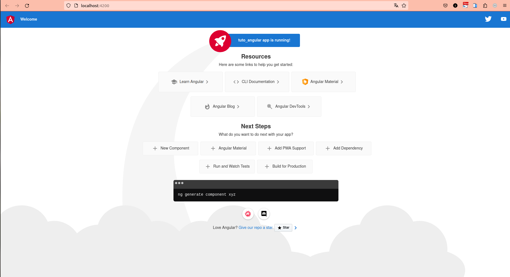

# Création d'un CV interactif avec Angular

### Créer le projet

```bash
ng new projet-cv
```

### Se rendre dans le dossier du projet

```bash
cd projet-cv
```

### Lancer le serveur

```bash
ng serve
```
La première page de l'application est disponible à l'adresse suivante : http://localhost:4200/



### Créer un nouveau composant appelé `header`
Pour une bonne organisation, il est préférable de créer un dossier `components` dans le dossier `app` et d'y placer tous les composants.

```bash
ng g c components/header
```
Cette commande crée le dossier components et le composant header.

Fichiers générés :
- header.component.css : ce fichier contiendra tous les styles du composant `header`
- header.component.html : ce fichier contiendra le code HTML du composant `header`
- header.component.spec.ts : ce fichier contiendra les tests unitaires du composant `header`
- header.component.ts : ce fichier contiendra la logique du composant `header`

Tous les composants que nous créerons aurons les fichiers générés cités ci-dessus et sont automatiquement déclarés dans le fichier `app.module.ts`.

### Créer un nouveau composant appelé `home` 

```bash
ng g c components/home
```

Le composant `home` contiendra le contenu de la page d'accueil. Pour ce fait, il nous faudra générer un module de routage avec la commande :

Attention ! : Cette commande doit être exécutée si pendant la création du projet, vous n'avez pas coché la case `Would you like to add Angular routing?` 
```bash
ng g m app-routing --flat --module=app
```
Cette commande crée le fichier `app-routing.module.ts` qui contiendra les routes de l'application.

Mise en place des routes dans le fichier `app-routing.module.ts` :

```typescript
import { NgModule } from '@angular/core';
import { RouterModule, Routes } from '@angular/router';

const routes: Routes = [

  { path: '', redirectTo: '/home', pathMatch: 'full' }, // default route
  { path: '**', redirectTo: '/home' } // si l'utilisateur accède à une route inconnue, il sera redirigé vers '/home'.
];

@NgModule({
  imports: [RouterModule.forRoot(routes)],
  exports: [RouterModule]
})
export class AppRoutingModule {

}
```

1. **`{ path: '', redirectTo: '/home', pathMatch: 'full' }`** : 

   * Cette route est une route par défaut typique. Elle correspond à une URL vide.
   * L'option `pathMatch: 'full'` signifie que la totalité de l'URL doit correspondre à la chaîne vide. C'est une manière de dire : "Si l'URL est complètement vide, redirigez vers `'/home'`".
   * En général, c'est une bonne manière de définir une route par défaut qui redirige vers une autre route si l'utilisateur accède à l'URL de base de l'application sans aucune autre partie de chemin.

2. **`{ path: '**', redirectTo: '/home' }`** :

   * Cette route est une route de type `wildcard` qui correspond à n'importe quelle URL qui n'a pas été reconnue par les routes définies précédemment dans le tableau de routes.
   * L'utilisation de (`**`) est comme un `joker` qui attrape tout.
   * L'option `redirectTo: '/home'` signifie que si l'utilisateur accède à une route inconnue, il sera redirigé vers `'/home'`.
   * Cette configuration est souvent utilisée pour gérer les erreurs `404`. Elle redirige vers `'/home'` si l'URL demandée ne correspond à aucune route définie dans la configuration de la route.
   * L'ordre des routes dans le tableau est important car, l'analyseur d'URL utilise un algorithme de premier arrivé, premier servi pour sélectionner la route à utiliser.
   * La route générique doit être la dernière route de la configuration de la route, car elle correspond à chaque URL et, par conséquent, capture toutes les routes définies ultérieurement.
   * La route wildcard (`**`) doit généralement être placée à la fin pour fonctionner comme une "route de capture-tout".