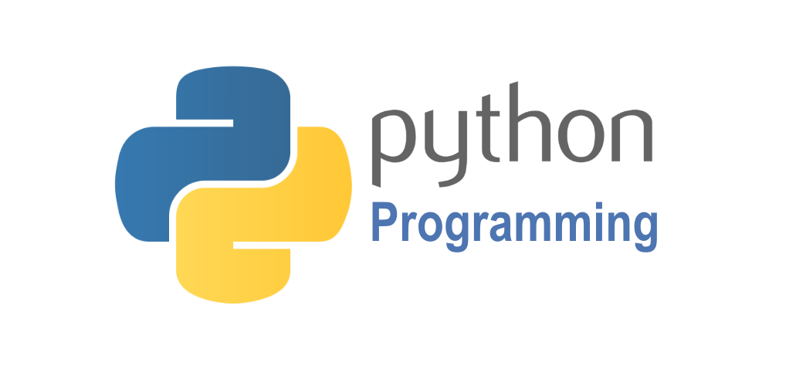

# Algorithmie avec Python



<!-- TOC -->
* [Algorithmie avec Python](#algorithmie-avec-python)
  * [1. Introduction à Python](#1-introduction-à-python)
  * [Historique et caractéristiques de Python](#historique-et-caractéristiques-de-python)
    * [Historique de Python](#historique-de-python)
    * [Caractéristiques de Python](#caractéristiques-de-python)
    * [1.2. Installation et environnement de travail](#12-installation-et-environnement-de-travail)
      * [Installation de Python](#installation-de-python)
      * [Configurer un environnement virtuel](#configurer-un-environnement-virtuel)
      * [IDEs et éditeurs de texte](#ides-et-éditeurs-de-texte)
    * [1.3. Premiers pas : syntaxe de base et types de données](#13-premiers-pas--syntaxe-de-base-et-types-de-données)
      * [Syntaxe de base](#syntaxe-de-base)
      * [Types de données](#types-de-données)
  * [2. Structures de contrôle](#2-structures-de-contrôle)
    * [2.1. Instructions conditionnelles : `if`, `elif`, `else`](#21-instructions-conditionnelles--if-elif-else)
    * [2.2. Boucles : `for` et `while`](#22-boucles--for-et-while)
    * [2.3. Contrôle de boucles : `break`, `continue`, `pass`](#23-contrôle-de-boucles--break-continue-pass)
  * [3. Fonctions et modules](#3-fonctions-et-modules)
    * [3.1. Définition et appel de fonctions](#31-définition-et-appel-de-fonctions)
    * [3.2. Arguments, valeurs de retour et portée des variables](#32-arguments-valeurs-de-retour-et-portée-des-variables)
    * [3.3. Modules et bibliothèques standards](#33-modules-et-bibliothèques-standards)
  * [4. Structures de données (4h)](#4-structures-de-données-4h)
    * [4.1. Listes, tuples et ensembles](#41-listes-tuples-et-ensembles)
    * [4.2. Dictionnaires](#42-dictionnaires)
    * [4.3. Manipulation et méthodes associées](#43-manipulation-et-méthodes-associées)
  * [5. Fonctions avancées](#5-fonctions-avancées-)
    * [5.1. Fonctions anonymes](#51-fonctions-anonymes)
  * [6. Algorithmes de base](#6-algorithmes-de-base)
    * [6.1. Recherche séquentielle et recherche binaire](#61-recherche-séquentielle-et-recherche-binaire)
    * [6.2. Algorithmes de tri : tri à bulles, tri par insertion](#62-algorithmes-de-tri--tri-à-bulles-tri-par-insertion)
    * [6.3. Algorithmes récursifs](#63-algorithmes-récursifs)
  * [7. Programmation orientée objet avec Python](#7-programmation-orientée-objet-avec-python)
    * [7.1. Introduction à l'orienté objet](#71-introduction-à-lorienté-objet)
    * [7.2. Classes, objets et héritage](#72-classes-objets-et-héritage)
    * [7.3. Encapsulation et polymorphisme](#73-encapsulation-et-polymorphisme)
  * [9. Gestion des exceptions et erreurs](#9-gestion-des-exceptions-et-erreurs)
    * [9.1. Concepts de base des exceptions](#91-concepts-de-base-des-exceptions)
    * [9.2. Gestion des exceptions avec `try`, `except`, `finally`](#92-gestion-des-exceptions-avec-try-except-finally)
    * [9.3. Création et utilisation d'exceptions personnalisées](#93-création-et-utilisation-dexceptions-personnalisées)
  * [10. Algorithmes avancés](#10-algorithmes-avancés)
    * [10.1. Structures de données avancées : arbres, graphes](#101-structures-de-données-avancées--arbres-graphes)
    * [10.2. Algorithmes sur les graphes : recherche en profondeur, recherche en largeur](#102-algorithmes-sur-les-graphes--recherche-en-profondeur-recherche-en-largeur)
    * [10.3. Techniques d'optimisation : programmation dynamique](#103-techniques-doptimisation--programmation-dynamique)
  * [11. Projet pratique et mise en application](#11-projet-pratique-et-mise-en-application)
    * [11.1. Définition du projet](#111-définition-du-projet)
    * [11.2. Planification et conception](#112-planification-et-conception)
    * [11.3. Développement et tests](#113-développement-et-tests)
  * [12. Conclusion et perspectives](#12-conclusion-et-perspectives)
    * [12.1. Résumé des concepts clés](#121-résumé-des-concepts-clés)
    * [12.2. Ressources pour approfondir et continuer l'apprentissage](#122-ressources-pour-approfondir-et-continuer-lapprentissage)
    * [12.3. Tendances futures en algorithmie et Python](#123-tendances-futures-en-algorithmie-et-python)
<!-- TOC -->
---

## 1. Introduction à Python

Python est un langage de programmation universel, interprété et de haut niveau. Depuis sa création en 1991 par Guido van Rossum, Python a gagné en popularité en raison de sa syntaxe claire et de son code lisible, suivant la philosophie que "le code est lu beaucoup plus de fois qu'il n'est écrit". Cette lisibilité, combinée à sa puissance, en fait un choix idéal pour les débutants en programmation ainsi que pour les experts du secteur.

L'une des forces majeures de Python réside dans sa polyvalence. Il est utilisé dans une multitude de domaines, allant du développement web avec des frameworks comme Django et Flask, à la science des données avec des bibliothèques comme Pandas et NumPy, en passant par l'intelligence artificielle et l'apprentissage automatique avec TensorFlow et scikit-learn.

Python est également une plateforme dynamique qui encourage la collaboration. Sa riche bibliothèque standard, complétée par des milliers de paquets tiers disponibles via le Python Package Index (PyPI), permet aux développeurs d'aborder presque n'importe quel projet imaginable. De plus, la communauté Python est réputée pour être l'une des plus accueillantes et actives, avec une multitude de conférences, ateliers et forums dédiés pour aider les programmeurs de tous niveaux.

En résumé, Python est plus qu'un simple langage de programmation ; c'est un écosystème riche et en pleine croissance qui continue d'influencer et de façonner le paysage technologique moderne. Quel que soit votre objectif ou votre niveau d'expertise, Python a quelque chose à offrir.

## Historique et caractéristiques de Python

### Historique de Python

Python a été conçu à la fin des années 1980 par **Guido van Rossum** au Centrum Wiskunde & Informatica (CWI) aux Pays-Bas. La première version officielle, Python 0.9.0, a été publiée en février 1991. Cette version incluait déjà de nombreuses fonctionnalités présentes dans les versions actuelles, notamment l'utilisation de l'indentation pour définir les blocs de code et l'inclusion d'une grande variété de types de données de haut niveau.

L'origine du nom "Python" n'est pas liée au serpent, mais est plutôt un hommage au groupe comique britannique "Monty Python", dont Guido van Rossum était fan.

Python a connu plusieurs versions majeures :

- **Python 1.0 (1994)** : la première version officielle.
- **Python 2.0 (2000)** : introduction des générateurs, de la collecte des ordures et du support Unicode. La version 2.7, sortie en 2010, était la dernière de la série 2.x.
- **Python 3.0 (2008)** : une refonte majeure du langage, non rétrocompatible avec les versions 2.x. Elle a introduit des changements tels que `print` devenant une fonction et non une instruction, et la division de deux entiers renvoyant un flottant plutôt qu'un entier.

### Caractéristiques de Python

1. **Interprété** : Contrairement aux langages compilés comme C ou Java, Python est interprété, ce qui signifie qu'il exécute le code ligne par ligne, rendant le débogage plus facile.

2. **Dynamiquement typé** : Pas besoin de déclarer le type de variable à l'avance. Le type est déterminé lors de l'exécution.

3. **Indention** : Contrairement à de nombreux autres langages, Python utilise l'indentation pour délimiter les blocs de code.

4. **Bibliothèque standard riche** : Python est livré "avec les piles incluses", ce qui signifie qu'il dispose d'une vaste bibliothèque standard qui facilite la réalisation de nombreuses tâches courantes.

5. **Extensible** : Il est possible d'écrire du code Python en C ou C++ pour des performances optimales.

6. **Portabilité** : Python est disponible et fonctionne sur divers systèmes d'exploitation, y compris Windows, macOS et Linux.

7. **Communauté forte** : La communauté Python est vaste, active et en constante croissance, offrant une abondance de ressources, de bibliothèques et de frameworks.

En conclusion, Python est un langage puissant, polyvalent et facile à apprendre, ce qui explique sa popularité croissante et sa large adoption dans de nombreux domaines de l'informatique.

### 1.2. Installation et environnement de travail

L'installation de Python et la mise en place d'un environnement de travail adéquat sont des étapes cruciales pour commencer à programmer efficacement. Voici un guide pour vous aider à travers ce processus :

#### Installation de Python

**Windows :**

1. Rendez-vous sur le site officiel de Python à l'adresse [python.org](https://www.python.org/).
2. Accédez à la section "Downloads" et téléchargez la version la plus récente pour Windows.
3. Exécutez le fichier d'installation. Assurez-vous de cocher la case "Add Python to PATH" avant de cliquer sur "Install Now".

**macOS :**

1. Vous pouvez utiliser Homebrew : `brew install python3`

```bash
brew install python3
```

2. Ou téléchargez la version macOS depuis le site officiel [python.org](https://www.python.org/).

**Linux :**

1. La plupart des distributions Linux ont Python préinstallé. Vous pouvez vérifier sa présence avec : `python3 --version`.

```bash
python3 --version
```

2. Si ce n'est pas le cas, utilisez le gestionnaire de paquets de votre distribution. Par exemple, sur Debian ou Ubuntu : `sudo apt-get install python3`.

```bash
sudo apt-get install python3
```

#### Configurer un environnement virtuel

L'utilisation d'un environnement virtuel est recommandée car, elle permet de gérer les dépendances de chaque projet séparément.

1. Installez `virtualenv` : `pip install virtualenv`
2. Créez un nouvel environnement virtuel : `virtualenv mon_env`
3. Activez l'environnement :
   - Sur Windows : `mon_env\Scripts\activate`
   - Sur macOS ou Linux : `source mon_env/bin/activate`
4. Vous pouvez désormais installer des paquets dans cet environnement sans affecter votre installation Python globale.

#### IDEs et éditeurs de texte

Plusieurs IDEs (Integrated Development Environment) et éditeurs de texte sont disponibles pour Python :

- **PyCharm** : Un IDE puissant spécialement conçu pour Python avec de nombreuses fonctionnalités.
- **Visual Studio Code** : Un éditeur de texte léger et extensible avec une excellente prise en charge de Python grâce à des extensions.
- **Jupyter Notebook** : Idéal pour l'analyse de données, la recherche et l'apprentissage interactif.
- **IDLE** : L'IDE de base fourni avec Python, bien pour les débutants.

En fin de compte, le choix de l'environnement dépend des préférences personnelles et du type de projet sur lequel vous travaillez. Assurez-vous simplement de maintenir votre environnement à jour et de suivre les bonnes pratiques pour un développement efficace et sans tracas.

### 1.3. Premiers pas : syntaxe de base et types de données

Démarrer avec un nouveau langage de programmation nécessite de comprendre sa syntaxe de base et les types de données qu'il offre. Python, avec sa philosophie de simplicité et de clarté, facilite grandement cette étape initiale. Voici un aperçu des éléments essentiels de la syntaxe de Python et de ses types de données fondamentaux :

#### Syntaxe de base

- **Indentation :**
  - Contrairement à de nombreux langages qui utilisent des accolades pour délimiter les blocs de code, Python se fie à l'indentation. Cela rend le code plus lisible.
- **Commentaires :**
  - Tout texte précédé par un `#` est considéré comme un commentaire et n'est pas exécuté.
- **Instructions :**
  - En Python, les instructions sont exécutées ligne par ligne. Contrairement à certains langages, il n'est pas nécessaire de terminer une instruction par un point-virgule.
- **Variables :**

  - Les variables sont définies sans avoir besoin de déclarer leur type à l'avance. Par exemple :

  ```python
   x = 10
   name = "Alice"

   print(x) # Affichera 10
  ```

#### Types de données

- **Nombres :**

Les nombres sont divisés en deux catégories :

- **Integers (int)** : Ce sont des nombres entiers. Exemple : `5`, `-3`, `42`.
- **Floats (float)** : Ce sont des nombres à virgule flottante. Exemple : `3.14`, `-0.001`, `2.71`.

- **Chaînes de caractères (string) :**

Les chaînes de caractères sont des séquences de caractères.

- Tout texte encadré de guillemets simples (`'...'`) ou doubles (`"..."`). Exemple : `'Python'`, `"Hello, World!"` sont des chaînes de caractères valides.

  ```python
   name = "Alice"
   print(name) # Affichera Alice

   message = 'Hello, World!'
   print(message) # Affichera Hello, World!
  ```

- **Listes :**
  Les listes sont des collections ordonnées et modifiables d'éléments.

  - Une collection ordonnée et modifiable d'éléments. Exemple : `[1, 2, 3]`, `['apple', 'banana', 'cherry']`.
  - Les éléments d'une liste peuvent être de différents types. Exemple : `[1, 'apple', True]`.

  ```python
   fruits = ['apple', 'banana', 'cherry']
   print(fruits) # Affichera ['apple', 'banana', 'cherry']

   fruits[0] = 'orange'
   print(fruits) # Affichera ['orange', 'banana', 'cherry']
  ```

  Dans ce code d'exemple, nous avons créé une liste de fruits et l'avons affichée. Ensuite, nous avons modifié le premier élément de la liste et l'avons affiché à nouveau. Comme vous pouvez le voir, les listes sont modifiables.

- **Tuples :**

  Les tuples sont similaires aux listes, mais immuables. C'est-à-dire qu'une fois qu'un tuple est créé, il ne peut pas être modifié.

  - Semblable aux listes, mais immuable. Exemple : `(1, 2, 3)`, `('a', 'b', 'c')`.
  - Les éléments d'un tuple peuvent être de différents types. Exemple : `(1, 'apple', True)`.

  ```python
   fruits = ('apple', 'banana', 'cherry')
   print(fruits) # Affichera ('apple', 'banana', 'cherry')

   fruits[0] = 'orange' # Erreur : les tuples sont immuables
  ```

  Comme vous pouvez le voir, nous avons obtenu une erreur lors de la tentative de modification du premier élément du tuple. C'est parce que les tuples sont immuables.

- **Dictionnaires :**
  Les dictionnaires sont des collections non ordonnées de paires clé-valeur. Chaque élément d'un dictionnaire est une paire clé-valeur. Les clés sont uniques et ne peuvent pas être dupliquées.

  - Une collection non ordonnée de paires clé-valeur. Exemple : `{"name": "Alice", "age": 30}`.
  - Les clés d'un dictionnaire doivent être uniques. Exemple : `{"name": "Alice", "name": "Bob"}` <span style="color: red">n'est pas valide.</span>

  ```python
   person = {"name": "Alice", "age": 30}
   print(person) # Affichera {'name': 'Alice', 'age': 30}

   print(person["name"]) # Affichera Alice
   print(person["age"]) # Affichera 30

   # Ajouter un nouvel élément
   person["city"] = "Paris"
   print(person) # Affichera {'name': 'Alice', 'age': 30, 'city': 'Paris'}

   # Modifier un élément existant
   person["age"] = 31 # Désormais Alice a 31 ans

   print(person["name"], "a", person["age"]) # Affichera Alice a 31

   # Concaténer
   print(f"{person['name']} a {person['age']} ans") # Affichera Alice a 31 ans

   # Supprimer un élément
   del person["city"] # Supprime la clé "city"
  ```

  Dans cet exemple, nous avons créé un dictionnaire représentant une personne. Nous avons affiché le dictionnaire, puis accédé à ses éléments individuels. Ensuite, nous avons ajouté un nouvel élément, modifié un élément existant et supprimé un élément. Enfin, nous avons utilisé la concaténation pour afficher une phrase décrivant la personne.

  - On peut utiliser la méthode `get()` pour accéder à un élément d'un dictionnaire. Exemple : `person.get("name")`.
  - On peut utiliser la méthode `keys()` pour obtenir une liste des clés d'un dictionnaire. Exemple : `person.keys()`.
  - On peut utiliser la méthode `values()` pour obtenir une liste des valeurs d'un dictionnaire. Exemple : `person.values()`.
  - On peut utiliser la méthode `items()` pour obtenir une liste des paires clé-valeur d'un dictionnaire. Exemple : `person.items()`.
  - On peut utiliser la méthode `pop()` pour supprimer un élément d'un dictionnaire. Exemple : `person.pop("name")`.
  - On peut utiliser la méthode `popitem()` pour supprimer le dernier élément d'un dictionnaire. Exemple : `person.popitem()`.
  - On peut utiliser la méthode `clear()` pour supprimer tous les éléments d'un dictionnaire. Exemple : `person.clear()`.
  - On peut utiliser la méthode `update()` pour mettre à jour un dictionnaire avec les éléments d'un autre dictionnaire. Exemple : `person.update({"name": "Bob"})`.

- **Booléens :**
      Les booléens sont des valeurs binaires qui peuvent être `True` ou `False`.
      - `True` et `False` sont des booléens valides.
      - Les booléens sont généralement utilisés pour les instructions conditionnelles et les boucles.

      ```python
       x = 5
       y = 10

       print(x == y) # Affichera False
       print(x < y) # Affichera True
       print(x > y) # Affichera False
       print(x != y) # Affichera True
      ```
  Dans cet exemple, nous avons défini deux variables `x` et `y`. Ensuite, nous avons utilisé des opérateurs de comparaison pour comparer les valeurs des deux variables. Comme vous pouvez le voir, les opérateurs de comparaison renvoient des booléens.

En résumé, Python offre une syntaxe intuitive et une variété de types de données pour répondre aux besoins des développeurs. La clé est de comprendre ces fondamentaux pour pouvoir écrire des programmes efficaces et optimisés.

## 2. Structures de contrôle

La programmation ne serait guère plus qu'une simple liste d'instructions sans la capacité de prendre des décisions et de répéter certaines actions. Les structures de contrôle en Python, comme dans la plupart des langages de programmation, permettent d'exécuter des instructions de manière conditionnelle ou répétitive. Voici un aperçu de ces structures essentielles :

### 2.1. Instructions conditionnelles : `if`, `elif`, `else`

Les instructions conditionnelles permettent d'exécuter des instructions en fonction d'une condition. En Python, les instructions conditionnelles sont créées avec les mots-clés `if`, `elif` et `else`. Voici un exemple :

- `if` : Exécute un bloc de code si la condition est vraie.

```python
x = 5
y = 10

if x < y:
    print("x est inférieur à y")
```

- `elif` : Exécute un bloc de code si la condition est vraie et si la condition précédente est fausse.

```python
x = 5
y = 10

if x < y:
    print("x est inférieur à y")
elif x > y:
    print("x est supérieur à y")
```

- `else` : Exécute un bloc de code si toutes les conditions précédentes sont fausses.

```python
x = 5
y = 10

if x < y:
    print("x est inférieur à y")
elif x > y:
    print("x est supérieur à y")
else:
    print("x est égal à y")
```

Dans cet exemple, nous avons défini deux variables `x` et `y`. Ensuite, nous avons utilisé une instruction conditionnelle pour comparer les valeurs des deux variables. Comme vous pouvez le voir, les instructions conditionnelles sont utiles pour exécuter des instructions en fonction d'une condition.

### 2.2. Boucles : `for` et `while`

Les boucles permettent d'exécuter des instructions de manière répétitive. En Python, les boucles sont créées avec les mots-clés `for` et `while`. Voici un exemple :

- `for` : Exécute un bloc de code pour chaque élément d'une collection.

```python
fruits = ["apple", "banana", "cherry"]

for fruit in fruits:
    print(fruit) # Affichera apple, banana, cherry
```

- `while` : Exécute un bloc de code tant qu'une condition est vraie.

```python
i = 1

while i < 6:
    print(i) # Affichera 1, 2, 3, 4, 5
    i += 1
```

Dans cet exemple, nous avons créé une liste de fruits et utilisé une boucle `for` pour afficher chaque élément de la liste. Ensuite, nous avons utilisé une boucle `while` pour afficher les nombres de 1 à 5. Comme vous pouvez le voir, les boucles sont utiles pour exécuter des instructions de manière répétitive.

### 2.3. Contrôle de boucles : `break`, `continue`, `pass`

Les instructions `break`, `continue` et `pass` permettent de contrôler le flux d'exécution des boucles.

- `break` : Arrête l'exécution de la boucle.

```python
fruits = ["apple", "banana", "cherry"]

for fruit in fruits:
    if fruit == "banana": # Si le fruit est banana
        break # Arrête la boucle
    print(fruit) # Affichera apple seulement
```

Dans cet exemple, Si la liste contient un élément `banana`, la boucle `for` s'arrêtera (grâce à l'instruction `break`) avant d'atteindre cet élément et n'imprimera que les éléments qui le précèdent.

Si nous prenons l'exemple où `fruits = ["apple", "banana", "cherry"]`, le code affichera effectivement seulement `apple`, car la boucle s'arrête avant d'atteindre `banana`.

- `continue` : Passe à l'itération suivante de la boucle.

```python
fruits = ["apple", "banana", "cherry"]

for fruit in fruits:
    if fruit == "banana": # Si le fruit est banana
        continue # Passe à l'itération suivante
    print(fruit) # Affichera apple et cherry
```

Dans cet exemple, lorsque la boucle `for` parcourt la liste `fruits` et rencontre l'élément `banana`, l'instruction `continue` est exécutée. Cela signifie que le reste du code dans cette itération de la boucle (dans ce cas, `print(fruit)`) est ignoré, et la boucle passe à l'itération suivante.

Donc, pour la liste `fruits = ["apple", "banana", "cherry"]` :

- `apple` sera imprimé,
- `banana` sera ignoré à cause de l'instruction `continue`,
- `cherry` sera imprimé.

Le résultat final sera l'affichage de `apple` suivi de `cherry`.

- `pass` : Ignore l'instruction.

L'instruction `pass` en Python est une opération `nulle` - rien ne se passe lorsqu'elle est exécutée. Elle est souvent utilisée comme un espace réservé pour s'assurer qu'un bloc de code est syntaxiquement correct.

```python
fruits = ["apple", "banana", "cherry"]

for fruit in fruits:
    if fruit == "banana": # Si le fruit est banana
        pass # Ignore l'instruction
    print(fruit) # Affichera apple, banana, cherry
```

Dans cet exemple, lorsque la boucle `for` parcourt la liste `fruits` et rencontre l'élément `banana`, l'instruction `pass` est exécutée. Cela signifie que le reste du code dans cette itération de la boucle (dans ce cas, `print(fruit)`) est ignoré, mais la boucle ne passe pas à l'itération suivante.

Donc, Pour chaque fruit dans `fruits = ["apple", "banana", "cherry"]` :

- Si fruit est égal à `banana`, l'instruction `pass` est exécutée. Cependant, `pass` ne fait rien, c'est une instruction qui est simplement ignorée.
- Puis, `print(fruit)` est exécuté pour chaque `fruit`.
- Donc, le code imprimera chaque élément de la liste fruits dans l'ordre, soit : `apple`, `banana`, puis `cherry`.

En résumé, les structures de contrôle sont essentielles pour exécuter des instructions de manière conditionnelle ou répétitive. La clé est de comprendre ces structures pour pouvoir écrire des programmes efficaces et optimisés.

## 3. Fonctions et modules

En Python, les fonctions sont des blocs de code réutilisables qui effectuent une action spécifique. Les modules, quant à eux, sont des fichiers contenant un ensemble de fonctions, de classes et de variables liées. Ils permettent de structurer et d'organiser le code de manière plus efficace, en particulier pour les grands projets.

### 3.1. Définition et appel de fonctions

En Python, les fonctions sont des blocs de code réutilisables qui permettent d'encapsuler un comportement spécifique. Elles peuvent prendre des arguments en entrée et retourner une valeur. Voici un exemple :

**Définition d'une fonction**

Pour définir une fonction, on utilise le mot-clé `def` suivi du nom de la fonction et d'une paire de parenthèses contenant éventuellement des paramètres.

Syntaxe de base :

```python
def ma_fonction(param1, param2):
    # Code à exécuter
    return resultat  # Le retour est optionnel
```

Exemple concret :

```python
def add(x, y):
    return x + y
```

Dans cet exemple, nous avons défini une fonction `add` qui prend deux paramètres `x` et `y` et retourne leur somme.

**Appel d'une fonction**

Pour appeler une fonction, on utilise son nom suivi d'une paire de parenthèses contenant éventuellement des arguments.

Syntaxe de base :

```python
resultat = ma_fonction(arg1, arg2)
```

Exemple concret :

```python
somme = add(5, 10)

print(somme) # Affichera 15
```

Dans cet exemple, nous avons appelé la fonction `add` avec les arguments `5` et `10`. La fonction a retourné la somme de ces deux arguments, que nous avons ensuite stockée dans la variable `somme`.

**Fonction sans retour** :

Toutes les fonctions n'ont pas besoin de renvoyer une valeur. Certaines peuvent simplement effectuer une action.

```python
def dire_bonjour():
    print("Bonjour !")
```

Dans cet exemple, nous avons défini une fonction `dire_bonjour` qui affiche le message `Bonjour !`. Cette fonction ne prend aucun paramètre et ne retourne aucune valeur.

Appel de la fonction :

```python
dire_bonjour() # Affichera Bonjour !
```

**Fonction avec paramètres par défaut** :

Les fonctions peuvent avoir des paramètres par défaut. Cela signifie que si aucun argument n'est fourni pour ce paramètre, la valeur par défaut sera utilisée.

```python
def dire_bonjour(nom="Alice"):
    print("Bonjour", nom)
```

Dans cet exemple, nous avons défini une fonction `dire_bonjour` qui prend un paramètre `nom` avec une valeur par défaut `Alice`. Si aucun argument n'est fourni pour ce paramètre, la valeur par défaut sera utilisée.

Appel de la fonction :

```python
dire_bonjour() # Affichera Bonjour Alice

dire_bonjour("Bob") # Affichera Bonjour Bob
```

**Fonction avec nombre variable d'arguments** :

Les fonctions peuvent prendre un nombre variable d'arguments. Cela signifie que le nombre d'arguments n'est pas fixe et peut varier.

```python
def add(*args):
    somme = 0
    for arg in args:
        somme += arg
    return somme
```

Dans cet exemple, nous avons défini une fonction `add` qui prend un nombre variable d'arguments. La fonction parcourt ensuite tous les arguments et retourne leur somme.

Appel de la fonction :

```python
print(add(1, 2, 3)) # Affichera 6

print(add(1, 2, 3, 4, 5)) # Affichera 15
```

**Fonction avec nombre variable d'arguments nommés** :

Les fonctions peuvent prendre un nombre variable d'arguments nommés. Cela signifie que le nombre d'arguments n'est pas fixe et peut varier.

```python
def dire_bonjour(**kwargs):
    for key, value in kwargs.items():
        print(f"{key} dit bonjour à {value}")
```

Dans cet exemple, nous avons défini une fonction `dire_bonjour` qui prend un nombre variable d'arguments nommés. La fonction parcourt ensuite tous les arguments et affiche un message personnalisé pour chacun d'eux.

Appel de la fonction :

```python
dire_bonjour(Alice="Bob", Bob="Alice") # Affichera Alice dit bonjour à Bob et Bob dit bonjour à Alice
```

**Fonction avec nombre variable d'arguments et d'arguments nommés** :

Les fonctions peuvent prendre un nombre variable d'arguments et d'arguments nommés. Cela signifie que le nombre d'arguments n'est pas fixe et peut varier.

```python
def dire_bonjour(*args, **kwargs):
    for arg in args:
        print(f"Bonjour {arg}")
    for key, value in kwargs.items():
        print(f"{key} dit bonjour à {value}")
```

Dans cet exemple, nous avons défini une fonction `dire_bonjour` qui prend un nombre variable d'arguments et d'arguments nommés. La fonction parcourt ensuite tous les arguments et affiche un message personnalisé pour chacun d'eux.

Appel de la fonction :

```python
dire_bonjour("Alice", "Bob", Alice="Bob", Bob="Alice") # Affichera Bonjour Alice, Bonjour Bob, Alice dit bonjour à Bob et Bob dit bonjour à Alice
```

En résumé, les fonctions sont des blocs de code réutilisables qui permettent d'encapsuler un comportement spécifique. La clé est de comprendre ces fonctions pour pouvoir écrire des programmes efficaces et optimisés.

### 3.2. Arguments, valeurs de retour et portée des variables

Les fonctions en Python peuvent être définies pour accepter des arguments et renvoyer des valeurs. De plus, il est important de comprendre la portée des variables lors de la création et de l'utilisation de fonctions. Cela détermine où une variable peut être utilisée ou modifiée.

**Arguments**

Les arguments sont des valeurs que vous passez à une fonction lorsque vous l'appelez. Ils permettent de fournir des données à une fonction pour qu'elle puisse effectuer des opérations.

Exemple concret :

```python
def saluer(nom, age):
    print(f"Bonjour {nom}, vous avez {age} ans!")
```

Dans cet exemple, la fonction `saluer` accepte deux arguments : `nom` et `age`. Lorsque la fonction est appelée, ces arguments sont fournis et utilisés pour afficher un message personnalisé.

Appel de la fonction :

```python
saluer("Alice", 30) # Affichera Bonjour Alice, vous avez 30 ans!
```

**Valeurs de retour**

Une fonction peut renvoyer une valeur à l'endroit où elle a été appelée à l'aide de l'instruction return.

Exemple concret :

```python
def add(x, y):
    return x + y
```

Dans cet exemple, la fonction `add` renvoie la somme de ses deux arguments `x` et `y`. Lorsque la fonction est appelée, la valeur de retour est stockée dans la variable `somme`.

Appel de la fonction :

```python
somme = add(5, 10)

print(somme) # Affichera 15
```

**Portée des variables**

La portée d'une variable fait référence à l'endroit où elle peut être utilisée ou modifiée. Les variables définies à l'intérieur d'une fonction sont appelées variables locales et ne peuvent être utilisées qu'à l'intérieur de cette fonction. Les variables définies en dehors de toute fonction sont appelées variables globales et peuvent être utilisées n'importe où dans le code.

Exemple concret :

```python
variable_globale = "Je suis une variable globale"

def ma_fonction():
    variable_locale = "Je suis une variable locale"
    print(variable_globale)  # Cela fonctionnera
    print(variable_locale)   # Cela fonctionnera également

print(variable_globale)      # Cela fonctionnera
# print(variable_locale)     # Cela provoquerait une erreur car la variable est locale à la fonction
```

En résumé, lors de la création de fonctions en Python, il est essentiel de comprendre comment passer des arguments, renvoyer des valeurs et gérer la portée des variables pour écrire des programmes efficaces et sans erreurs.

### 3.3. Modules et bibliothèques standards

En Python, un module est un fichier contenant des définitions, des fonctions, des classes et des variables, ainsi que du code exécutable. Les bibliothèques standards sont une collection de modules qui sont inclus avec chaque installation de Python et fournissent des fonctionnalités prêtes à l'emploi pour de nombreuses tâches courantes.

**Modules**

- **Importation d'un module** : Pour utiliser un module dans votre code, il faut d'abord l'importer à l'aide de l'instruction `import`.

  ```python
  import math
  ```

- **Utilisation d'un module** : Après avoir importé un module, vous pouvez accéder à ses fonctions et variables en utilisant le nom du module, suivi d'un point, puis du nom de la fonction ou de la variable.

  ```python
  print(math.pi) # Affichera 3.141592653589793

  racine = math.sqrt(25)  # Utilise la fonction sqrt du module math
  print(racine) # Affichera 5.0
  ```

Dans cet exemple, nous importons le module math qui fournit des fonctions mathématiques. Nous pouvons ensuite utiliser le module pour accéder à la valeur de pi.

**Bibliothèques standards**

Python est livré avec une bibliothèque standard riche qui fournit des modules pour une variété de tâches, telles que l'accès aux fichiers, la manipulation de chaînes, la gestion des dates et heures, et bien plus encore. Voici quelques exemples :

- `os` : Fournit des fonctions pour interagir avec le système d'exploitation, comme la création de dossiers, la lecture de variables d'environnement, etc.

  - **Importation d'une bibliothèque standard** :

  ```python
    import os
    os.mkdir("nouveau_dossier")
  ```

  Dans cet exemple, nous importons la bibliothèque standard `os` et utilisons la fonction `mkdir` pour créer un nouveau dossier.

- `sys` : Fournit des fonctions et des variables utilisées pour manipuler différentes parties de l'environnement d'exécution Python.

  ```python
      import sys
      print(sys.argv)
  ```

  Dans cet exemple, nous importons la bibliothèque standard `sys` et utilisons la variable `argv` pour accéder aux arguments de la ligne de commande.

- `datetime` : Pour la manipulation des dates et des heures.

  ```python
      import datetime
      aujourd'hui = datetime.date.today()
  ```

  Dans cet exemple, nous importons la bibliothèque standard `datetime` et utilisons la fonction `today` pour obtenir la date d'aujourd'hui.

- `random` : Pour la génération de nombres aléatoires.

  ```python
      import random
      nombre_aleatoire = random.randint(1, 10)
  ```

  Dans cet exemple, nous importons la bibliothèque standard `random` et utilisons la fonction `randint` pour générer un nombre aléatoire entre 1 et 10.

- `json` : Pour encoder et décoder des données au format JSON.

  ```python
     import json
     data = {"nom": "Alice", "age": 30}
     json_str = json.dumps(data)  # Convertit le dictionnaire en chaîne JSON
     print(json_str) # Affichera {"nom": "Alice", "age": 30}
  ```

  Dans cet exemple, nous importons la bibliothèque standard `json` et utilisons la fonction `loads` pour décoder une chaîne JSON en un objet Python.

En résumé, les modules et la bibliothèque standard en Python permettent aux développeurs de gagner du temps et d'éviter de "réinventer la roue" en fournissant des outils et des fonctions prédéfinis pour des tâches courantes. Il est toujours recommandé de consulter la documentation officielle de Python pour en savoir plus sur les modules et fonctions disponibles.

## 4. Structures de données (4h)

En Python, les structures de données permettent de stocker, d'accéder et de manipuler des données de manière organisée et efficace. Voici un aperçu des principales structures de données en Python et de leurs méthodes associées.

### 4.1. Listes, tuples et ensembles

Les listes, les tuples et les ensembles sont des structures de données courantes en Python. Ils permettent de stocker des collections d'éléments et d'accéder à ces éléments de manière efficace. Voici un aperçu de ces structures de données et de leurs méthodes associées :

**Listes**

Les listes sont des collections ordonnées et modifiables d'éléments.

- **Création d'une liste** : Pour créer une liste, on utilise des crochets `[]` et on sépare les éléments par des virgules `,`.

  ```python
  fruits = ["apple", "banana", "cherry"]
  ```

- **Accès aux éléments d'une liste** : Pour accéder aux éléments d'une liste, on utilise des crochets `[]` et on fournit l'index de l'élément.

  ```python
    fruits = ["apple", "banana", "cherry"]

    print(fruits[0]) # Affichera apple
    print(fruits[1]) # Affichera banana
    print(fruits[2]) # Affichera cherry
  ```

Avec Lists, on peut utiliser des index négatifs pour accéder aux éléments en partant de la fin de la liste. Par exemple, `-1` fait référence au dernier élément de la liste, `-2` au deuxième élément de la fin, et ainsi de suite.

Ajoutons un élément à la liste :

```python
fruits = ["apple", "banana", "cherry"]

fruits.append("orange") # Ajoute un élément à la fin de la liste

print(fruits) # Affichera ['apple', 'banana', 'cherry', 'orange']
```

Dans cet exemple, nous avons ajouté un élément à la liste à l'aide de la méthode `append`.

Supposons maintenant que nous voulons ajouter un élément à un index spécifique de la liste. Pour ce faire, nous pouvons utiliser la méthode `insert` :

```python
fruits = ["apple", "banana", "cherry"]

fruits.insert(1, "orange") # Ajoute un élément à l'index 1

print(fruits) # Affichera ['apple', 'orange', 'banana', 'cherry']
```

Dans cet exemple, nous avons ajouté un élément à l'index 1 de la liste à l'aide de la méthode `insert`.

Supposons maintenant que nous voulons supprimer un élément de la liste. Pour ce faire, nous pouvons utiliser la méthode `remove` :

```python
fruits = ["apple", "banana", "cherry"]

fruits.remove("banana") # Supprime l'élément "banana"

print(fruits) # Affichera ['apple', 'cherry']
```

Dans cet exemple, nous avons supprimé l'élément `banana` de la liste à l'aide de la méthode `remove`.

### 4.2. Dictionnaires

Les dictionnaires sont des collections non ordonnées de paires clé-valeur.

- **Création d'un dictionnaire** : Pour créer un dictionnaire, on utilise des accolades `{}` et on sépare les paires clé-valeur par des virgules `,`.

  ```python
  person = {"name": "Alice", "age": 30}

  print(person) # Affichera {'name': 'Alice', 'age': 30}
  ```

- **Accès aux éléments d'un dictionnaire** : Pour accéder aux éléments d'un dictionnaire, on utilise des crochets `[]` et on fournit la clé de l'élément.

  ```python
    person = {"name": "Alice", "age": 30}

    print(person["name"]) # Affichera Alice

    print(person["age"]) # Affichera 30

    print(person.get("name")) # Affichera Alice

    print(person.get("city", "Paris")) # Affichera Paris

    print(person.keys()) # Affichera dict_keys(['name', 'age'])
  ```

### 4.3. Manipulation et méthodes associées

  - Listes: `append`, `insert`, `remove`, `pop`, `clear`, `index`, `count`, `sort`, `reverse`, `copy`

  ```python
    fruits = ["apple", "banana", "cherry"]

    fruits.append("orange") # Ajoute un élément à la fin de la liste

    fruits.insert(1, "orange") # Ajoute un élément à l'index 1

    fruits.remove("banana") # Supprime l'élément "banana"

    fruits.pop() # Supprime le dernier élément

    fruits.clear() # Supprime tous les éléments

    fruits.index("banana") # Retourne l'index de l'élément "banana"

    fruits.count("banana") # Retourne le nombre d'éléments "banana"

    fruits.sort() # Trie la liste par ordre alphabétique

    fruits.reverse() # Inverse l'ordre des éléments

    fruits.copy() # Retourne une copie de la liste
  ```

  - Tuples: `count`, `index`

  ```python
    fruits = ("apple", "banana", "cherry")

    fruits.count("banana") # Retourne le nombre d'éléments "banana"

    fruits.index("banana") # Retourne l'index de l'élément "banana"
  ```

  - Ensembles: `union`, `intersection`

  ```python
    fruits = {"apple", "banana", "cherry"}

    fruits.union({"orange", "mango"}) # Retourne un ensemble contenant tous les éléments des deux ensembles

    fruits.intersection({"apple", "banana"}) # Retourne un ensemble contenant les éléments communs aux deux ensembles
  ```

  - Dictionnaires: `get`, `keys`, `values`, `items`, `pop`, `popitem`, `clear`, `update`

  ```python
    person = {"name": "Alice", "age": 30}

    person.keys() # Retourne une liste des clés

    person.values() # Retourne une liste des valeurs

    person.items() # Retourne une liste des paires clé-valeur
  ```

En maîtrisant ces structures de données et leurs méthodes associées, vous pouvez gérer efficacement les données dans vos programmes et résoudre une grande variété de problèmes de programmation.

## 5. Fonctions avancées 

En Python, les fonctions avancées permettent d'effectuer des opérations plus complexes, telles que la création de fonctions anonymes, la gestion des erreurs et la manipulation de fichiers. Voici un aperçu de ces fonctions avancées et de leurs méthodes associées :

### 5.1. Fonctions anonymes

Les fonctions anonymes, également appelées fonctions lambdas, sont des fonctions sans nom qui peuvent être définies et appelées en une seule ligne. Elles sont généralement utilisées pour effectuer des opérations simples et sont souvent utilisées avec des fonctions intégrées telles que `map`, `filter` et `reduce`.

- **Création d'une fonction anonyme** : Pour créer une fonction anonyme, on utilise le mot-clé `lambda` suivi d'une liste d'arguments et d'une expression.

  ```python
  add = lambda x, y: x + y
  ```

- **Appel d'une fonction anonyme** : Pour appeler une fonction anonyme, on utilise son nom suivi d'une liste d'arguments.

  ```python
    add = lambda x, y: x + y

    print(add(5, 10)) # Affichera 15
  ```

Dans cet exemple, nous avons créé une fonction anonyme `add` qui prend deux arguments `x` et `y` et retourne leur somme. Ensuite, nous avons appelé la fonction anonyme avec les arguments `5` et `10`. La fonction a retourné la somme de ces deux arguments, que nous avons ensuite stockée dans la variable `somme`.

## 6. Algorithmes de base

Les algorithmes sont des séquences d'instructions qui résolvent un problème spécifique. Ils sont essentiels pour résoudre des problèmes de programmation et sont utilisés dans presque tous les programmes. Voici un aperçu des algorithmes de base et de leurs implémentations en Python :

### 6.1. Recherche séquentielle et recherche binaire

La recherche séquentielle et la recherche binaire sont des algorithmes de recherche qui permettent de trouver un élément dans une liste. La recherche séquentielle parcourt la liste et compare chaque élément à l'élément recherché. La recherche binaire divise la liste en deux et compare l'élément recherché à l'élément du milieu. Voici un aperçu de ces algorithmes et de leurs implémentations en Python :

- **Recherche séquentielle** : Pour implémenter la recherche séquentielle, on parcourt la liste et on compare chaque élément à l'élément recherché.

  ```python
  def recherche_sequentielle(liste, element):
      for i in range(len(liste)): # Parcourt la liste
          if liste[i] == element: # Compare chaque élément à l'élément recherché
              return i # Retourne l'index de l'élément recherché
      return -1 # Retourne -1 si l'élément n'est pas trouvé
  ```

- **Recherche binaire** : Pour implémenter la recherche binaire, on divise la liste en deux et on compare l'élément recherché à l'élément du milieu. Si l'élément recherché est plus petit, on recherche dans la première moitié de la liste. Si l'élément recherché est plus grand, on recherche dans la deuxième moitié de la liste. On répète ce processus jusqu'à ce que l'élément soit trouvé ou que la liste soit vide.

  ```python
    def recherche_binaire(liste, element):
        debut = 0
        fin = len(liste) - 1
        while debut <= fin: # Tant que la liste n'est pas vide
            milieu = (debut + fin) // 2 # Trouve l'élément du milieu
            if liste[milieu] < element: # Si l'élément recherché est plus grand
                debut = milieu + 1 # Recherche dans la deuxième moitié de la liste
            elif liste[milieu] > element: # Si l'élément recherché est plus petit
                fin = milieu - 1 # Recherche dans la première moitié de la liste
            else:
                return milieu # Retourne l'index de l'élément recherché
        return -1 # Retourne -1 si l'élément n'est pas trouvé
  ```

Dans cet exemple de recherche binaire, nous avons divisé la liste en deux et comparé l'élément recherché à l'élément du milieu. Si l'élément recherché est plus petit, nous avons recherché dans la première moitié de la liste. Si l'élément recherché est plus grand, nous avons recherché dans la deuxième moitié de la liste. Nous avons répété ce processus jusqu'à ce que l'élément soit trouvé ou que la liste soit vide.

### 6.2. Algorithmes de tri : tri à bulles, tri par insertion

Les algorithmes de tri permettent de trier une liste d'éléments dans un ordre spécifique. Le tri à bulles et le tri par insertion sont des algorithmes de tri simples et efficaces. Le tri à bulles parcourt la liste et compare chaque élément à l'élément suivant. Si l'élément suivant est plus petit, les deux éléments sont échangés. Le tri par insertion parcourt la liste et compare chaque élément à tous les éléments précédents. Si l'élément est plus petit, il est inséré à sa place. Voici un aperçu de ces algorithmes et de leurs implémentations en Python :

- **Tri à bulles** : Pour implémenter le tri à bulles, on parcourt la liste et on compare chaque élément à l'élément suivant. Si l'élément suivant est plus petit, on les échange.

  ```python
  def tri_a_bulles(liste):
      for i in range(len(liste)): # Parcourt la liste
          for j in range(len(liste) - 1): # Parcourt la liste - 1
              if liste[j] > liste[j + 1]: # Compare chaque élément à l'élément suivant
                  liste[j], liste[j + 1] = liste[j + 1], liste[j] # Échange les éléments
  ```

Dans cet exemple de tri à bulles, nous avons parcouru la liste et comparé chaque élément à l'élément suivant. Si l'élément suivant est plus petit, nous les avons échangés. Nous avons répété ce processus jusqu'à ce que la liste soit triée.

- **Tri par insertion** : Pour implémenter le tri par insertion, on parcourt la liste et on compare chaque élément à tous les éléments précédents. Si l'élément est plus petit, on l'insère à sa place.

  ```python
     def tri_par_insertion(liste):
        for i in range(1, len(liste)): # Parcourt la liste
            element = liste[i] # Stocke l'élément actuel
            j = i - 1 # Stocke l'index de l'élément précédent
            while j >= 0 and liste[j] > element: # Tant que l'élément précédent est plus grand
                liste[j + 1] = liste[j] # Déplace l'élément précédent vers la droite
                j -= 1 # Décrémente l'index de l'élément précédent
            liste[j + 1] = element # Insère l'élément à sa place
  ```

Dans cet exemple de tri par insertion, nous avons parcouru la liste et comparé chaque élément à tous les éléments précédents. Si l'élément est plus petit, nous l'avons inséré à sa place. Nous avons répété ce processus jusqu'à ce que la liste soit triée.

### 6.3. Algorithmes récursifs

Les algorithmes récursifs sont des algorithmes qui se répètent jusqu'à ce qu'une condition de base soit atteinte. Ils sont généralement utilisés pour résoudre des problèmes qui peuvent être décomposés en problèmes plus petits. Voici un aperçu des algorithmes récursifs et de leurs implémentations en Python :

- **Fonction récursive** : Pour implémenter une fonction récursive, on définit une fonction qui s'appelle elle-même.

Syntaxe de base :

```python
   def fonction_recursive():
      fonction_recursive() # Appelle la fonction elle-même
```

```python
   def fonction_recursive(n):
      if n == 0: # Condition de base
          return
      fonction_recursive(n - 1) # Appelle la fonction elle-même
```

Dans cet exemple de fonction récursive, nous avons défini une fonction `fonction_recursive` qui s'appelle elle-même. Cela crée une boucle infinie qui ne se termine jamais.

## 7. Programmation orientée objet avec Python

La programmation orientée objet (POO) est un paradigme de programmation qui repose sur le concept d'"objets", qui peuvent contenir des données et des méthodes pour manipuler ces données. Python, en tant que langage de programmation polyvalent, prend en charge la POO, ce qui permet aux développeurs de créer des applications modulaires et évolutives.

### 7.1. Introduction à l'orienté objet

La programmation orientée objet (POO) est un style de programmation qui permet de regrouper des données et des fonctionnalités connexes en une seule entité appelée "objet". Cette approche est centrée sur la création d'objets qui représentent des éléments réels ou conceptuels. Ces objets sont basés sur des "classes" qui définissent les attributs (données) et les méthodes (fonctionnalités) que ces objets peuvent avoir.

### 7.2. Classes, objets et héritage

La programmation orientée objet (POO) en Python repose sur quelques concepts fondamentaux : les classes, les objets et l'héritage. Ces concepts forment la base de la POO et permettent aux développeurs de créer des structures de code réutilisables et bien organisées.

- **Classes** :

  Les classes sont des modèles qui définissent les attributs (données) et les méthodes (fonctionnalités) que les objets peuvent avoir. Elles sont utilisées pour créer des objets. Ou encore, Une classe est un modèle ou un plan à partir duquel des objets sont créés. Elle représente une entité et définit les attributs et les méthodes qui caractérisent cette entité.

- **Création d'une classe** : Pour créer une classe, on utilise le mot-clé `class` suivi du nom de la classe et d'une paire de parenthèses contenant éventuellement des paramètres.

  ```python
  class Chien:
      def __init__(self, nom, race):
      self.nom = nom
      self.race = race

      def aboyer(self): # Méthode
          print(f"Chien{self.nom} aboie !") # Méthode
      print(f"Chien{self.nom} aboie !")
  ```

  Expliquons ce code :

- `class Chien` : Définit une classe appelée `Chien`.
- `def __init__` : Définit une méthode spéciale appelée `__init__` qui est appelée lorsqu'un objet est créé à partir de la classe. C'est la méthode constructeur de la classe.
- `self` : Fait référence à l'objet lui-même. Il est utilisé pour accéder aux attributs et aux méthodes de l'objet. Dans d'autres langages de programmation comme `PHP`, il est appelé `this`.
- `self.nom` : Définit un attribut `nom` pour l'objet.
- `self.race` : Définit un attribut `race` pour l'objet.
- `def aboyer` : Définit une méthode appelée `aboyer` qui affiche un message.
- `print(f"Chien{self.nom} aboie !")` : Affiche un message avec le nom de l'objet.

- **Objet** : Un objet est une instance d'une classe. C'est une représentation concrète basée sur le modèle fourni par la classe.

  ```python
  rex = Chien(nom="Rex", race="Labrador")
  rex.aboyer()  # Affiche "Rex aboie !"
  ```

  Expliquons ce code :

- `rex = Chien(nom="Rex", race="Labrador")` : Crée un objet appelé `rex` à partir de la classe `Chien`.
- `rex.aboyer()` : Appelle la méthode `aboyer` de l'objet `rex`.

- **Héritage** :

  L'héritage est un mécanisme qui permet à une classe (la classe fille) d'hériter des attributs et des méthodes d'une autre classe (la classe mère). Cela favorise la réutilisation du code et établit une relation de type "est-un" entre la classe mère et la classe fille.

  -`Classe de base (ou classe mère)` : La classe dont les propriétés et méthodes sont héritées.

  -`Classe dérivée (ou classe fille) `: La classe qui hérite des propriétés et méthodes d'une autre

  ```python
  class Animal:
      def __init__(self, nom):
          self.nom = nom

      def parler(self):
          pass

  class Chat(Animal):
      def parler(self):
          print(f"{self.nom} miaule !")

  class Chien(Animal):
      def parler(self):
          print(f"{self.nom} aboie !")
  ```

  Dans l'exemple ci-dessus, `Chat` et `Chien` sont des `classes dérivées` qui `héritent` de la classe de base `Animal`. Grâce à l'héritage, les classes `Chat` et `Chien` peuvent utiliser la méthode `parler` tout en la redéfinissant pour fournir une implémentation spécifique.

L'héritage permet d'éviter la redondance, de promouvoir la modularité et d'établir des hiérarchies claires entre les classes. Il facilite également l'extension et la maintenance des applications en regroupant les comportements communs dans des classes de base et en permettant aux classes dérivées de les étendre ou de les modifier selon les besoins.

### 7.3. Encapsulation et polymorphisme

La programmation orientée objet en Python, comme dans de nombreux autres langages, implique également des concepts tels que l'encapsulation et le polymorphisme. Ces notions sont cruciales pour comprendre comment les objets interagissent entre eux et comment ils peuvent être utilisés pour créer des structures de code flexibles et sécurisées.

**Encapsulation** :

L'encapsulation est un mécanisme qui permet de regrouper des données et des méthodes connexes en une seule entité appelée `classe`. Elle permet de contrôler l'accès aux données et d'éviter les interférences entre les différentes parties du code. Ou encore, L'encapsulation est le mécanisme qui permet de restreindre l'accès à certains composants d'un objet, empêchant ainsi les modifications indésirables. En Python, cela est réalisé à l'aide de modificateurs d'accès privés et protégés.

- **Attributs et méthodes privés** : Ces membres sont précédés d'un double underscore (`_ _`). Ils ne peuvent pas être accessibles ni modifiés en dehors de la classe.

```python
class Voiture:
    def __init__(self):
        self.__kilometrage = 0

    def conduire(self, kilometres):
        self.__kilometrage += kilometres

fiat = Voiture()
fiat.__kilometrage = 1000 # Ne fonctionnera pas car, __kilometrage est privé

fiat.conduire(100) # Fonctionnera
```

Expliquons ce code :

- `class Voiture` : Définit une classe appelée Voiture.
- `def __init__` : Définit une méthode spéciale appelée `__init__` qui est appelée lorsqu'un objet est créé à partir de la classe. C'est la méthode constructeur de la classe.
- `self` : Fait référence à l'objet lui-même. Il est utilisé pour accéder aux attributs et aux méthodes de l'objet.
- `self.__kilometrage` : Définit un attribut privé `kilometrage` pour l'objet.
- `def conduire` : Définit une méthode appelée `conduire` qui incrémente l'attribut `kilometrage` de l'objet.
- `self.__kilometrage += kilometres` : Incrémente l'attribut `kilometrage` de l'objet.
- `fiat = Voiture()` : Crée un objet appelé `fiat` à partir de la classe `Voiture`.
- `fiat.__kilometrage = 1000` : Attribue une valeur de 1000 à l'attribut `kilometrage` de l'objet `fiat`. <span style="color :red">Cela ne fonctionnera pas</span> car, l'attribut `kilometrage` est `privé`.
- `fiat.conduire(100)` : Appelle la méthode `conduire` de l'objet `fiat` et lui passe 100 comme argument. <span style="color :green">Cela fonctionnera</span> car, la méthode `conduire` est `publique`.

Remarque : En Python, il n'y a pas de modificateur d'accès `public`. Tous les attributs et méthodes qui ne sont pas privés ou protégés sont considérés comme publics.

**Attributs et méthodes protégés** : Ces membres sont précédés d'un seul underscore (`_`). Ils sont destinés à être utilisés dans les `sous-classes`, mais pas en dehors de la hiérarchie de classes.

```python
class Machine:
    def __init__(self):
        self._fonctionnement = False # Attribut protégé

    def demarrer(self):

          if self._fonctionnement:
                print("La machine est déjà démarrée")
            else:
                self._fonctionnement = True
                print("La machine démarre")

    def arreter(self):

          if self._fonctionnement:
                self._fonctionnement = False
                print("La machine s'arrête")
            else:
                print("La machine est déjà arrêtée")


class MachineACafe(Machine):
    def __init__(self):
        super().__init__()

    def faire_cafe(self):
        if self._fonctionnement:
            print("Faire un café")
        else:
            print("La machine est éteinte")

machine_a_cafe = MachineACafe()

machine_a_cafe.demarrer() # Affichera "La machine démarre"

machine_a_cafe.faire_cafe() # Affichera "Faire un café"
```

Expliquons ce code :

- `class Machine` : Définit une classe appelée Machine.
- `def __init__` : Définit une méthode spéciale appelée `__init__` qui est appelée lorsqu'un objet est créé à partir de la classe. C'est la méthode constructeur de la classe.
- `self` : Fait référence à l'objet lui-même. Il est utilisé pour accéder aux attributs et aux méthodes de l'objet.
- `self._fonctionnement` : Définit un attribut protégé `fonctionnement` pour l'objet.
- `def demarrer` : Définit une méthode appelée `demarrer` qui démarre la machine.
- `def arreter` : Définit une méthode appelée `arreter` qui arrête la machine.
- `class MachineACafe(Machine)` : Définit une classe appelée MachineACafe qui hérite de la classe Machine.
- `super().__init__()` : Appelle la méthode `__init__` de la classe mère.
- `def faire_cafe` : Définit une méthode appelée `faire_cafe` qui fait un café.
- `machine_a_cafe = MachineACafe()` : Crée un objet appelé `machine_a_cafe` à partir de la classe `MachineACafe`.
- `machine_a_cafe.demarrer()` : Appelle la méthode `demarrer` de l'objet `machine_a_cafe`.
- `machine_a_cafe.faire_cafe()` : Appelle la méthode `faire_cafe` de l'objet `machine_a_cafe`.
- `self._fonctionnement` : Accède à l'attribut `fonctionnement` de l'objet `machine_a_cafe`.

L'encapsulation garantit l'intégrité des données en évitant les modifications accidentelles et offre un moyen de contrôler l'accès aux méthodes et attributs d'une classe.

**Polymorphisme** :

Le `polymorphisme` permet à des `objets` de différentes classes d'être traités comme des objets d'une `classe` commune. C'est le principe selon lequel plusieurs classes peuvent implémenter la même méthode, mais cette méthode peut se comporter différemment pour chaque classe.

- **Polymorphisme avec les fonctions** : Une fonction peut être utilisée pour différents types de données. Cela permet d'écrire des fonctions génériques qui peuvent être utilisées pour différents types de données.

  ```python
  def afficher_details(objet):
      objet.afficher()
  ```

- **Polymorphisme avec les classes** : Différentes classes peuvent avoir des méthodes avec le même nom.

  ```python
  class Chat:
     def parler(self):
        print("Miaou!")

  class Chien:
     def parler(self):
        print("Wouaf!")

  animal1 = Chat()
  animal2 = Chien()

  animal1.parler()  # Affiche "Miaou!"
  animal2.parler()  # Affiche "Wouaf!"
  ```

Dans l'exemple ci-dessus, bien que les classes `Chat` et `Chien` soient différentes, elles ont toutes deux une méthode `parler()`. C'est un exemple de `polymorphisme` où différentes classes ont des méthodes portant le même `nom`. Le polymorphisme facilite l'extension du code et le rend plus flexible, permettant aux objets de différentes classes d'interagir les uns avec les autres de manière plus générique.

## 9. Gestion des exceptions et erreurs

Dans tout programme, il est inévitable de rencontrer des erreurs. En Python, les erreurs peuvent être gérées de manière élégante grâce à la gestion des exceptions. Cette section vous guidera à travers les bases de la gestion des exceptions en Python, en abordant comment détecter les erreurs, les gérer et même les déclencher intentionnellement.

**Types d'erreurs**

- `Erreurs de syntaxe` : Ces erreurs se produisent lorsque le programmeur fait une erreur dans la structure du code.

```python
print("Bonjour) # Erreur de syntaxe
```

La ligne ci-dessus génère une erreur de syntaxe car, la chaîne de caractères n'est pas correctement fermée.

- `Erreurs d'exécution` : Ces erreurs se produisent lorsque le programmeur fait une erreur dans la logique du code. Par exemple, une division par zéro ou une tentative d'accès à une clé inexistante dans un dictionnaire.

```python
x = 5
y = 0
print(x / y) # Erreur d'exécution
```

### 9.1. Concepts de base des exceptions

La programmation comporte souvent des erreurs, et ces erreurs peuvent survenir lors de la conception (erreurs de syntaxe) ou pendant l'exécution (exceptions). En Python, les exceptions sont des événements qui se produisent lors de l'exécution d'un programme et qui perturbent le flux normal du programme.

**Exemples d'exceptions courantes** :

- ValueError : Levée lorsque la fonction reçoit un argument de la bonne type, mais avec une valeur inappropriée. Par exemple, lorsqu'une chaîne de caractères est ajoutée à un entier ou quand un entier est appelé comme une fonction.

  ```python
  int("texte")  # génère ValueError
  ```

- TypeError : Levée lorsqu'une opération ou une fonction est appliquée à un objet de type inapproprié. C'est-à-dire lorsqu'un opérateur ou une fonction est appliqué à un objet de type inapproprié. Par exemple, quand une chaîne de caractères est ajoutée à un entier ou quand un entier est appelé comme une fonction.

  ```python
  "2" + 2  # génère TypeError
  ```

- IndexError : Levée lorsqu'un index de séquence est hors de portée. C'est-à-dire lorsque vous essayez d'accéder à un élément d'une liste, d'un tuple ou d'une chaîne de caractères qui n'existe pas.

  ```python
  liste = [1, 2, 3]
  print(liste[5])  # génère IndexError
  ```

### 9.2. Gestion des exceptions avec `try`, `except`, `finally`

La gestion des exceptions est essentielle pour assurer la robustesse de votre code. Python fournit plusieurs outils pour capturer et répondre aux exceptions.

**Bloc try et except** : Le code qui peut générer une exception est placé dans le bloc `try`. Si une exception est levée, le bloc `except` est exécuté.

```python
try:
    x = 1 / 0
except ZeroDivisionError:
    print("Division par zéro impossible!")
```

Dans ce code d'exemple, nous avons placé le code qui peut générer une exception dans le bloc `try`. Si une exception est levée, le bloc `except` est exécuté. Dans ce cas, nous avons levé une exception `ZeroDivisionError` en essayant de diviser un nombre par zéro. Le bloc `except` a capturé l'exception et a affiché un message d'erreur.

**Bloc else** : S'exécute si le bloc try ne lève pas d'exception.

```python
try:
    x = 1 / 2
except ZeroDivisionError:
    print("Division par zéro!")
else:
    print("Aucune exception levée!")
```

Dans ce code d'exemple, nous avons placé le code qui peut générer une exception dans le bloc `try`. Si aucune exception n'est levée, le bloc `else` est exécuté. Dans ce cas, nous n'avons pas levé d'exception et le bloc `else` a été exécuté.

**Bloc finally** : S'exécute toujours après le bloc try, qu'une exception soit levée ou non.

```python
try:
    x = 1 / 0
except ZeroDivisionError:
    print("Division par zéro!")
finally:
    print("Bloc 'finally' exécuté.")
```

Dans ce code d'exemple, nous avons placé le code qui peut générer une exception dans le bloc `try`. Si une exception est levée, le bloc `except` est exécuté. Dans ce cas, nous avons levé une exception `ZeroDivisionError` en essayant de diviser un nombre par zéro. Le bloc `except` a capturé l'exception et a affiché un message d'erreur. Enfin, le bloc `finally` a été exécuté.

### 9.3. Création et utilisation d'exceptions personnalisées

En plus des exceptions intégrées, Python permet de définir des exceptions personnalisées en créant une nouvelle classe d'exception.

**Création d'une exception personnalisée** :
Syntaxe de base :

```python
class MonException(Exception):
    pass
```

Exemple concret :

```python
try:
    raise MonErreur("Ceci est une erreur personnalisée")
except MonErreur as e:
    print(e)
```

Ces exceptions personnalisées peuvent être utiles pour signaler des erreurs spécifiques à votre application et pour fournir des messages d'erreur plus clairs et plus pertinents.

## 10. Algorithmes avancés

### 10.1. Structures de données avancées : arbres, graphes

**Arbres** : Un arbre est une structure de données hiérarchique composée de nœuds. Le premier nœud est appelé racine, et chaque nœud (sauf la racine) est associé à un autre nœud appelé parent. Chaque nœud à zéro ou plusieurs nœuds enfants.

- `Arbre binaire` : Chaque nœud a au maximum deux enfants, généralement appelés sous-arbre gauche et sous-arbre droit.

```python
class Noeud:
    def __init__(self, valeur):
        self.gauche = None
        self.droit = None
        self.valeur = valeur
```

Expliquons ce code :

- `class Noeud` : Définit une classe appelée `Noeud`.
- `def __init__` : Définit une méthode spéciale appelée `__init__` qui est appelée lorsqu'un objet est créé à partir de la classe. C'est la méthode constructeur de la classe.
- `self` : Fait référence à l'objet lui-même. Il est utilisé pour accéder aux attributs et aux méthodes de l'objet.
- `self.gauche` : Définit un attribut `gauche` pour l'objet.
- `self.droit` : Définit un attribut `droit` pour l'objet.
- `self.valeur` : Définit un attribut `valeur` pour l'objet.

**Graphes** : Un `graphe` est une structure de données non `linéaire` composée de `nœuds` et `d'arêtes`. Les nœuds sont les éléments de données et les arêtes sont les connexions entre les nœuds. Les graphes sont utilisés pour représenter des réseaux, des relations et des itinéraires. Ils peuvent être dirigés ou non dirigés.

On dit non orienté car, les arêtes ne sont pas orientées dans une direction spécifique.

**Représentation d'un graphe** : Peut être réalisée par une liste d'adjacence ou une matrice d'adjacence.

Exemple 1 : Représentation d'un graphe non orienté

```python
class Graphe:
    def __init__(self, n):
        self.n = n
        self.liste_adjacence = [[] for _ in range(n)]
```

Expliquons ce code :

- `class Graphe` : Définit une classe appelée `Graphe`.
- `def __init__` : Définit une méthode spéciale appelée `__init__` qui est appelée lorsqu'un objet est créé à partir de la classe. C'est la méthode constructeur de la classe.
- `self` : Fait référence à l'objet lui-même. Il est utilisé pour accéder aux attributs et aux méthodes de l'objet.
- `self.n` : Définit un attribut `n` pour l'objet.
- `self.liste_adjacence` : Définit un attribut `liste_adjacence` pour l'objet.

Exemple 2 : Représentation d'un graphe orienté

On dit orienté car, les arêtes sont orientées dans une direction spécifique.

```python
graphe = {
    "A": ["B", "C"],
    "B": ["A", "D", "E"],
    "C": ["A", "F"],
    "D": ["B"],
    "E": ["B", "F"],
    "F": ["C", "E"]
}
```

Expliquons ce code :

- `graphe` : Définit un dictionnaire appelé `graphe`.
- `"A": ["B", "C"]` : Définit un nœud appelé `"A"` avec deux arêtes `"B"` et `"C"`.
- `"B": ["A", "D", "E"]` : Définit un nœud appelé `"B"` avec trois arêtes `"A"`, `"D"` et `"E"`.
- `"C": ["A", "F"]` : Définit un nœud appelé `"C"` avec deux arêtes `"A"` et `"F"`.
- `"D": ["B"]` : Définit un nœud appelé `"D"` avec une arête `"B"`.
- `"E": ["B", "F"]` : Définit un nœud appelé `"E"` avec deux arêtes `"B"` et `"F"`.
- `"F": ["C", "E"]` : Définit un nœud appelé `"F"` avec deux arêtes `"C"` et `"E"`.

### 10.2. Algorithmes sur les graphes : recherche en profondeur, recherche en largeur

  - **Recherche en profondeur (DFS)** : Explore aussi loin que possible le long de chaque branche avant de revenir en arrière. Elle utilise généralement une pile pour mémoriser les nœuds.

  - **DFS** : `Depth` (profondeur) et FS pour `First Search` (recherche en premier) : explore aussi loin que possible le long de chaque branche avant de revenir en arrière.

    ```python
    def dfs(graphe, depart):
        visite = set()
        pile = [depart]

        while pile:
            sommet = pile.pop()
            if sommet not in visite:
                visite.add(sommet)
                pile.extend(graphe[sommet] - visite)
        return visite

    ```

Expliquons ce code :

- `def dfs` : Définit une fonction appelée `dfs` qui prend en paramètres un `graphe` et un nœud de départ.
- `visite = set()` : Définit un ensemble appelé `visite`.
- `pile = [depart]` : Définit une pile appelée `pile` avec le nœud de départ.
- `while pile` : Tant que la pile n'est pas vide.
- `sommet = pile.pop()` : Définit un sommet en retirant le dernier élément de la pile.
- `if sommet not in visite` : Si le sommet n'est pas dans l'ensemble `visite`.
- `visite.add(sommet)` : Ajoute le sommet à l'ensemble `visite`.
- `pile.extend(graphe[sommet] - visite)` : Ajoute les sommets voisins du sommet à la pile.
- `return visite` : Retourne l'ensemble `visite`.

  - **Recherche en largeur (BFS)** : Visite tous les nœuds d'un graphe niveau par niveau. Elle utilise généralement une file pour mémoriser les nœuds.

  - **BFS** : `Breadth` (largeur) et FS pour `First Search` (recherche en premier) : est similaire à DFS, mais utilise une file au lieu d'une pile.

    ```python
    def bfs(graphe, depart):
        visite = set()
        file = [depart]

        while file:
            sommet = file.pop(0)
            if sommet not in visite:
                visite.add(sommet)
                file.extend(graphe[sommet] - visite)
        return visite
    ```

Expliquons ce code :

- `def bfs` : Définit une fonction appelée `bfs` qui prend en paramètres un `graphe` et un nœud de départ.
- `visite = set()` : Définit un ensemble appelé `visite`.
- `file = [depart]` : Définit une file appelée `file` avec le nœud de départ.
- `while file` : Tant que la file n'est pas vide.
- `sommet = file.pop(0)` : Définit un sommet en retirant le premier élément de la file.
- `if sommet not in visite` : Si le sommet n'est pas dans l'ensemble `visite`.
- `visite.add(sommet)` : Ajoute le sommet à l'ensemble `visite`.
- `file.extend(graphe[sommet] - visite)` : Ajoute les sommets voisins du sommet à la file.
- `return visite` : Retourne l'ensemble `visite`.

### 10.3. Techniques d'optimisation : programmation dynamique

**La programmation dynamique** est une technique utilisée pour résoudre des problèmes en décomposant un problème en sous-problèmes plus petits. Elle utilise un tableau pour stocker les solutions des sous-problèmes, évitant ainsi les calculs redondants.

Exemple : Suite de Fibonacci

La suite de Fibonacci est une série où chaque nombre est la somme des deux précédents. Sans optimisation, la fonction est récursive et peut-être lente. Avec la programmation dynamique, le calcul est plus rapide.

```python
def fibonacci(n, memo={}):
    if n in memo:
        return memo[n]
    if n <= 2:
        return 1
    memo[n] = fibonacci(n-1, memo) + fibonacci(n-2, memo)
    return memo[n]
```

Expliquons ce code :

- `def fibonacci(n, memo={})` : Définit une fonction appelée `fibonacci` qui prend en paramètres un nombre `n` et un dictionnaire vide `memo`.
- `if n in memo` : Si `n` est dans le dictionnaire `memo`.
- `return memo[n]` : Retourne `n` dans le dictionnaire `memo`.
- `if n <= 2` : Si `n` est inférieur ou égal à 2.
- `return 1` : Retourne 1.
- `memo[n] = fibonacci(n-1, memo) + fibonacci(n-2, memo)` : Ajoute `n` au dictionnaire `memo`.
- `return memo[n]` : Retourne `n` dans le dictionnaire `memo`.

Cette technique est très utile pour optimiser les algorithmes qui répètent le même calcul plusieurs fois.

## 11. Projet pratique et mise en application

### 11.1. Définition du projet

Avant de commencer tout projet de programmation, il est essentiel de définir clairement le but et les objectifs du projet. Cette étape implique généralement de répondre aux questions suivantes :

- **Quel est le problème à résoudre ?** Identifiez le besoin ou le défi que votre projet abordera.

- **Quelles sont les fonctionnalités principales ?** Listez les fonctionnalités clés que votre application ou votre programme doit avoir.

- **Qui sont les utilisateurs cibles ?** Comprendre votre public cible peut influencer la conception et les fonctionnalités de votre application.

- **Exemple** : Créer une application de gestion de tâches qui permet aux utilisateurs de suivre leurs tâches quotidiennes.

### 11.2. Planification et conception

Une fois que vous avez une idée claire de ce que doit être votre projet, la prochaine étape est la planification et la conception. Cela implique :

- **Création de maquettes ou de wireframes** : Cela donne une idée visuelle de ce à quoi ressemblera l'application.

- **Définir l'architecture du logiciel** : Choisissez si vous voulez une architecture monolithique, micro-services, etc.

- **Sélection des outils et des technologies** : Décidez des langages de programmation, des cadres et des outils que vous utiliserez.

- **Exemple** : Pour notre application de gestion des tâches, nous pourrions décider d'utiliser Python avec le framework Flask pour le backend et React ou Angular pour le frontend.

### 11.3. Développement et tests

Avec tout en place, la prochaine étape est de commencer à coder !

- **Développement** : Commencez par développer les fonctionnalités principales identifiées lors de la définition du projet. Utilisez des méthodes de développement agile pour une collaboration efficace et des mises à jour fréquentes.

- **Tests** : Il est crucial de tester votre code pour s'assurer qu'il fonctionne comme prévu. Cela inclut des tests unitaires (pour tester des parties spécifiques de votre code) et des tests d'intégration (pour tester comment différentes parties fonctionnent ensemble).

**Exemple** : Pour notre application, nous pourrions d'abord développer la fonctionnalité d'ajout de tâche, suivie de la fonctionnalité de marquage d'une tâche comme terminée. Chaque fonctionnalité serait accompagnée de tests pour s'assurer qu'elle fonctionne correctement.

Après ces étapes, le projet peut être déployé et mis à la disposition des utilisateurs. Assurez-vous également de recueillir des commentaires pour améliorer et affiner votre application.

## 12. Conclusion et perspectives

### 12.1. Résumé des concepts clés

Au terme de ce parcours, plusieurs concepts essentiels ont été abordés :

- **Les bases de la programmation** avec la syntaxe Python, les types de données et les structures de contrôle.
- **L'introduction à la programmation orientée objet** et son importance dans la création de programmes modulables et réutilisables.
- **La gestion des exceptions** pour créer des applications robustes et résistantes aux erreurs.
- **Les algorithmes avancés et les structures de données**, essentiels pour résoudre des problèmes complexes.
- **La mise en pratique à travers un projet concret**, consolidant toutes les connaissances acquises.

### 12.2. Ressources pour approfondir et continuer l'apprentissage

L'apprentissage de la programmation est un voyage continu. Voici quelques ressources pour poursuivre votre exploration :

- **Livres** :

  - [Python Crash Course de Eric Matthes](https://www.amazon.fr/Python-Crash-Course-Eric-Matthes/dp/1593279280),
  - [Automate the Boring Stuff with Python de Al Sweigart](https://www.amazon.com/Automate-Boring-Stuff-Python-Programming/dp/1593275994)

- **Cours en ligne** :
  - [Coursera](https://www.coursera.org/learn/python-fr),
  - [Udemy](https://www.udemy.com/fr/topic/python/),
  - [edX](https://www.edx.org/learn/machine-learning/universite-de-montreal-apprivoiser-lapprentissage-automatique)
- **Communautés** : Rejoignez des forums comme

  - [Stack Overflow](https://stackoverflow.com/),
  - [Reddit's](https://www.reddit.com/r/learnpython/?rdt=46981) [r/learnpython ](https://www.reddit.com/r/learnpython/wiki/index/)
  - ou des groupes locaux de développeurs Python pour échanger et apprendre des autres.

### 12.3. Tendances futures en algorithmie et Python

Le monde de la programmation est en constante évolution. Voici quelques tendances à surveiller :

- **Intelligence artificielle et apprentissage automatique** : Python est devenu le langage de prédilection pour l'IA et le ML, avec des bibliothèques comme TensorFlow et PyTorch.

- **Automatisation** : Avec des outils comme Python's Robot Framework, l'automatisation des tâches et des tests est en plein essor.

- **Développement web** : Des frameworks comme Django et Flask rendent le développement web en Python plus accessible et puissant.

Gardez toujours un œil ouvert, continuez à apprendre et à explorer. La programmation est un domaine dynamique, et il y a toujours quelque chose de nouveau à découvrir.
